# 🔍 Estagio 1: Arqueologia Digital

> ⏱️ **Duracao.** 3 horas. Este e o estagio que mais separa times que vencem dos que se perdem. Uma boa arqueologia acelera todos os estagios seguintes.

  

---

## 📑 Sumario

1. [Onde estamos na jornada](#-onde-estamos-na-jornada)
2. [Objetivo do estagio](#-objetivo-do-estagio)
3. [Onde encontrar o codigo legado](#-onde-encontrar-o-codigo-legado)
4. [Workflow das 3 horas](#%EF%B8%8F-workflow-das-3-horas)
5. [Prompts para Copilot Chat](#-prompts-para-copilot-chat)
6. [Criterio de Pronto](#-criterio-de-pronto)
7. [Dica de ouro: caca aos misterios](#-dica-de-ouro-caca-aos-misterios)
8. [Navegacao](#-navegacao)

---

## 🎬 Onde estamos na jornada

Voces acabaram de receber a missao. O SIFAP roda ha 30 anos. Ninguem mais entende o codigo por inteiro. O time original se aposentou. Os comentarios, quando existem, estao em portugues de 1995 e usam abreviacoes que faziam sentido para aquela geracao.

Antes de propor uma arquitetura moderna, **voces precisam entender o que existe**. Esse e o trabalho de um arqueologo digital: ler codigo antigo, identificar regras de negocio reais, desenhar o mapa, e descobrir onde estao os tesouros e onde estao as armadilhas.

> 💡 **Analogia.** Arqueologia digital e parecida com explorar uma cidade antiga. Voce nao pode reformar o centro historico sem primeiro mapear cada rua, cada beco, e descobrir quais predios sustentam os outros.

---

## 🎯 Objetivo do estagio

Explorar o sistema legado SIFAP (Natural/Adabas) e extrair regras de negocio, dependencias e "misterios", que sao pedacos de logica escondida sem documentacao alguma.

**Ao final do estagio, seu time produziu:**

| Artefato | Formato | Local |
|----------|---------|-------|
| 📖 Glossario de termos | Markdown | `01-arqueologia/glossary.md` |
| 📋 Catalogo de regras de negocio | Markdown | `01-arqueologia/business-rules-catalog.md` |
| 🕸️ Mapa de dependencias | Mermaid | `01-arqueologia/dependency-map.md` |
| 🔎 Lista de misterios | Markdown | `01-arqueologia/mysteries-found.md` |
| 📊 Relatorio de descoberta | Markdown | `01-arqueologia/discovery-report.md` |

---

## 📦 Onde encontrar o codigo legado

> ⚠️ **Atencao.** O cenario legado (SIFAP) sera disponibilizado pelos facilitadores no inicio da Etapa 1. Copie o bundle entregue para dentro da raiz do seu repositorio, na pasta `02-cenario-sifap-legado/`, e use os caminhos abaixo.

| 📁 Recurso | 🔗 Caminho | 📊 Quantidade |
|---------|---------|------------|
| Programas Natural | `02-cenario-sifap-legado/natural-programs/` | 15 arquivos .NSN |
| DDMs Adabas | `02-cenario-sifap-legado/adabas-ddms/` | 4 arquivos .ddm |
| Documentacao parcial | `02-cenario-sifap-legado/legacy-docs/` | 3 docs desatualizados |
| README do sistema | `02-cenario-sifap-legado/README.md` | 1 arquivo |

---

## 🗺️ Workflow das 3 horas

```mermaid
gantt
    title Workflow do Estagio 1
    dateFormat HH:mm
    axisFormat %H:%M
    section Hora 1
    Reconhecimento geral :a1, 09:15, 60m
    section Hora 2
    Extracao em pares :a2, after a1, 60m
    section Hora 3
    Sintese e entrega :a3, after a2, 45m
```

### 🕵️ Hora 1: Reconhecimento (09:15 a 10:15)

| Ordem | Persona | Acao |
|:-:|---------|------|
| 1 | 👥 **Todos** | Leiam o README.md do SIFAP (15 min). Entender historia, equipe, criticidade. |
| 2 | 📝 Requirements Engineer + Tech Writer | Iniciem o glossario. Abram cada .NSN e anotem abreviacoes. |
| 3 | 🏛️ Enterprise Architect | Comece o mapa de dependencias. Quais programas chamam quais? |
| 4 | ☕ Developer + 🗄️ DBA | Abram os 4 DDMs. Mapeiem campos para entidades modernas. |

### 🧩 Hora 2: Extracao (10:15 a 11:15)

| Ordem | Persona | Acao |
|:-:|---------|------|
| 5 | 👯 Todos em pares | Cada par analisa 3 programas .NSN. Encontrem regras de negocio. |
| 6 | 🤖 Todos | Usem Copilot Chat. Pecam para o Copilot explicar cada programa. |
| 7 | 📋 Todos | Para cada regra encontrada, registre no catalogo. |

### 🧠 Hora 3: Sintese (11:15 a 12:00)

| Ordem | Persona | Acao |
|:-:|---------|------|
| 8 | 📝 Tech Writer | Consolide o glossario, minimo 30 termos. |
| 9 | 🏛️ Enterprise Architect | Finalize o mapa de dependencias em Mermaid. |
| 10 | 📋 Requirements Engineer | Consolide o catalogo de regras. |
| 11 | 🎯 Product Owner | Priorize as regras. Quais migrar primeiro? |
| 12 | 🧪 QA Engineer | Liste os misterios encontrados. |

---

## 🤖 Prompts para Copilot Chat

Use estes prompts para explorar o codigo legado. Copie, cole, adapte.

1. 💬 "Explique este programa Natural linha por linha: [cole o codigo]"
2. 💬 "Quais regras de negocio estao implementadas neste codigo?"
3. 💬 "Quais campos do DDM este programa le e escreve?"
4. 💬 "Encontre todos os valores hardcoded neste programa e explique o que fazem"
5. 💬 "Este programa tem alguma logica condicional que nao esta documentada nos comentarios?"
6. 💬 "Compare CALCBENF.NSN e BATCHPGT.NSN, ha duplicacao de logica?"
7. 💬 "Quais programas dependem do DDM BENEFICIARIO?"
8. 💬 "Explique a diferenca entre os status A, S, C, I, D no contexto do SIFAP"
9. 💬 "Este codigo tem alguma regra que parece um workaround ou hack?"
10. 💬 "Crie um diagrama Mermaid das dependencias entre os 15 programas"

> 💡 **Dica.** Copilot Chat funciona melhor quando voce fornece contexto. Abra o programa .NSN no editor antes de fazer a pergunta, para que o modelo tenha o codigo no contexto.

---

## ✅ Criterio de Pronto

Ao final do Estagio 1, seu time deve ter todos os itens abaixo.

- [ ] 📖 Glossario com 30 ou mais termos em `01-arqueologia/glossary.md`
- [ ] 📋 Catalogo de regras de negocio em `01-arqueologia/business-rules-catalog.md`
- [ ] 🕸️ Mapa de dependencias em Mermaid em `01-arqueologia/dependency-map.md`
- [ ] 🔎 Lista de misterios encontrados em `01-arqueologia/mysteries-found.md`
- [ ] 📊 Relatorio de descoberta em `01-arqueologia/discovery-report.md`

> ✅ **Checkpoint.** O facilitador assina o GO para o Estagio 2 quando os 5 artefatos estao no repositorio.

---

## 🏆 Dica de ouro: caca aos misterios

Existem **10 regras de negocio escondidas**, **3 easter eggs** e **4 inconsistencias** plantados no codigo legado. Abra o arquivo `mysteries-checklist.md` neste diretorio. Ele lista o que procurar, sem dar as respostas.

| 🎯 Categoria | 🔢 Quantidade | 🏆 Pontos |
|-------------|-----------|--------|
| Regras escondidas | 10 | 20 |
| Easter eggs | 3 | 6 |
| Inconsistencias | 4 | 6 |
| **Total** | **17** | **32** |

Seu time e avaliado na rubrica (dimensao A1) pela quantidade e qualidade dos misterios encontrados.

> 🆘 **Travados?** Apos 90 minutos, o facilitador (pessoa da equipe organizadora com cordao azul, circulando pela sala) pode dar dicas calibradas. Levante a mao.

---

## Navegacao

| Anterior | Home | Proximo |
|---|---|---|
| [README do kit](../README.md) | [README do kit](../README.md) | [Estagio 2: Spec Moderna](../02-spec-moderna/GUIDE.md) |

> Autoria: Paula Silva, AI-Native Software Engineer, Americas Global Black Belt at Microsoft.
