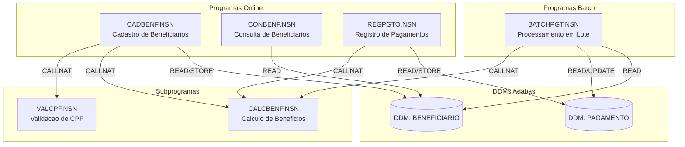
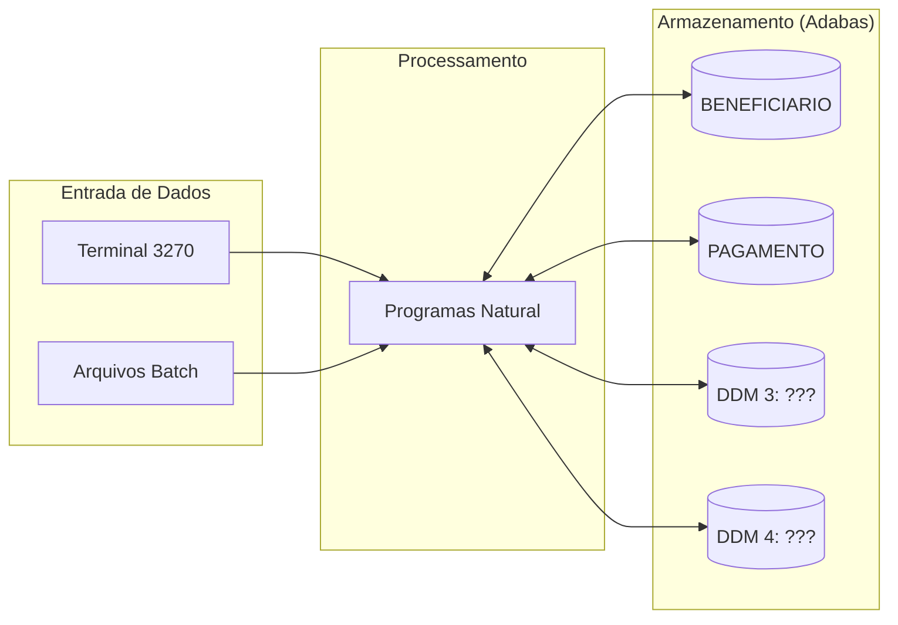

# Mapa de Dependencias - SIFAP Legado

> Use diagramas Mermaid para mapear as dependencias entre programas Natural e DDMs Adabas.
> O objetivo e visualizar "quem chama quem" e "quem le/escreve o que".

## Diagrama de Dependencias entre Programas

> Substitua o exemplo abaixo pelo mapa real do seu time.
> Dica: use `CALLNAT` e `PERFORM` no codigo para encontrar chamadas entre programas.

> **Instrucao**: Este e apenas um exemplo inicial com 6 programas.
> Seu time deve mapear **todos os 15 programas** e **4 DDMs**.

## Diagrama de Fluxo de Dados (DDMs)

> Substitua "DDM 3: ???" e "DDM 4: ???" pelos nomes reais encontrados.

## Tabela de Dependencias

| Programa | Chama (CALLNAT) | Le (READ) DDMs | Escreve (STORE/UPDATE) DDMs | Observacoes |
|----------|----------------|----------------|----------------------------|-------------|
| CADBENF.NSN | | | | |
| CONBENF.NSN | | | | |
| REGPGTO.NSN | | | | |
| BATCHPGT.NSN | | | | |
| CALCBENF.NSN | | | | |
| VALCPF.NSN | | | | |
| | | | | |
| | | | | |
| | | | | |
| | | | | |
| | | | | |
| | | | | |
| | | | | |
| | | | | |
| | | | | |

## Dependencias Circulares

> Liste aqui qualquer dependencia circular encontrada (programa A chama B que chama A):

- Nenhuma encontrada ate agora.

## Programas Orfaos

> Programas que nao sao chamados por nenhum outro (possiveis pontos de entrada ou codigo morto):

- A investigar.
