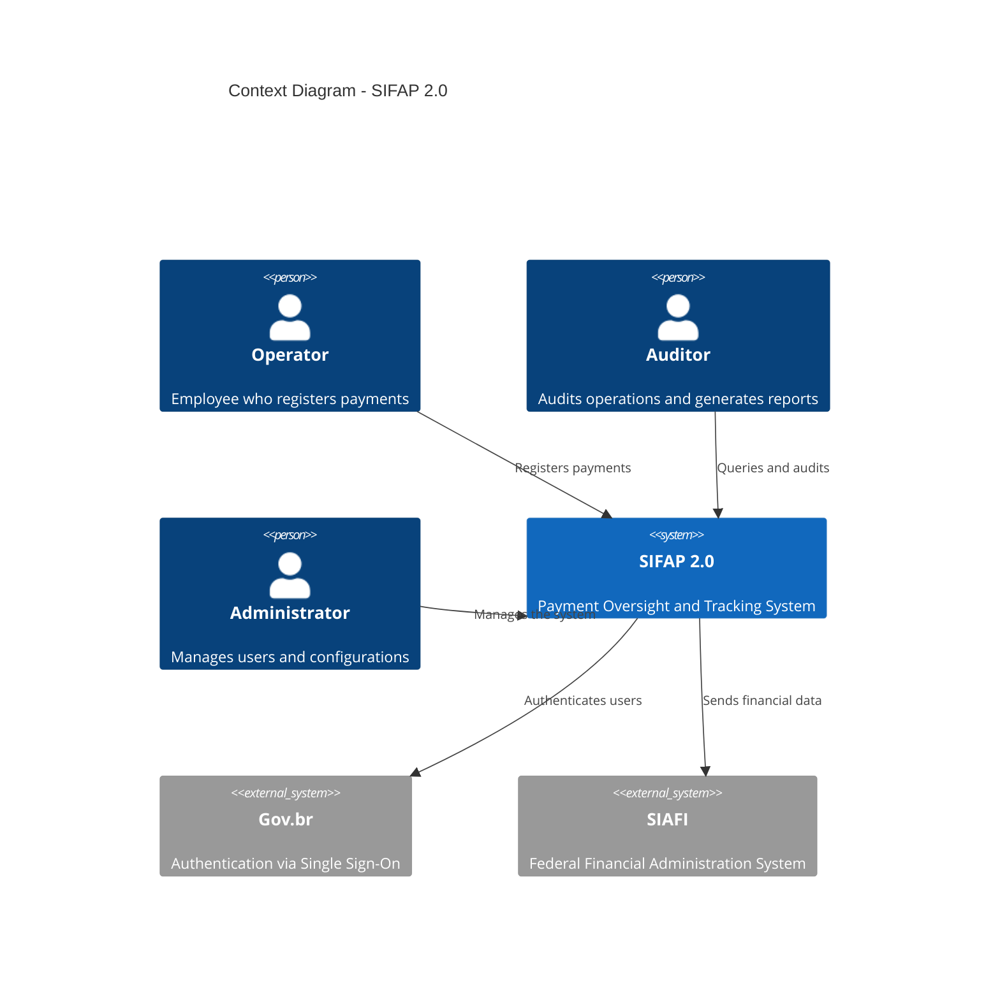
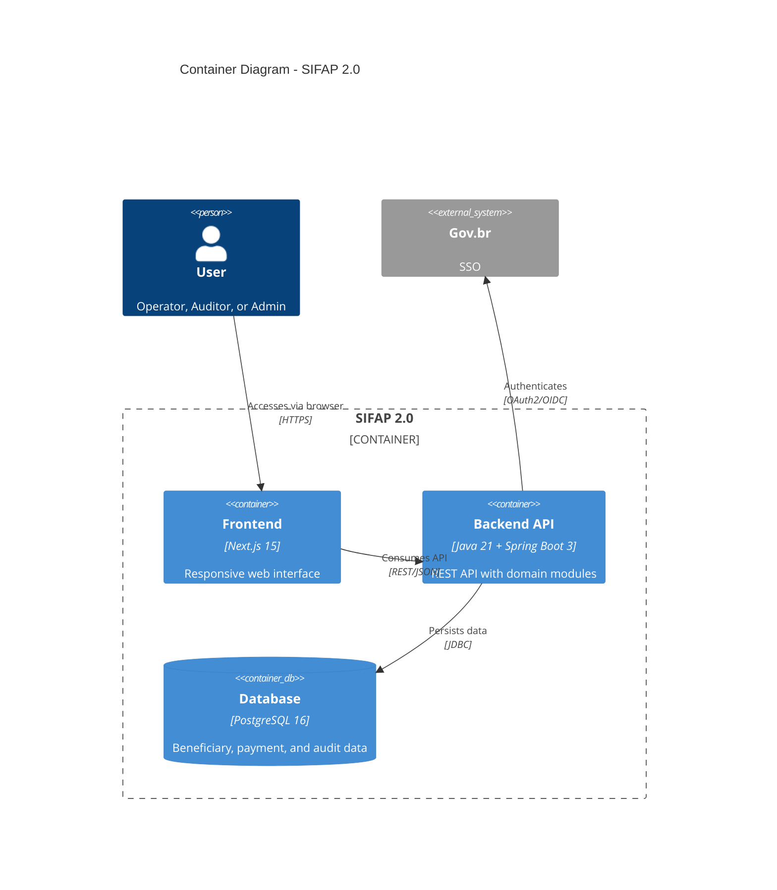

# Stage 2 - Modern Specification (3 hours)

> **HARD RULE.** Every EARS requirement in your `SPECIFICATION.md` must include a `source_legacy:` line pointing to a `.NSN` or `.ddm` file inside [`legacy/`](../legacy/), **or** be marked `source_legacy: "[GREENFIELD] <one-line justification>"`. CI rejects PRs that violate this. Facilitators sample at Handoff #2 (~14:30).
>
> Why? In the previous edition some teams wrote specs from the modernization brief alone, skipping legacy reading. Their prototypes lost real business rules. This time, traceability is the gate.

## Objective

Transform the discoveries from Stage 1 (archaeology) into a modern, structured technical specification, using EARS notation for requirements, ADRs for architecture decisions, and C4 diagrams for visualization. Every artifact must trace back to legacy evidence or declare its greenfield nature.

## Gold-Standard Reference

Before you start, study the reference specification:

```
03-spec-sifap-moderno/SPECIFICATION.md
```

This document shows the format and level of detail expected. Your specification should follow the same structure — including the `source_legacy:` field on every requirement.

---

## EARS Notation - Easy Approach to Requirements Syntax

EARS is a method for writing requirements without ambiguity. There are **6 patterns** that eliminate vague language. Specky validates each requirement programmatically via `sdd_validate_ears`.

### Pattern 1: Ubiquitous (always true)

> **The [system] shall [action].**

SIFAP example:
> The SIFAP shall store all payment records with a UTC timestamp.

Use when: the rule ALWAYS holds, with no condition.

### Pattern 2: Event-Driven (when something happens)

> **When [event], the [system] shall [action].**

SIFAP example:
> When a beneficiary is registered, the SIFAP shall validate the CPF using the modulo-11 algorithm from Receita Federal.

Use when: the rule only applies after a specific event.

### Pattern 3: State-Driven (while a condition holds)

> **While [condition], the [system] shall [action].**

SIFAP example:
> While a payment has status PENDING, the SIFAP shall allow cancellation by a user with the OPERATOR profile.

Use when: the rule only holds during a state.

### Pattern 4: Optional (if the user chooses)

> **Where [optional condition], the [system] shall [action].**

SIFAP example:
> Where the operator chooses to export the report, the SIFAP shall generate a CSV file with UTF-8 encoding.

Use when: the functionality is not mandatory — it depends on a user choice.

### Pattern 5: Unwanted Behavior (what shall NOT happen)

> **The [system] shall not [unwanted action].**

SIFAP example:
> The SIFAP shall not allow deletion of records from the audit table.
> The SIFAP shall not process payments for beneficiaries with status CANCELLED.

Use when: you need to document explicit restrictions or prohibitions.

### Pattern 6: Complex Scenario (combination of conditions)

> **While [condition], when [event], where [optional condition], the [system] shall [action].**

SIFAP example:
> While the beneficiary has status ACTIVE, when a payment cycle is generated in December, the SIFAP shall calculate the 13th salary using a differentiated formula.

Use when: multiple conditions combine.

### Example: BAD vs. GOOD requirement

| Bad (vague) | Good (EARS) |
|-------------|-------------|
| "The system must be secure" | "The SIFAP shall mask CPF in logs using the format \*\*\*.\*\*\*.XXX-\*\*" |
| "Payments must be processed" | "When a cycle is generated, the SIFAP shall create payment records for all beneficiaries with status ACTIVE" |
| "Complete audit" | "When any entity is changed, the SIFAP shall write an audit record with prior and posterior state in JSON format" |

### Tip: Every requirement must be TESTABLE

When writing a requirement, ask: "How would I test this automatically?" If you can't answer, the requirement is too vague.

| Requirement | Test |
|-------------|------|
| REQ-BEN-01: "The SIFAP shall validate CPF with modulo-11" | Test: invalid CPF returns error 400 |
| REQ-PAY-03: "When a cycle is generated, create payments for ACTIVE beneficiaries" | Test: 10 active + 2 suspended = 10 payments |
| REQ-AUD-01: "The SIFAP shall not allow DELETE on audit" | Test: DELETE returns error 403 |

---

## Complete Example: From Legacy Rule to Test

See the full cycle of a SIFAP rule from legacy code to automated test:

### 1. Rule found in Stage 1

In the program `CALCDSCT.NSN`, the team discovers:
```natural
* CHECK DEDUCTION CAP
IF #TIPO-DSCT NE 'J'
 IF #VLR-TOTAL-DSCT > (#VLR-BRUTO * 0.30)
 COMPUTE #VLR-TOTAL-DSCT = #VLR-BRUTO * 0.30
 END-IF
END-IF
```

**Interpretation**: Deductions have a cap of 30% of the gross amount, EXCEPT judicial deductions (type 'J'), which have no cap.

### 2. EARS requirement (Stage 2)

Using the **Unwanted Behavior** + **Event** patterns:

> **REQ-PAY-DSCT-01**: The SIFAP shall not allow the total of non-judicial deductions to exceed 30% of the payment's gross amount.
>
> **REQ-PAY-DSCT-02**: When a judicial deduction is applied, the SIFAP shall add the value to the total deductions without applying the 30% cap.

**Acceptance Criteria**:
- AC-01: Non-judicial deduction of 35% is truncated to 30%
- AC-02: Judicial deduction of 50% is accepted in full
- AC-03: Mix of judicial (20%) + non-judicial (25%) = 45% total accepted

### 3. Code (Stage 3)

```java
// payment/application/PaymentService.java
public BigDecimal calculateTotalDeductions(List<Deduction> deductions, BigDecimal grossAmount) {
 BigDecimal judicialTotal = deductions.stream()
 .filter(d -> "JUDICIAL".equals(d.type()))
 .map(Deduction::amount)
 .reduce(BigDecimal.ZERO, BigDecimal::add);
 
 BigDecimal otherTotal = deductions.stream()
 .filter(d -> !"JUDICIAL".equals(d.type()))
 .map(Deduction::amount)
 .reduce(BigDecimal.ZERO, BigDecimal::add);
 
 BigDecimal maxOther = grossAmount.multiply(new BigDecimal("0.30"));
 otherTotal = otherTotal.min(maxOther); // Cap at 30%
 
 return judicialTotal.add(otherTotal); // Judicial has no cap
}
```

### 4. Test (Stage 3)

```java
// payment/application/PaymentServiceTest.java
@Test
@DisplayName("REQ-PAY-DSCT-01: Non-judicial deductions capped at 30%")
void nonJudicialDeductionsCappedAt30Percent() {
 var deductions = List.of(new Deduction("TAX", new BigDecimal("350.00")));
 var gross = new BigDecimal("1000.00");
 
 var total = service.calculateTotalDeductions(deductions, gross);
 
 assertThat(total).isEqualByComparingTo("300.00"); // 35% capped to 30%
}

@Test
@DisplayName("REQ-PAY-DSCT-02: Judicial deductions bypass 30% cap")
void judicialDeductionsBypass30PercentCap() {
 var deductions = List.of(new Deduction("JUDICIAL", new BigDecimal("500.00")));
 var gross = new BigDecimal("1000.00");
 
 var total = service.calculateTotalDeductions(deductions, gross);
 
 assertThat(total).isEqualByComparingTo("500.00"); // No cap for judicial
}
```

### Traceability

| Artifact | ID | Reference |
|----------|-----|-----------|
| Legacy rule | BR-006 | CALCDSCT.NSN lines 101-105 |
| Requirement | REQ-PAY-DSCT-01/02 | SPECIFICATION.md |
| Code | PaymentService.calculateTotalDeductions() | payment/application/ |
| Test | PaymentServiceTest (2 methods) | payment/application/ |

**This cycle is what Specky enforces automatically via `sdd_check_sync`.** If the code diverges from the spec, the hook detects it.

---

## ADRs - Architecture Decision Records

ADRs document important architecture decisions. For each decision, create a file using the `ADR-TEMPLATE.md` template.

### When to create an ADR?

- Technology choice (database, framework, etc.)
- Architecture pattern (modular monolith vs. microservices)
- Migration strategy (big bang vs. incremental)
- Significant trade-offs (performance vs. simplicity)

### Expected ADRs (minimum 3)

1. **ADR-001**: Architecture choice (e.g., modular monolith)
2. **ADR-002**: Data migration strategy
3. **ADR-003**: Authentication and authorization approach
4. ADR-004 to ADR-005: Additional team decisions

---

## C4 Diagrams - Context, Containers, Components

Use Mermaid to create at least the **Context (C4-L1)** and **Containers (C4-L2)** diagrams.

### Example C4-L1: Context Diagram



### Example C4-L2: Container Diagram



---

## Scope Decisions

Use the `scope-decisions.md` file to record what will be migrated, dropped, or evolved.

---

## Specky Workflow - RECOMMENDED

> **What is Specky?** It is a CLI tool that installs inside your project (VS Code or Claude Code) a set of **agents** (specialized assistants you invoke in chat), **slash commands** (shortcuts like `/specky-migration`), and **MCP tools** (internal engines that validate your artifacts). You interact with the **agents** and **slash commands** — the MCP tools run underneath automatically.

**Specky** (https://github.com/paulasilvatech/specky) is the workshop's Spec-Driven Development engine. It validates your EARS requirements programmatically and enforces quality.

### Installation (if not in the devcontainer)

```bash
npm install -g specky-sdd@latest
specky install --ide=copilot # VS Code + GitHub Copilot
# OR
specky install --ide=claude # Claude Code
```

### Verify the installation

```bash
specky doctor # All checks should be green
specky status # Shows the current pipeline phase
```

### Specky Agents (invoke in chat)

| Agent | What it does | When to use |
|-------|--------------|-------------|
| `@specky-orchestrator` | Coordinates the full pipeline | To run the complete flow |
| `@spec-engineer` | Writes SPECIFICATION.md in EARS | Phase 2 - requirements |
| `@design-architect` | Generates DESIGN.md + C4 diagrams | Phase 4 - architecture |
| `@sdd-clarify` | Resolves EARS ambiguities | When a requirement is confusing |
| `@requirements-engineer` | Extracts requirements from docs/code | Convert Stage 1 → requirements |

### Slash Commands (shortcuts)

| Command | Description |
|---------|-------------|
| `/specky-greenfield` | New project from scratch |
| `/specky-brownfield` | Feature in an existing system |
| `/specky-migration` | Legacy modernization ← **USE THIS ONE** |
| `/specky-specify` | Specify EARS requirements |

### MCP Tools (used internally by the agents)

| Tool | What it does |
|------|--------------|
| `sdd_init` | Initialize the project in `.specs/NNN-feature/` |
| `sdd_discover` | Discovery phase (uses Stage 1 data) |
| `sdd_write_spec` | Generate a structured SPECIFICATION.md |
| `sdd_write_design` | Generate DESIGN.md with diagrams |
| `sdd_validate_ears` | **Validate requirements against the EARS pattern** (6 patterns) |
| `sdd_generate_diagram` | Generate C4 diagrams in Mermaid |
| `sdd_clarify` | Resolve ambiguities between requirements |

### Recommended workflow for Stage 2

```
1. @specky-orchestrator "run migration pipeline for SIFAP 2.0"
 → Creates the structure in .specs/001-sifap-modernization/

2. @requirements-engineer
 → Imports rules from Stage 1 and converts them to EARS

3. @spec-engineer
 → Generates a complete SPECIFICATION.md with 20-30 EARS requirements

4. sdd_validate_ears
 → Validates that each requirement follows one of the 6 EARS patterns

5. @design-architect
 → Generates DESIGN.md with C4 L1+L2 and ADRs

6. @sdd-clarify (if needed)
 → Resolves detected ambiguities
```

### If Specky is NOT available

Don't worry — write the EARS requirements manually in SPECIFICATION.md following the 6 patterns above. The format is plain text.

---

## Definition of Done

By the end of Stage 2, your team must have:

- [ ] Complete SPECIFICATION.md with EARS requirements (file: `02-spec-moderna/SPECIFICATION.md`)
- [ ] 3 to 5 ADRs (files: `02-spec-moderna/ADR-001.md`, `ADR-002.md`, etc.)
- [ ] C4 diagram in Mermaid (inside SPECIFICATION.md or in a separate file)
- [ ] Documented scope decisions (file: `02-spec-moderna/scope-decisions.md`)

## Prompts for Copilot Chat

1. "Convert this business rule to EARS notation: [describe the rule]"
2. "Create an ADR for the decision to use [technology X] instead of [technology Y]"
3. "Generate a C4 context diagram in Mermaid for a system that [description]"
4. "Review this EARS requirement and suggest clarity improvements"
5. "Which quality attributes (NFRs) should we consider for this system?"
6. "Based on these business rules, suggest the backend module structure"
7. "Create user stories from these EARS requirements"

## Golden Tip

Don't try to reinvent the wheel. The reference specification at `03-spec-sifap-moderno/SPECIFICATION.md` already has the ideal structure. Use it as a base and adapt it with your team's discoveries.
