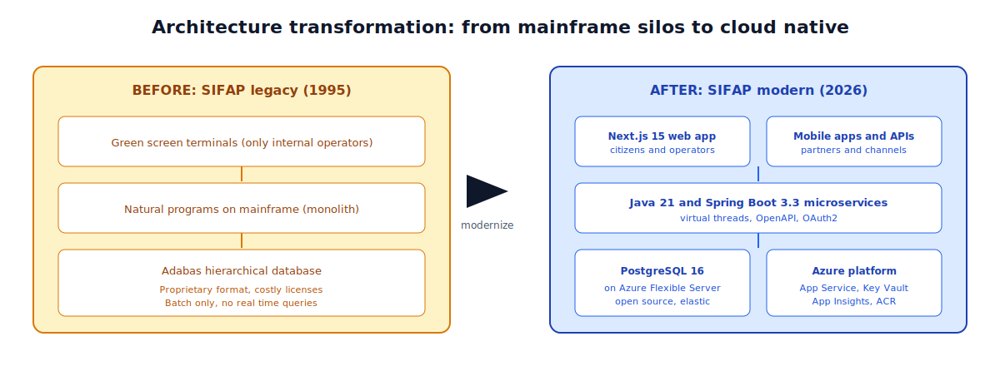
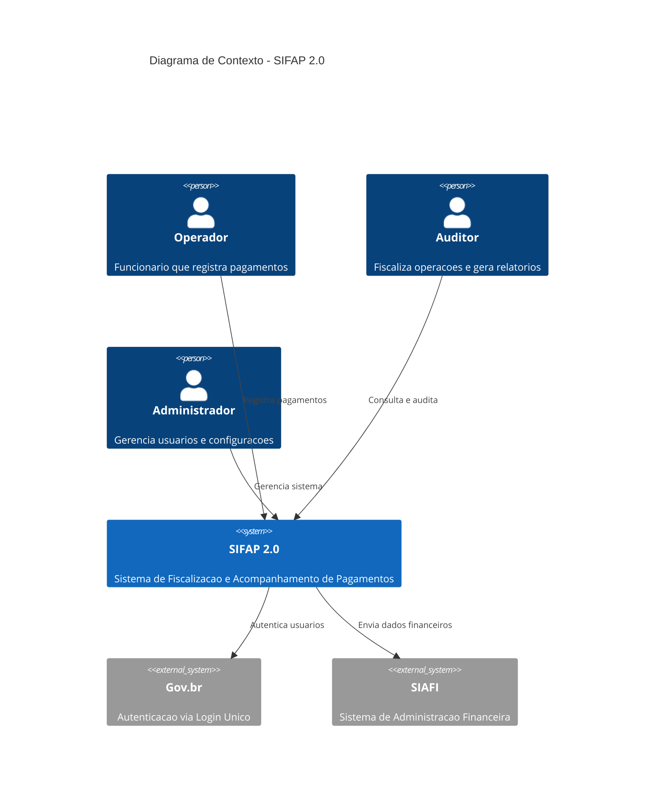
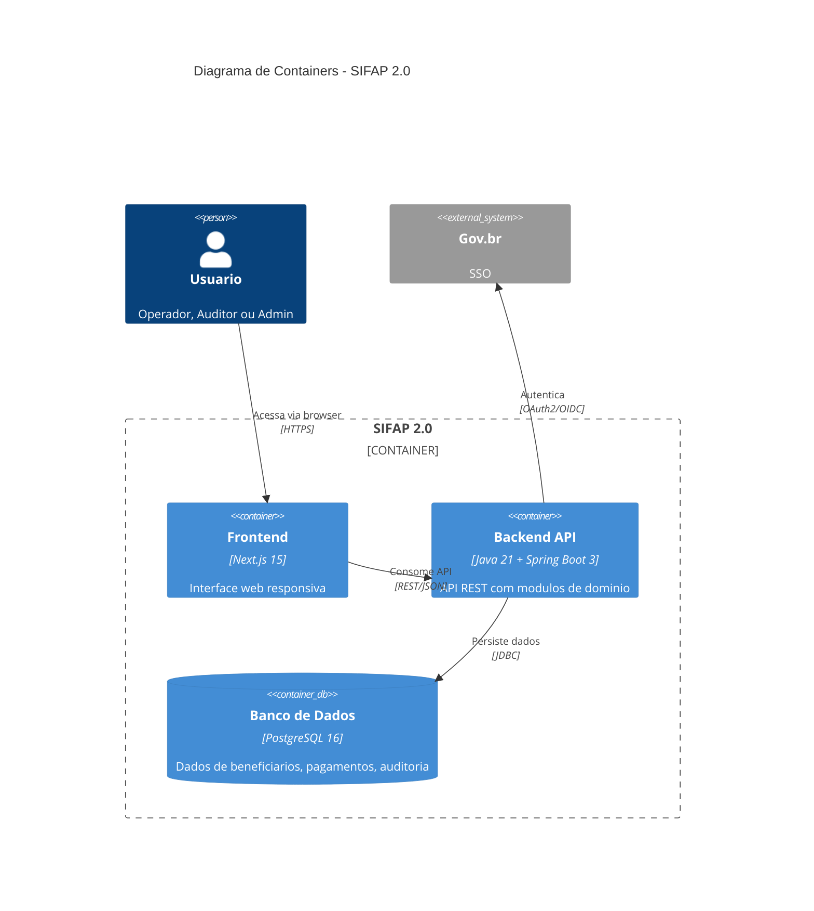

# 📜 Estagio 2: Especificacao Moderna

> ⏱️ **Duracao.** 3 horas. Aqui e onde a jornada muda de investigacao para desenho. O que voces descobriram no Estagio 1 vira linguagem formal, testavel e rastreavel.

<p align="center">
  
</p>

---

## 📑 Sumario

1. [Onde estamos na jornada](#-onde-estamos-na-jornada)
2. [Objetivo](#-objetivo)
3. [Referencia Gold Standard](#-referencia-gold-standard)
4. [Notacao EARS](#-notacao-ears-easy-approach-to-requirements-syntax)
5. [ADRs](#-adrs-architecture-decision-records)
6. [Diagramas C4](#-diagramas-c4)
7. [Specky SDD](#-specky-sdd)
8. [Criterio de Pronto](#-criterio-de-pronto)
9. [Navegacao](#-navegacao)

---

## 🎬 Onde estamos na jornada

Voces ja mapearam o SIFAP legado. Conhecem as regras, as dependencias, os misterios. Agora e hora de responder uma pergunta diferente: **como o novo SIFAP deve se comportar?**

A tentacao e pular direto para o codigo. Resistam. Uma hora desenhando spec economiza 8 horas depurando codigo que ninguem entende. O estagio 2 entrega tres artefatos que alimentam o estagio 3.

> 💡 **Analogia.** Escrever EARS e como escrever uma receita de cozinha precisa. "Sal a gosto" e ambiguo. "5 gramas de sal" e testavel. Requisitos bons sao receitas precisas que qualquer desenvolvedor e qualquer teste automatizado consegue seguir.

---

## 🎯 Objetivo

Transformar as descobertas do Estagio 1 (arqueologia) em uma especificacao tecnica moderna e estruturada, usando notacao EARS para requisitos, ADRs para decisoes de arquitetura, e diagramas C4 para visualizacao.

## ⭐ Referencia Gold Standard

Antes de comecar, estude a especificacao de referencia:

```
03-spec-sifap-moderno/SPECIFICATION.md
```

Este documento mostra o formato e nivel de detalhe esperados. Sua especificacao deve seguir a mesma estrutura.

---

## 📐 Notacao EARS (Easy Approach to Requirements Syntax)

EARS e um metodo para escrever requisitos sem ambiguidade. Sao **6 padroes** que eliminam linguagem vaga. O Specky valida cada requisito programaticamente via `sdd_validate_ears`.

### Padrao 1: Ubiquo (sempre verdadeiro)

> **O [sistema] deve [acao].**

Exemplo SIFAP:
> O SIFAP deve armazenar todos os registros de pagamento com timestamp UTC.

Use quando: a regra vale SEMPRE, sem condicao.

### Padrao 2: Dirigido por Evento (quando algo acontece)

> **Quando [evento], o [sistema] deve [acao].**

Exemplo SIFAP:
> Quando um beneficiario e cadastrado, o SIFAP deve validar o CPF usando o algoritmo modulo-11 da Receita Federal.

Use quando: a regra so se aplica apos um evento especifico.

### Padrao 3: Dirigido por Estado (enquanto uma condicao e verdadeira)

> **Enquanto [condicao], o [sistema] deve [acao].**

Exemplo SIFAP:
> Enquanto um pagamento estiver com status PENDENTE, o SIFAP deve permitir cancelamento por usuario com perfil OPERADOR.

Use quando: a regra vale apenas durante um estado.

### Padrao 4: Opcional (se o usuario escolher)

> **Se [condicao opcional], o [sistema] deve [acao].**

Exemplo SIFAP:
> Se o operador escolher exportar o relatorio, o SIFAP deve gerar arquivo CSV com encoding UTF-8.

Use quando: a funcionalidade nao e obrigatoria - depende de escolha do usuario.

### Padrao 5: Comportamento Indesejado (o que NAO deve acontecer)

> **O [sistema] nao deve [acao indesejada].**

Exemplo SIFAP:
> O SIFAP nao deve permitir exclusao de registros da tabela de auditoria.
> O SIFAP nao deve processar pagamentos para beneficiarios com status CANCELADO.

Use quando: voce precisa documentar restricoes ou proibicoes explicitas.

### Padrao 6: Cenario Complexo (combinacao de condicoes)

> **Enquanto [condicao], quando [evento], se [condicao opcional], o [sistema] deve [acao].**

Exemplo SIFAP:
> Enquanto o beneficiario estiver com status ATIVO, quando um ciclo de pagamento for gerado no mes de dezembro, o SIFAP deve calcular o 13o salario usando formula diferenciada.

Use quando: multiplas condicoes se combinam.

### Exemplo: Requisito RUIM vs. BOM

| Ruim (vago) | Bom (EARS) |
|-------------|-----------|
| "O sistema deve ser seguro" | "O SIFAP deve mascarar CPF nos logs usando formato \*\*\*.\*\*\*.XXX-\*\*" |
| "Pagamentos devem ser processados" | "Quando um ciclo e gerado, o SIFAP deve criar registros de pagamento para todos os beneficiarios com status ATIVO" |
| "Auditoria completa" | "Quando qualquer entidade e alterada, o SIFAP deve gravar registro de auditoria com estado anterior e posterior em formato JSON" |

### Dica: Cada requisito deve ser TESTAVEL

Ao escrever um requisito, pergunte: "Como eu testaria isso automaticamente?" Se nao consegue responder, o requisito esta vago demais.

| Requisito | Teste |
|-----------|-------|
| REQ-BEN-01: "O SIFAP deve validar CPF com modulo-11" | Teste: CPF invalido retorna erro 400 |
| REQ-PAY-03: "Quando ciclo gerado, criar pagamentos para ATIVOS" | Teste: 10 ativos + 2 suspensos = 10 pagamentos |
| REQ-AUD-01: "SIFAP nao deve permitir DELETE em auditoria" | Teste: DELETE retorna erro 403 |

---

## 🔄 Exemplo Completo: Da Regra Legado ao Teste

Veja o ciclo completo de uma regra do SIFAP legado ate o teste automatizado:

### 1. Regra encontrada no Estagio 1

No programa `CALCDSCT.NSN`, o time descobre:
```natural
* VERIF TETO DESCONTO
IF #TIPO-DSCT NE 'J'
  IF #VLR-TOTAL-DSCT > (#VLR-BRUTO * 0.30)
    COMPUTE #VLR-TOTAL-DSCT = #VLR-BRUTO * 0.30
  END-IF
END-IF
```

**Interpretacao**: Descontos tem teto de 30% do valor bruto, EXCETO descontos judiciais (tipo 'J') que nao tem teto.

### 2. Requisito EARS (Estagio 2)

Usando padrao **Comportamento Indesejado** + **Evento**:

> **REQ-PAY-DSCT-01**: O SIFAP nao deve permitir que o total de descontos nao-judiciais exceda 30% do valor bruto do pagamento.
>
> **REQ-PAY-DSCT-02**: Quando um desconto judicial e aplicado, o SIFAP deve somar o valor ao total de descontos sem aplicar o teto de 30%.

**Acceptance Criteria**:
- AC-01: Desconto nao-judicial de 35% e truncado para 30%
- AC-02: Desconto judicial de 50% e aceito integralmente
- AC-03: Mix de judicial (20%) + nao-judicial (25%) = 45% total aceito

### 3. Codigo (Estagio 3)

```java
// payment/application/PaymentService.java
public BigDecimal calculateTotalDeductions(List<Deduction> deductions, BigDecimal grossAmount) {
    BigDecimal judicialTotal = deductions.stream()
        .filter(d -> "JUDICIAL".equals(d.type()))
        .map(Deduction::amount)
        .reduce(BigDecimal.ZERO, BigDecimal::add);
    
    BigDecimal otherTotal = deductions.stream()
        .filter(d -> !"JUDICIAL".equals(d.type()))
        .map(Deduction::amount)
        .reduce(BigDecimal.ZERO, BigDecimal::add);
    
    BigDecimal maxOther = grossAmount.multiply(new BigDecimal("0.30"));
    otherTotal = otherTotal.min(maxOther); // Cap at 30%
    
    return judicialTotal.add(otherTotal); // Judicial has no cap
}
```

### 4. Teste (Estagio 3)

```java
// payment/application/PaymentServiceTest.java
@Test
@DisplayName("REQ-PAY-DSCT-01: Non-judicial deductions capped at 30%")
void nonJudicialDeductionsCappedAt30Percent() {
    var deductions = List.of(new Deduction("TAX", new BigDecimal("350.00")));
    var gross = new BigDecimal("1000.00");
    
    var total = service.calculateTotalDeductions(deductions, gross);
    
    assertThat(total).isEqualByComparingTo("300.00"); // 35% capped to 30%
}

@Test
@DisplayName("REQ-PAY-DSCT-02: Judicial deductions bypass 30% cap")
void judicialDeductionsBypass30PercentCap() {
    var deductions = List.of(new Deduction("JUDICIAL", new BigDecimal("500.00")));
    var gross = new BigDecimal("1000.00");
    
    var total = service.calculateTotalDeductions(deductions, gross);
    
    assertThat(total).isEqualByComparingTo("500.00"); // No cap for judicial
}
```

### Rastreabilidade

| Artefato | ID | Referencia |
|----------|-----|-----------|
| Regra legado | BR-006 | CALCDSCT.NSN linhas 101-105 |
| Requisito | REQ-PAY-DSCT-01/02 | SPECIFICATION.md |
| Codigo | PaymentService.calculateTotalDeductions() | payment/application/ |
| Teste | PaymentServiceTest (2 metodos) | payment/application/ |

**Este ciclo e o que o Specky enforca automaticamente via `sdd_check_sync`.** Se o codigo divergir da spec, o hook detecta.

---

## 🏛️ ADRs (Architecture Decision Records)

ADRs documentam decisoes de arquitetura importantes. Para cada decisao, crie um arquivo usando o template `ADR-TEMPLATE.md`.

### Quando criar um ADR?

- Escolha de tecnologia (banco de dados, framework, etc.)
- Padrao de arquitetura (monolito modular vs. microsservicos)
- Estrategia de migracao (big bang vs. incremental)
- Trade-offs significativos (performance vs. simplicidade)

### ADRs esperados (minimo 3)

1. **ADR-001**: Escolha da arquitetura (ex.: monolito modular)
2. **ADR-002**: Estrategia de migracao de dados
3. **ADR-003**: Abordagem de autenticacao e autorizacao
4. ADR-004 a ADR-005: Decisoes adicionais do time

---

## 📊 Diagramas C4 (Context, Containers, Components)

Use Mermaid para criar pelo menos o diagrama de **Contexto (C4-L1)** e **Containers (C4-L2)**.

### Exemplo C4-L1: Diagrama de Contexto



### Exemplo C4-L2: Diagrama de Containers



---

## 🎯 Decisoes de Escopo

Use o arquivo `scope-decisions.md` para registrar o que sera migrado, descartado ou evoluido.

---

## 🤖 Workflow com Specky (recomendado)

> **O que e Specky?** E uma ferramenta CLI que instala dentro do seu projeto (VS Code ou Claude Code) um conjunto de **agents** (assistentes especializados que voce invoca no chat), **slash commands** (atalhos como `/specky-migration`), e **MCP tools** (motores internos que validam seus artefatos). Voce interage com os **agents** e **slash commands** - os MCP tools rodam por baixo automaticamente.

**Specky** (https://github.com/paulasilvatech/specky) e o motor de Spec-Driven Development do hackathon. Ele valida seus requisitos EARS programaticamente e enforça qualidade.

### Instalacao (se nao estiver no devcontainer)

```bash
npm install -g specky-sdd@latest
specky install --ide=copilot   # VS Code + GitHub Copilot
# OU
specky install --ide=claude    # Claude Code
```

### Verificar instalacao

```bash
specky doctor    # Todos os checks devem ser verdes
specky status    # Mostra fase atual do pipeline
```

### Agents do Specky (invocar no chat)

| Agent | O que faz | Quando usar |
|-------|----------|-------------|
| `@specky-orchestrator` | Coordena todo o pipeline | Para rodar fluxo completo |
| `@spec-engineer` | Escreve SPECIFICATION.md em EARS | Fase 2 - requisitos |
| `@design-architect` | Gera DESIGN.md + diagramas C4 | Fase 4 - arquitetura |
| `@sdd-clarify` | Resolve ambiguidades EARS | Quando requisito e confuso |
| `@requirements-engineer` | Extrai requisitos de docs/codigo | Converter Stage 1 → requisitos |

### Slash Commands (atalhos)

| Comando | Descricao |
|---------|-----------|
| `/specky-greenfield` | Novo projeto do zero |
| `/specky-brownfield` | Feature em sistema existente |
| `/specky-migration` | Modernizacao de legado ← **USE ESTE** |
| `/specky-specify` | Especificar requisitos EARS |

### MCP Tools (usados internamente pelos agents)

| Tool | O que faz |
|------|----------|
| `sdd_init` | Inicializar projeto em `.specs/NNN-feature/` |
| `sdd_discover` | Fase de descoberta (usa dados do Estagio 1) |
| `sdd_write_spec` | Gerar SPECIFICATION.md estruturada |
| `sdd_write_design` | Gerar DESIGN.md com diagramas |
| `sdd_validate_ears` | **Validar requisitos no padrao EARS** (6 padroes) |
| `sdd_generate_diagram` | Gerar diagramas C4 em Mermaid |
| `sdd_clarify` | Resolver ambiguidades entre requisitos |

### Workflow recomendado para o Estagio 2

```
1. @specky-orchestrator "run migration pipeline for SIFAP 2.0"
   → Cria estrutura em .specs/001-sifap-modernization/

2. @requirements-engineer
   → Importa regras do Estagio 1 e converte para EARS

3. @spec-engineer
   → Gera SPECIFICATION.md completa com 20-30 requisitos EARS

4. sdd_validate_ears
   → Valida que cada requisito segue um dos 6 padroes EARS

5. @design-architect
   → Gera DESIGN.md com C4 L1+L2 e ADRs

6. @sdd-clarify (se necessario)
   → Resolve ambiguidades detectadas
```

### Se o Specky NAO estiver disponivel

Nao se preocupe - escreva os requisitos EARS manualmente no SPECIFICATION.md seguindo os 6 padroes acima. O formato e texto simples.

---

## ✅ Criterio de Pronto

Ao final do Estagio 2, seu time deve ter:

- [ ] SPECIFICATION.md completa com requisitos em EARS (arquivo: `02-spec-moderna/SPECIFICATION.md`)
- [ ] 3 a 5 ADRs (arquivos: `02-spec-moderna/ADR-001.md`, `ADR-002.md`, etc.)
- [ ] Diagrama C4 em Mermaid (dentro da SPECIFICATION.md ou arquivo separado)
- [ ] Decisoes de escopo documentadas (arquivo: `02-spec-moderna/scope-decisions.md`)

## 💬 Prompts para Copilot Chat

1. "Converta esta regra de negocio para notacao EARS: [descreva a regra]"
2. "Crie um ADR para a decisao de usar [tecnologia X] em vez de [tecnologia Y]"
3. "Gere um diagrama C4 de contexto em Mermaid para um sistema que [descricao]"
4. "Revise este requisito EARS e sugira melhorias de clareza"
5. "Quais atributos de qualidade (NFRs) devemos considerar para este sistema?"
6. "Com base nestas regras de negocio, sugira a estrutura de modulos do backend"
7. "Crie user stories a partir destes requisitos EARS"

## 🏆 Dica de Ouro

Nao tente reinventar a roda. A especificacao de referencia em `03-spec-sifap-moderno/SPECIFICATION.md` ja tem a estrutura ideal. Use-a como base e adapte com as descobertas do seu time.

---

## 🧭 Navegacao

| ⬅️ Anterior | 🏠 Home | ➡️ Proximo |
|---|---|---|
| [🔍 Estagio 1: Arqueologia](../01-arqueologia/GUIDE.md) | [README do kit](../README.md) | [💻 Estagio 3: Implementacao](../03-implementacao/GUIDE.md) |

> Autoria: Paula Silva, Americas Software GBB, Microsoft.
