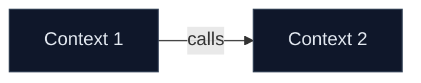

<!-- How to use: Run /carve-bounded-contexts. Clone the context block for each. -->
# Bounded Context Map

## Hypothesis Evaluations
### <!-- placeholder: Name --> — <!-- placeholder: ACCEPTED/REJECTED -->
| Criterion | Rating | Evidence |
|---|---|---|
| Cohesion | <!-- placeholder --> | <!-- placeholder --> |
| Coupling | <!-- placeholder --> | <!-- placeholder --> |
| Change frequency | <!-- placeholder --> | <!-- placeholder --> |

## Final Bounded Contexts
### <!-- placeholder: Context Name -->
- **Responsibility:** <!-- placeholder -->
- **Owned data:** <!-- placeholder -->
- **Public interface:** <!-- placeholder -->
- **Why its own context:** <!-- placeholder -->

## Inter-Context Communication
| From | To | Mechanism | Data |
|---|---|---|---|

---
**Definition of Done reminder:** Hypotheses evaluated, rejections documented, 2-5 contexts named, Mermaid renders.
