# Team Repository Kit

> 🌐 **Choose your language / Escolha seu idioma / Elige tu idioma:**
> - **English** → [`en/README.md`](en/README.md)
> - **Português (BR)** → [`pt-br/README.md`](pt-br/README.md)
> - **Español (LATAM)** → [`es/README.md`](es/README.md)
>
> Each locale contains the same 35 didactic docs. Shared assets (`legacy/`, `persona-kits/`, `.github/`, `scripts/`, `.devcontainer/`) live at this root and are not duplicated per language.

> **START HERE** if you are a workshop participant.
>
> 1. Pick your language above, OR read [`TEAM-FLOW.md`](TEAM-FLOW.md) (English, kit root) — how the 5 of you cover 10 personas in 5 pairs (10 minutes)
> 2. Read your two persona cards in [`personas/`](personas/) (15 minutes)
> 3. Open the Stage 1 guide at [`01-arqueologia/GUIDE.md`](01-arqueologia/GUIDE.md)

## Table of Contents

- [Team Repository Kit](#team-repository-kit)
 - [Table of Contents](#table-of-contents)
 - [Navigation](#navigation)
 - [1. Overview](#1-overview)
 - [2. The 5 Pairs and 10 Personas](#2-the-5-pairs-and-10-personas)
 - [3. Stage Flow](#3-stage-flow)
 - [4. Folder Structure](#4-folder-structure)
 - [5. How to Use This Kit](#5-how-to-use-this-kit)
 - [6. References](#6-references)

## Navigation

| Previous | Home | Next |
|----------|------|------|
| [05 - Terraform Azure](../05-terraform-azure/README.md) | [Workspace Root](../README.md) | [07 - Facilitation Playbook](../07-playbook-facilitacao/README.md) |

---

## 1. Overview

This kit is distributed to each team at the start of the workshop. It provides a ready-to-use repository scaffold with GitHub templates, Copilot instructions, 10 persona cards, 10 matching Copilot agent kits, and stage-by-stage workflow guides — so teams spend their time learning and building, not configuring.

> **Think of this kit like a toolbox.** Each persona has its own specialized tools (Copilot agents, prompts, skills), and each stage has its own workflow. Your job is to pick up the right tool at the right time and hand off cleanly to the next pair.

**this edition:** 20 teams · 5 people per team · 2 personas per person (1 pair) · 5 pairs covering the full SDLC.

---

## 2. The 5 Pairs and 10 Personas

Each team has 5 people. Each person picks **one pair** (two personas) and stays in that pair the whole day. The two personas in a pair are co-responsible — no internal handoff, continuous collaboration. Read **both** of your persona cards in [`personas/`](personas/) before the event starts.

| # | Pair | Personas (one person) | Owns | SDLC phase | Hands off to |
|---|------|-----------------------|------|------------|--------------|
| 1 | **Vision** | Product Owner + Requirements Engineer | Scope, priorities, EARS specs with REQ-IDs | Discovery + Specification (S1, S2) | Pair 2 |
| 2 | **Architecture** | Enterprise Architect + Software Architect | C4 L1/L2/L3, bounded contexts, ADRs | Specification + Design (S2) | Pairs 3 & 4 |
| 3 | **Implementation** | Technical Lead + Developer | Code standards, Java + TypeScript, PR review, agent orchestration | Implementation + Evolution (S3, S4) | Pair 5 |
| 4 | **Quality** | DBA + QA Engineer | Schema, Flyway migrations, BDD scenarios, coverage gates | Implementation (S3) | Pair 5 |
| 5 | **Operations** | DevOps Engineer + Tech Writer | Terraform, CI/CD, glossary, ADR clarity, runbook | Cross-cutting + Evolution (S1–S4) | Demo |

> **Each persona has a corresponding Copilot agent kit in [`persona-kits/`](persona-kits/).** The kit gives you a pre-configured agent (`.github/agents/*.agent.md`), prompts (`.github/prompts/*.prompt.md`), and skills (`.github/skills/*/SKILL.md`) — copy **both** of your personas' kits into your team repo's `.github/` folder.

> **Coordination is in [`TEAM-FLOW.md`](TEAM-FLOW.md)**: pair-level handoff diagrams, daily timeline, first-30-minutes onboarding, and "stuck for 20 minutes" escalation rules.

---

## 3. Stage Flow

The 8-hour event flows through 4 stages. Each persona contributes at every stage, but the **lead persona** changes per stage.

```mermaid
flowchart LR
 subgraph S1["Stage 1 — Archaeology (60 min)<br/>Lead: Pair 1 (Vision) + Pair 5 (Operations)"]
 A1["Read legacy SIFAP<br/>(Natural + Adabas)<br/>with Copilot Chat"]
 A2["Build glossary<br/>+ business-rules catalog"]
 A3["Discover hidden<br/>mysteries"]
 end
 subgraph S2["Stage 2 — Modern Spec (45 min)<br/>Lead: Pair 2 (Architecture)"]
 B1["EARS specifications<br/>with Spec-Kit"]
 B2["C4 diagrams<br/>+ ADRs"]
 B3["Bounded contexts<br/>+ API contracts"]
 end
 subgraph S3["Stage 3 — Implementation (120 min)<br/>Lead: Pair 3 (Implementation) + Pair 4 (Quality)"]
 C1["Java backend<br/>(Copilot Agent)"]
 C2["Next.js frontend<br/>(Copilot Agent)"]
 C3["Tests + migrations<br/>+ green CI"]
 end
 subgraph S4["Stage 4 — Evolution (45 min)<br/>Lead: Pair 5 (Operations) + Pair 3 (Implementation)"]
 D1["Terraform IaC<br/>+ GitHub Actions"]
 D2["Agent-mode<br/>delegation via Issues"]
 D3["Demo prep<br/>+ retrospective"]
 end

 S1 --> S2 --> S3 --> S4
```



---

## 4. Folder Structure

### Inside the kit (what you own and edit)

| Path | Purpose |
|------|---------|
| [`TEAM-FLOW.md`](TEAM-FLOW.md) | **READ FIRST.** Daily timeline, handoffs, escalation rules |
| [`legacy/`](legacy/) | **MANDATORY EXPLORATION.** Bundled copy of the SIFAP legacy (15 .NSN programs + 4 DDMs + 3 outdated docs). Every EARS in Stage 2 must trace back here. |
| [`01-arqueologia/`](01-arqueologia/) | Stage 1 — legacy code archaeology guide, templates, and the [`LEGACY-EXPLORATION-CHECKLIST.md`](01-arqueologia/LEGACY-EXPLORATION-CHECKLIST.md) hard gate |
| [`02-spec-moderna/`](02-spec-moderna/) | Stage 2 — EARS specification (every REQ needs `source_legacy:`), ADR template, scope decisions |
| [`03-implementacao/`](03-implementacao/) | Stage 3 — implementation scaffolding and Copilot Agent prompts |
| [`04-evolucao/`](04-evolucao/) | Stage 4 — Terraform IaC and CI/CD evolution guide |
| [`cheat-sheets/`](cheat-sheets/) | Quick-reference cards: Copilot 3 modes, Specky, model routing |
| [`personas/`](personas/) | The 10 persona cards (read yours before starting) |
| [`persona-kits/`](persona-kits/) | 10 Copilot agent kits (one per persona) with agents, prompts, instructions, and skills |
| [`plugins/`](plugins/) | Optional integrations (GitHub Issues, Azure Boards) |
| [`scripts/`](scripts/) | `setup.sh` (bootstrap) and `check.sh` (run all CI gates locally) |
| [`docs/`](docs/) | Team-curated docs: ADRs, glossary, runbook (Tech Writer owns) |
| [`.specs/`](.specs/) | Specky SDD pipeline artifacts (one folder per feature) |
| [`.github/`](.github/) | Workflows (incl. `legacy-traceability` gate), issue templates, PR template, copilot-instructions |
| [`.devcontainer/`](.devcontainer/) | Pre-configured dev environment (Java 21, Node 20, Docker) |

> **Why a copy of the legacy is bundled.** In the previous workshop edition some teams wrote specs without reading the legacy code. Their prototypes lost real business rules from 29 years of SIFAP. This time the legacy lives next to you and Stage 2 cannot close without traceability.

### Reference materials (cloned read-only by `scripts/setup.sh`)

After running `./scripts/setup.sh`, the following symlinks point to the main workshop repo:

| Symlink | Source | Purpose |
|---------|--------|---------|
| `prototype/` | [`04-prototipo-sifap-moderno/`](https://github.com/paulasilvatech/workshop-legacy-modernization-datacorp/tree/main/04-prototipo-sifap-moderno) | Reference Java + Next.js prototype — clone into your repo as starting point |
| `infra/` | [`05-terraform-azure/`](https://github.com/paulasilvatech/workshop-legacy-modernization-datacorp/tree/main/05-terraform-azure) | Terraform Azure modules — copy what you need into your `infra/` folder |

> **Don't edit anything inside `legacy/`.** Treat it as a museum exhibit.
> The prototype and infra are starting points — copy the parts you need into your team's working tree.

---

## 5. How to Use This Kit

```bash
# 1. Copy the kit into your team's empty repository
cp -r 06-kit-repositorio-times/. ~/team-XX-repo/

# 2. Bootstrap (clones reference materials, sets up symlinks, verifies tools)
cd ~/team-XX-repo
./scripts/setup.sh

# 3. Open in VS Code
code .

# Then: Ctrl+Shift+P > "Dev Containers: Reopen in Container"
```

Once inside the devcontainer:

```bash
# 1. Read the team flow first (10 minutes)
cat TEAM-FLOW.md

# 2. Read BOTH of your persona cards (15 minutes) — one per persona in your pair
cat personas/XX-persona-A.md
cat personas/YY-persona-B.md

# 3. Copy BOTH Copilot agent kits into your repo's .github/
cp -r persona-kits/XX-persona-A/.github/* .github/
cp -r persona-kits/YY-persona-B/.github/* .github/

# 4. Open the Stage 1 guide and start
cat 01-arqueologia/GUIDE.md
```

---

## 6. References

- [Workshop Blueprint](../01-blueprint/WORKSHOP-BLUEPRINT.md) — overall event design
- [SIFAP Modern Specification](../03-spec-sifap-moderno/SPECIFICATION.md) — gold-standard spec example
- [Reference Prototype](../04-prototipo-sifap-moderno/README.md) — running Java + Next.js codebase
- [Facilitator Playbook](../07-playbook-facilitacao/README.md) — what facilitators are doing
- [Evaluation Rubric](../07-playbook-facilitacao/EVALUATION-RUBRIC.md) — how your team is scored

— Paula
