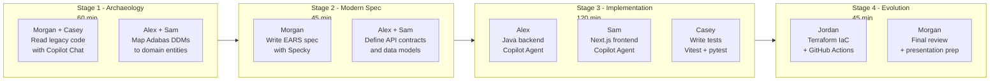

# Team Repository Kit

> **START HERE** if you are a hackathon participant. Read your persona card in `personas/`, then open the Stage 1 guide at `01-arqueologia/GUIDE.md`.

## Table of Contents

- [1. Overview](#1-overview)
- [2. Your Team Personas](#2-your-team-personas)
- [3. Stage Flow](#3-stage-flow)
- [4. Folder Structure](#4-folder-structure)
- [5. How to Use This Kit](#5-how-to-use-this-kit)
- [6. References](#6-references)

## Navigation

| Previous | Home | Next |
|----------|------|------|
| [05 - Terraform Azure](../05-terraform-azure/README.md) | [Workspace Root](../README.md) | [07 - Facilitation Playbook](../07-playbook-facilitacao/README.md) |

---

## 1. Overview

This kit is distributed to each team at the start of the hackathon. It provides a ready-to-use repository scaffold with GitHub templates, Copilot instructions, personas, and stage-by-stage workflow cheat sheets - so teams spend their time coding, not configuring.

> **Think of this kit like a toolbox.** Each persona has their own set of specialized tools (Copilot prompts, cheat sheets, guides), and each stage has its own workflow. Your job is to pick up the right tool at the right time.

---

## 2. Your Team Personas

Each team of 10 has 5 defined personas (2 people per persona). Personas define your role, your primary tool, and what you are responsible for delivering.

| Persona | Role | Primary Tool | Delivers |
|---------|------|-------------|---------|
| **Alex** | Backend Engineer | Java 21 + Spring Boot | REST API, domain models, services |
| **Sam** | Frontend Engineer | Next.js 15 + TypeScript | UI components, pages, API integration |
| **Jordan** | DevOps Engineer | Terraform + GitHub Actions | IaC modules, CI/CD pipeline |
| **Morgan** | Tech Lead | Specky SDD + Copilot | Architecture decisions, ADRs, code review |
| **Casey** | QA Engineer | Vitest + pytest | Test stubs, coverage report, quality gates |

> **Not sure which persona you are?** Check the `personas/` folder - each file describes your persona in detail, including what prompts to use with Copilot.

---

## 3. Stage Flow



---

## 4. Folder Structure

| Path | Purpose |
|------|---------|
| [`01-arqueologia/`](01-arqueologia/) | Stage 1 - legacy code archaeology guides and Copilot prompts |
| [`02-spec-moderna/`](02-spec-moderna/) | Stage 2 - EARS specification templates and ADR scaffolds |
| [`03-implementacao/`](03-implementacao/) | Stage 3 - implementation scaffolding and Copilot Agent prompts |
| [`04-evolucao/`](04-evolucao/) | Stage 4 - Terraform guides and CI/CD templates |
| [`cheat-sheets/`](cheat-sheets/) | Quick-reference cards for each stage and each persona |
| [`personas/`](personas/) | Persona definitions - read yours before starting |
| [`.github/`](.github/) | Issue templates, PR template, and Copilot instructions |

---

## 5. How to Use This Kit

Copy this entire folder into your team's repository before the event starts. The `.github/` templates should not be modified - they ensure consistent issue and PR formats across all teams.

```bash
# Copy kit into a new team repository
cp -r 06-kit-repositorio-times/ ~/team-01-repo/

# Open your devcontainer (VS Code)
code ~/team-01-repo
# Then: Ctrl+Shift+P > "Dev Containers: Reopen in Container"
```

Once inside the devcontainer, start with Stage 1:

```bash
# Open the Stage 1 guide
cat 01-arqueologia/GUIDE.md
```

---

## 6. References

- [Hackathon Blueprint](../01-blueprint/HACKATHON-BLUEPRINT.md)
- [SIFAP Modern Specification](../03-spec-sifap-moderno/README.md)
- [Reference Prototype](../04-prototipo-sifap-moderno/README.md)
- [Facilitator Playbook](../07-playbook-facilitacao/README.md)
