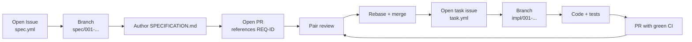

# Setup Guide — From Zero to Coding

> **You are 10 people.** You have one workday. The goal of this guide is to take you from "no repository yet" to "first commit pushed and Copilot working" in **30 minutes**.
>
> Read this **once, together, at 09:00**. One person screen-shares, the rest follow on their laptops.

## Table of Contents

- [1. Prerequisites — what every laptop needs](#1-prerequisites--what-every-laptop-needs)
- [2. Step 1 — Create the team's GitHub repository](#2-step-1--create-the-teams-github-repository)
- [3. Step 2 — Bootstrap your repo from this kit](#3-step-2--bootstrap-your-repo-from-this-kit)
- [4. Step 3 — Configure `.github/` and team conventions](#4-step-3--configure-github-and-team-conventions)
- [5. Step 4 — Activate GitHub Copilot in VS Code](#5-step-4--activate-github-copilot-in-vs-code)
- [6. Step 5 — Install and use Spec-Kit](#6-step-5--install-and-use-spec-kit)
- [7. Step 6 — Install and use Specky](#7-step-6--install-and-use-specky)
- [8. Step 7 — How a team of 10 works in one repository](#8-step-7--how-a-team-of-10-works-in-one-repository)
- [9. Smoke test — prove everything works](#9-smoke-test--prove-everything-works)
- [10. Troubleshooting](#10-troubleshooting)

---

## 1. Prerequisites — what every laptop needs

| Tool | Min version | Verify |
|------|-------------|--------|
| **Git** | 2.40+ | `git --version` |
| **GitHub account** | — | logged in to `github.com` in the browser |
| **GitHub CLI** | 2.40+ | `gh --version` |
| **VS Code** | 1.93+ (or VS Code Insiders) | `code --version` |
| **Docker Desktop** | 4.30+ | `docker --version` (must be running) |
| **Java JDK** | 21 | `java -version` |
| **Node.js** | 20 LTS | `node --version` |
| **Python** | 3.11+ | `python3 --version` |

> **Don't have all of these?** Open the dev container instead (see [§5](#5-step-4--activate-github-copilot-in-vs-code)). It bundles every required tool.

### License check (one person per team)

- [ ] **GitHub Copilot license** — go to <https://github.com/settings/copilot>. You must see "Active subscription" or "Business plan".
- [ ] **Specky access** — `npx -y specky-sdd@latest --version` should print a version number.

If either fails, raise a hand for the blue-cord facilitator team.

---

## 2. Step 1 — Create the team's GitHub repository

Each team gets **one private repository** for the day. Pick a team lead to do this once; the other 9 join afterwards.

### Option A — using the GitHub CLI (preferred)

```bash
# Replace XX with your team number (01..10)
TEAM=team-01

gh auth login                         # sign in once per laptop
gh repo create paulasilvatech/hackathon-${TEAM} \
  --private \
  --description "Hackathon DATACORP 2026 — ${TEAM}" \
  --add-readme \
  --gitignore Java
```

### Option B — using the GitHub website

1. Open <https://github.com/new>
2. Owner: **paulasilvatech**, Repository name: `hackathon-team-XX`
3. Visibility: **Private**
4. Initialize with: README ✅, `.gitignore` Java ✅
5. Create repository

### Add the other 9 team members

```bash
# Once, by the team lead
for user in alice bob carla dani eve felipe gabi hugo ivone juliana; do
  gh api -X PUT "repos/paulasilvatech/hackathon-${TEAM}/collaborators/${user}" \
    -f permission=write
done
```

Or, in the GitHub UI: **Settings → Collaborators → Add people**.

### Branch protection (recommended)

Protect `main` so nothing merges without review:

```bash
gh api -X PUT "repos/paulasilvatech/hackathon-${TEAM}/branches/main/protection" \
  --input - <<'JSON'
{
  "required_status_checks": null,
  "enforce_admins": false,
  "required_pull_request_reviews": { "required_approving_review_count": 1 },
  "restrictions": null
}
JSON
```

---

## 3. Step 2 — Bootstrap your repo from this kit

### 3.1 Clone the team kit and the new team repo

```bash
cd ~/Code  # or wherever you keep projects

# 1. The team kit (this repository)
git clone https://github.com/paulasilvatech/hackathon-datacorp-team-kit.git kit

# 2. Your team's empty repo
git clone https://github.com/paulasilvatech/hackathon-team-01.git
```

### 3.2 Copy the kit content into the team repo

```bash
cd hackathon-team-01

# Copy everything from the kit (including hidden dotfiles)
cp -R ../kit/. .

# Don't bring the kit's git history — your team has its own
rm -rf .git
git init -b main
git remote add origin https://github.com/paulasilvatech/hackathon-team-01.git
```

### 3.3 Run the bootstrap script

```bash
chmod +x scripts/setup.sh
./scripts/setup.sh
```

This will:

- Verify Java, Node, Docker, gh
- Clone [`sifap-legacy`](https://github.com/paulasilvatech/sifap-legacy) into `reference/sifap-legacy/`
- Create the symlink `legacy/ → reference/sifap-legacy/`
- Initialize `.specs/` (empty — Specky will fill it)

### 3.4 Initial commit

```bash
git add -A
git commit -m "chore: bootstrap team kit"
git push -u origin main
```

You now have a working team repository.

---

## 4. Step 3 — Configure `.github/` and team conventions

The kit ships with a starting `.github/`. Customize it for your team.

### 4.1 Update `.github/copilot-instructions.md`

Open the file and **fill in the active personas** (one name per row):

```markdown
## Active Personas in This Team

- [x] 01 — Product Owner — Maria Santos
- [x] 02 — Requirements Engineer — João Silva
- [x] 03 — Enterprise Architect — Ana Costa
- [x] 04 — Software Architect — Bruno Lima
- [x] 05 — Technical Lead — Carolina Souza
...
```

This makes Copilot aware of which roles exist on your team — it will produce better suggestions.

### 4.2 Verify these files exist (they came from the kit)

| File | Purpose |
|------|---------|
| `.github/copilot-instructions.md` | Project-wide rules for Copilot |
| `.github/PULL_REQUEST_TEMPLATE.md` | Forces every PR to link a REQ-ID |
| `.github/ISSUE_TEMPLATE/spec.yml` | Specification request (Stage 2) |
| `.github/ISSUE_TEMPLATE/adr.yml` | Architecture Decision Record |
| `.github/ISSUE_TEMPLATE/task.yml` | Implementation task (Stage 3) |
| `.github/ISSUE_TEMPLATE/config.yml` | Helper links shown above the templates |
| `.github/workflows/ci.yml` | Auto-runs tests on every push and PR |
| `.github/workflows/spec-quality.yml` | Lints markdown and checks REQ-ID traceability |

### 4.3 Set up labels (one-time)

Issue templates assume these labels exist:

```bash
for label in spec adr task stage-1 stage-2 stage-3 stage-4 architecture; do
  gh label create "$label" --force
done
```

### 4.4 Pick the branch strategy

```text
main          ← release-ready, protected
develop       ← integration of features
spec/NNN-foo  ← specification work (Stage 2)
impl/NNN-foo  ← implementation work (Stage 3)
```

Create the `develop` branch and push:

```bash
git checkout -b develop
git push -u origin develop
```

---

## 5. Step 4 — Activate GitHub Copilot in VS Code

### 5.1 Open the project

```bash
code .
```

If prompted, **Reopen in Container**. The `.devcontainer/` brings Java 21, Node 20, Docker-in-Docker, and the Copilot extensions.

### 5.2 Sign in to Copilot

1. Click the **Copilot** icon in the bottom status bar
2. Choose **Sign in to GitHub**
3. Authorize VS Code
4. Wait for "Copilot ready" in the bottom-right

### 5.3 Verify the 3 modes are available

| Mode | How to invoke |
|------|---------------|
| **Chat** | `Ctrl+Alt+I` (Windows/Linux) · `Cmd+Ctrl+I` (Mac) |
| **Edits** | Open Copilot Chat panel, switch the dropdown to **Edits** |
| **Agent** | Open Copilot Chat panel, switch the dropdown to **Agent** |

> See [`cheat-sheets/copilot-3-modes.md`](cheat-sheets/copilot-3-modes.md) for when to use each.

### 5.4 Confirm Copilot is reading your instructions

Open Chat and ask:

```
What stack are we using on this project?
```

It must answer with **Java 21 + Spring Boot 3.3 + Next.js 15 + PostgreSQL 16**. If it doesn't, the `copilot-instructions.md` isn't being loaded — see [§10. Troubleshooting](#10-troubleshooting).

---

## 6. Step 5 — Install and use Spec-Kit

[**Spec-Kit**](https://github.com/github/spec-kit) is the GitHub-official toolkit for spec-driven development. It generates structured specs in `.spec-kit/` (different from Specky's `.specs/`).

### 6.1 Install

```bash
# Once per laptop
npm install -g @github/spec-kit
spec-kit --version
```

### 6.2 Initialize in your team repo

```bash
cd hackathon-team-01
spec-kit init
```

This creates `.spec-kit/` with a starter project file.

### 6.3 Author a feature spec

```bash
spec-kit new "payment-cycle-generation"
```

Spec-Kit opens an interactive prompt that walks you through:

1. Goal (1 sentence)
2. Personas (who benefits?)
3. Acceptance criteria
4. Out-of-scope notes

Output: `.spec-kit/payment-cycle-generation/spec.md`.

### 6.4 When to prefer Spec-Kit vs Specky

| Use Spec-Kit | Use Specky |
|--------------|------------|
| Quick natural-language spec | Full 10-phase SDD pipeline |
| Stakeholder-friendly | Engineering-friendly |
| Stage 1 → 2 transition | Stage 2 → 3 → 4 |
| Single feature in 30 min | Modular monolith with REQ-IDs |

> **Recommended for the hackathon:** start in Spec-Kit (Stage 2 brain-dump), then promote the validated requirements into Specky for full pipeline tracking.

---

## 7. Step 6 — Install and use Specky

[**Specky**](https://github.com/paulasilvatech/specky) is the SDD pipeline engine used in this hackathon. It is **already configured** for the team kit — see `.github/agents/`, `.github/prompts/`, `.github/skills/` inside each persona-kit.

### 7.1 Install

```bash
# Once per laptop
npm install -g specky-sdd@latest
specky --version
specky doctor                    # verifies environment
```

### 7.2 Install Specky into your team repo

```bash
cd hackathon-team-01
specky install --ide=copilot     # installs agents, prompts, skills, hooks
```

This populates:

- `.github/agents/` — the 13 SDD agents (sdd-init, research-analyst, spec-engineer, …)
- `.github/prompts/` — slash commands like `/specky-init`, `/sdd-clarify`
- `.github/skills/` — reusable skill files
- `.specky/config.yml` — pipeline configuration

### 7.3 Initialize a feature

```bash
# Inside Copilot Chat
@specky-onboarding
```

Or directly:

```bash
@sdd-init
```

The agent asks for: feature name, sponsoring persona, target stage. It writes:

```
.specs/001-payment-cycle-generation/
├── CONSTITUTION.md
├── RESEARCH.md
└── (others created in later phases)
```

### 7.4 The 10-phase pipeline at a glance

| Phase | Agent | Output | Owner persona |
|-------|-------|--------|---------------|
| 0 Init | `@sdd-init` | CONSTITUTION.md | Tech Lead |
| 1 Discover | `@research-analyst` | RESEARCH.md | RE + EA |
| 2 Specify | `@spec-engineer` | SPECIFICATION.md (EARS) | RE |
| 3 Clarify | `@sdd-clarify` | CLARIFICATION-LOG.md | RE + PO |
| 4 Design | `@design-architect` | DESIGN.md + ADRs + diagrams | SA + EA |
| 5 Tasks | `@task-planner` | TASKS.md + CHECKLIST.md | TL |
| 6 Analyze | `@quality-reviewer` | ANALYSIS.md | QA |
| 7 Implement | `@implementer` | code | Developer |
| 8 Verify | `@test-verifier` | tests + coverage | QA |
| 9 Release | `@release-engineer` | PR + deploy | DevOps |

> **LGTM gates** after Specify, Design, and Tasks — the team must explicitly approve before advancing.

### 7.5 Daily Specky workflow

```bash
# Check current pipeline status
@specky-orchestrator status

# Advance one phase
@specky-orchestrator advance

# See all available agents
specky list-agents
```

> See [`cheat-sheets/specky-workflow.md`](cheat-sheets/specky-workflow.md) for the full reference card.

---

## 8. Step 7 — How a team of 10 works in one repository

You are 10 people in one repository for 8 hours. Without rules, you'll trip over each other. With these rules, you won't.

### 8.1 Branching

| Branch | Who creates | Lifetime |
|--------|-------------|----------|
| `main` | nobody (protected) | always |
| `develop` | team lead, day 0 | always |
| `spec/NNN-feature` | Requirements Engineer | until Stage 2 ends |
| `impl/NNN-feature` | Developer | until Stage 3 ends |
| `infra/NNN-azure` | DevOps Engineer | until Stage 4 ends |

Naming examples:

```
spec/001-payment-cycle-generation
impl/001-payment-cycle-generation
infra/001-azure-deployment
```

### 8.2 PR rules

1. **One PR per feature**, never per file.
2. PR title uses Conventional Commits: `feat(payments): add cycle generation`.
3. PR body must reference at least one `REQ-ID` (the issue template enforces this).
4. **At least 1 reviewer** from a different persona.
5. CI must be green before merge (the `ci.yml` workflow checks).
6. **Rebase, don't merge.** Use `Rebase and merge` button to keep history linear.

### 8.3 Issue → Branch → PR flow



### 8.4 Persona pairings (who works with whom)

| Pair | Time of day | Output |
|------|-------------|--------|
| RE + Tech Writer | Stage 1 | Glossary, business rules catalog |
| EA + SA | Stage 2 | C4 diagrams, bounded contexts |
| SA + TL | Stage 2 → 3 boundary | Architecture handoff |
| Developer + DBA | Stage 3 first hour | Schema + migrations |
| Developer + QA | Stage 3 | Tests-first |
| QA + DevOps | Stage 4 | Coverage gates in CI |
| PO + TL | Demo prep | Demo script |

> Full daily timeline + the 20-minute escalation rule are in [`TEAM-FLOW.md`](TEAM-FLOW.md).

### 8.5 Communication channels

| Channel | Purpose |
|---------|---------|
| **GitHub Issues** | All tasks, specs, ADRs, and decisions |
| **PR comments** | Code-level discussion |
| **Voice (in person)** | The 4 stage-transition stand-ups (max 2 minutes each) |
| **Slack `#team-XX`** | Side discussions, links to Issues |
| **Raise a hand** | When stuck >20 minutes — for the blue-cord facilitator |

---

## 9. Smoke test — prove everything works

Run this checklist together at **09:30**. Any item that fails goes straight to the blue-cord team.

- [ ] `git push origin develop` works (write access confirmed)
- [ ] CI ran on the bootstrap commit (Actions tab → green checkmark)
- [ ] `docker compose up -d` succeeds (or facilitator hands you the prototype tarball later)
- [ ] Copilot Chat answers "What stack are we using?" with the right answer
- [ ] `specky doctor` reports no errors
- [ ] `spec-kit --version` prints a version
- [ ] `gh issue list` works (returns the templates)
- [ ] You can see all 10 team members in the repo's Collaborators page
- [ ] Each persona has read their card in `personas/XX-role.md`
- [ ] The team lead has updated `.github/copilot-instructions.md` with everyone's names
- [ ] Each persona has run `cp -r persona-kits/XX-role/.github/* .github/` to install their kit
- [ ] [`TEAM-FLOW.md`](TEAM-FLOW.md) has been read aloud once

When all 12 are checked, your team is ready for **Stage 1: Archaeology**.

---

## 10. Troubleshooting

### Copilot doesn't read `copilot-instructions.md`

- Make sure VS Code is opened **at the repo root**, not inside a sub-folder.
- Restart VS Code after editing the file.
- In Settings, confirm `github.copilot.chat.useProjectInstructions` is `true` (it is by default in 1.93+).

### `specky install` fails with "Cannot resolve plugin"

- Run `specky doctor` to see which dependency is missing.
- Manually clear cache: `rm -rf ~/.specky-cache && specky install --ide=copilot`.

### `gh repo create` returns 422

- The name is already taken. Bump the number (`hackathon-team-01b`).
- Or create from the website (Option B in [§2](#2-step-1--create-the-teams-github-repository)).

### CI fails on first push with "no tests found"

- Expected on the bootstrap commit. The `ci.yml` only runs jobs whose paths changed. Once the team adds backend or frontend code, the relevant job runs.

### Docker compose up hangs

- Port 5432 / 8080 / 3000 already used. Run:

  ```bash
  lsof -i :5432 -i :8080 -i :3000
  ```

  Kill the offending process, then retry.

### Copilot Agent mode does not appear

- Update VS Code to **1.93 or later** (Insiders preferred during hackathon).
- Reload window: `Cmd+Shift+P → Reload Window`.

### "Permission denied" pushing to `main`

- Branch protection is working as designed. Open a PR from `develop` instead.

---

## Navigation

| Parent | Home |
|--------|------|
| [README](README.md) | [Repository Root](README.md) |

— Paula
