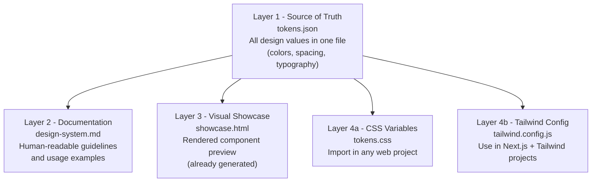

# Design System - Prompt Package for GitHub Copilot

> Four independent prompts that, when run in sequence in GitHub Copilot Chat (Claude Sonnet 4.6 model), generate the complete DATACORP Hackathon 2026 design system across its four layers.

## Table of Contents

- [1. What Is in This Package](#1-what-is-in-this-package)
- [2. Design System Layers](#2-design-system-layers)
- [3. Execution Order](#3-execution-order)
- [4. Setup Before Running](#4-setup-before-running)
- [5. How to Run Each Prompt](#5-how-to-run-each-prompt)
- [6. Estimated Time](#6-estimated-time)
- [7. Troubleshooting](#7-troubleshooting)
- [8. Integration with Other Tools](#8-integration-with-other-tools)
- [9. Post-Hackathon Roadmap](#9-post-hackathon-roadmap)

## Navigation

| Previous | Home | Next |
|----------|------|------|
| [08 - Retrospective](../08-retrospectiva/README.md) | [Workspace Root](../README.md) | [Workspace Root](../README.md) |

---

## 1. What Is in This Package

| File | Layer | Purpose |
|------|-------|---------|
| [`tokens.json`](tokens.json) | Layer 1 - source of truth | All design values in one machine-readable file |
| [`design-system.md`](design-system.md) | Layer 2 - textual documentation | Human-readable guidelines and usage examples |
| [`hackathon-datacorp-design-system.html`](hackathon-datacorp-design-system.html) | Layer 3 - visual showcase | Rendered preview of all components |
| [`dist/tokens.css`](dist/tokens.css) | Layer 4a - CSS variables | Import in any web project |
| [`dist/tailwind.config.js`](dist/tailwind.config.js) | Layer 4b - Tailwind config | Import in Next.js + Tailwind projects |

---

## 2. Design System Layers



**Color semantics used throughout SIFAP:**

| Color | Semantic Role | Example Use |
|-------|--------------|-------------|
| Red (`ms.red`) | Legacy system, SIFAP 1.x | Legacy code badges, Natural/Adabas labels |
| Green (`ms.green`) | Modern system, SIFAP 2.0 | New API endpoints, Spring Boot components |
| Blue (`ms.blue`) | Tooling | GitHub Copilot, Terraform, CI/CD |
| Yellow (`ms.yellow`) | AI agents | Specky, Claude, Copilot Agent |

---

## 3. Execution Order

Prompts are independent but have logical dependencies. Run them in this order:

1. **Prompt 01 (tokens.json) first** - this is the source of truth. All other prompts reference this file.
2. **Prompts 02, 03, and 04** - in any order. They all derive from tokens.json but do not depend on each other.

If you want to run 02, 03, and 04 in parallel (one VS Code window per prompt, separate conversations), that works and saves time.

---

## 4. Setup Before Running

Before pasting any prompt, do these three things:

**Step 1: Repository folder structure**

Confirm or create this structure in your project:

```
hackathon-datacorp/
├── design-system/
│   ├── dist/                (empty - Copilot will fill this)
│   └── showcase.html        (copy hackathon-datacorp-design-system.html here)
├── prompts-design-system/   (this folder, with the 4 prompts)
└── README.md
```

If `design-system/dist/` does not exist, Copilot creates it automatically when needed.

**Step 2: Configure Copilot**

In VS Code, open the workspace. In the Copilot Chat panel:

- Select **Claude Sonnet 4.6** as the model
- Set **Edits** mode as default (allows Copilot to create and modify files across the project)
- Open the full workspace in the Explorer (Copilot needs to see the folder structure to create files in the right locations)

**Step 3: Open tokens.json in a tab**

From Prompt 02 onwards, make sure `design-system/tokens.json` is open in a VS Code tab. This makes Copilot include its content as context automatically, ensuring derived files have identical values to the source of truth.

---

## 5. How to Run Each Prompt

The procedure is the same for all four prompts:

1. Open the `XX-prompt-...md` file in this folder
2. Go to the "Prompt to paste" section (roughly in the middle of the file)
3. Copy everything inside the code block (between the triple backticks)
4. Paste into Copilot Chat
5. Wait for Copilot to generate the file
6. Validate against the checklist in the "Acceptance criteria" section of the prompt
7. If everything looks good, save and commit
8. If something is wrong, ask for a specific correction (do not regenerate the whole file)

Each prompt has a "Post-execution notes" section at the end with quick validation tips (checking color hex values, testing syntax, etc.). Use that checklist before marking a prompt as done.

---

## 6. Estimated Time

| Prompt | Copilot generation | Human validation | Total |
|--------|--------------------|-----------------|-------|
| 01 tokens.json | 3 to 5 min | 5 min | 10 min |
| 02 design-system.md | 3 to 5 min | 10 min | 15 min |
| 03 tokens.css | 2 to 3 min | 3 min | 6 min |
| 04 tailwind.config.js | 2 to 3 min | 3 min | 6 min |
| **Total (sequential)** | | | **~40 min** |

Running prompts 02, 03, and 04 in parallel drops the total to approximately 25 minutes.

---

## 7. Troubleshooting

| Scenario | Resolution |
|----------|-----------|
| Copilot generates a wrong hex value (e.g., `#F25020` instead of `#F25022`) | Ask specifically: "In tokens.json, the value for ms.red.500 should be #F25022 but got #F25020. Please fix that value and any alias that references it." |
| Copilot skips a section | Ask directly: "The color.dark section is missing from tokens.json. Please add it following the spec in prompt 01." |
| Copilot uses wrong format (JSON with trailing commas, CSS without quotes) | Ask for format correction: "The JSON has trailing commas on lines X and Y. Please remove them." |
| File is much larger or smaller than expected | Probably a missing or duplicated section. Ask: "The file should have between X and Y lines but has Z. Please review for duplicates or incomplete sections." |
| Copilot creates the file in the wrong folder | Move it manually or ask: "Please move this file to design-system/dist/, creating the folder if it does not exist." |

---

## 8. Integration with Other Tools

Once all 5 files are complete (showcase.html, tokens.json, design-system.md, tokens.css, tailwind.config.js), the design system can be consumed by any tool:

**For hackathon artifacts (briefings, decks):**
Reference the design system like this: "When producing this document, follow the design system documented in design-system/design-system.md. Use design-system/tokens.json as the visual reference. Apply color semantics: red for legacy, green for modern, blue for tooling, yellow for agents."

**For Copilot (SIFAP 2.0 Next.js prototype):**
Import `tailwind.config.js` in the Next.js project. When requesting components, Copilot will suggest Tailwind classes that consume the tokens naturally (`bg-ms-red`, `text-semantic-legacy`, `p-sp-md`, etc).

**For future system versions:**
Modify tokens.json and regenerate the derived files by running prompts 03 and 04 again. `design-system.md` may need manual adjustment if there were structural changes, or can be regenerated with prompt 02.

---

## 9. Post-Hackathon Roadmap

**Short term (first week after the event):**

- Collect feedback from all 10 teams on what worked, what was confusing, and what was missing
- Update design-system.md with real learnings
- Bump version to 1.1.0 with corrections

**Medium term (first 2 months):**

- Extract the design system to its own repository
- Publish as a private or public npm package
- Add Style Dictionary to the pipeline to auto-generate CSS, Tailwind, Figma, iOS, and Android outputs from tokens.json

**Long term (next 6 months):**

- Build reusable React components that wrap the design system (shadcn/ui style)
- Document in a static site (Astro, Next.js, or Storybook)
- Open for external contributions if relevant

---

- Paula
