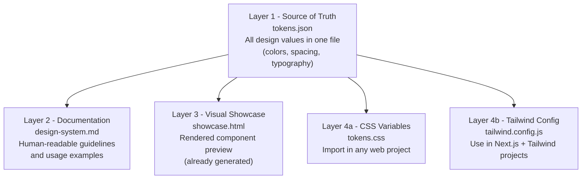
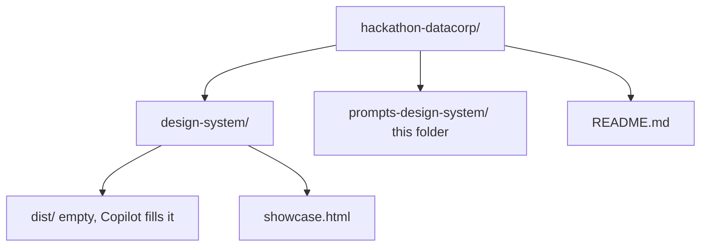

# Design System - Prompt Package for GitHub Copilot

> Four independent prompts that, when run in sequence in GitHub Copilot Chat (Claude Sonnet 4.6 model), generate the complete DATACORP Hackathon 2026 design system across its four layers.

## Table of Contents

- [1. What Is in This Package](#1-what-is-in-this-package)
- [2. Design System Layers](#2-design-system-layers)
- [3. Execution Order](#3-execution-order)
- [4. Setup Before Running](#4-setup-before-running)
- [5. How to Run Each Prompt](#5-how-to-run-each-prompt)
- [6. Estimated Time](#6-estimated-time)
- [7. Troubleshooting](#7-troubleshooting)
- [8. Integration with Other Tools](#8-integration-with-other-tools)
- [9. Post-Hackathon Roadmap](#9-post-hackathon-roadmap)

## Navigation

| Previous | Home | Next |
|----------|------|------|
| [Workspace Root](../README.md) | [Workspace Root](../README.md) | [Workspace Root](../README.md) |

---

## 1. What Is in This Package

| File | Layer | Output |
|------|-------|--------|
| [`01-prompt-tokens-json.md`](01-prompt-tokens-json.md) | Layer 1 - source of truth | `design-system/tokens.json` |
| [`02-prompt-design-system-md.md`](02-prompt-design-system-md.md) | Layer 2 - textual documentation | `design-system/design-system.md` |
| [`03-prompt-tokens-css.md`](03-prompt-tokens-css.md) | Layer 4 - CSS variables | `design-system/dist/tokens.css` |
| [`04-prompt-tailwind-config.md`](04-prompt-tailwind-config.md) | Layer 4 - Tailwind config | `design-system/dist/tailwind.config.js` |

Layer 3 (visual showcase) is already produced: `hackathon-datacorp-design-system.html`.

---

## 2. Design System Layers



**Color semantics used throughout SIFAP:**

| Color | Semantic Role | Example Use |
|-------|--------------|-------------|
| Red (`ms.red`) | Legacy system, SIFAP 1.x | Legacy code badges, Natural/Adabas labels |
| Green (`ms.green`) | Modern system, SIFAP 2.0 | New API endpoints, Spring Boot components |
| Blue (`ms.blue`) | Tooling | GitHub Copilot, Terraform, CI/CD |
| Yellow (`ms.yellow`) | AI agents | Specky, Claude, Copilot Agent |

---

## 3. Execution Order

Prompts are independent but have logical dependencies. Run them in this order:

1. **Prompt 01 (tokens.json) first** - this is the source of truth. All other prompts reference this file.
2. **Prompts 02, 03, and 04** - in any order. They all derive from tokens.json but do not depend on each other.

If you want to run 02, 03, and 04 in parallel (one VS Code window per prompt, separate conversations), that works and saves time.

---

## 4. Setup Before Running

Before pasting any prompt, do these three things:

**Step 1: Repository folder structure**

Confirm or create this structure in your project:



If `design-system/dist/` does not exist, Copilot creates it automatically when needed.

**Step 2: Configure Copilot**

In VS Code, open the workspace. In the Copilot Chat panel:

- Select **Claude Sonnet 4.6** as the model
- Set **Edits** mode as default (allows Copilot to create and modify files across the project)
- Open the full workspace in the Explorer (Copilot needs to see the folder structure to create files in the right locations)

**Step 3: Open tokens.json in a tab**

From Prompt 02 onwards, make sure `design-system/tokens.json` is open in a VS Code tab. This makes Copilot include its content as context automatically, ensuring derived files have identical values to the source of truth.

---

## 5. How to Run Each Prompt

The procedure is the same for all four prompts:

1. Open the `XX-prompt-...md` file in this folder
2. Go to the "Prompt to paste" section (roughly in the middle of the file)
3. Copy everything inside the code block (between the triple backticks)
4. Paste into Copilot Chat
5. Wait for Copilot to generate the file
6. Validate against the checklist in the "Acceptance criteria" section of the prompt
7. If everything looks good, save and commit
8. If something is wrong, ask for a specific correction (do not regenerate the whole file)

Each prompt has a "Post-execution notes" section at the end with quick validation tips (checking color hex values, testing syntax, etc.). Use that checklist before marking a prompt as done.

---

## 6. Estimated Time

| Prompt | Copilot generation | Human validation | Total |
|--------|--------------------|-----------------|-------|
| 01 tokens.json | 3 to 5 min | 5 min | 10 min |
| 02 design-system.md | 3 to 5 min | 10 min | 15 min |
| 03 tokens.css | 2 to 3 min | 3 min | 6 min |
| 04 tailwind.config.js | 2 to 3 min | 3 min | 6 min |
| **Total (sequential)** | | | **~40 min** |

Running prompts 02, 03, and 04 in parallel drops the total to approximately 25 minutes.

---

## 7. Troubleshooting

| Scenario | Resolution |
|----------|-----------|
| Copilot generates a wrong hex value (e.g., `#F25020` instead of `#F25022`) | Ask specifically: "In tokens.json, the value for ms.red.500 should be #F25022 but got #F25020. Please fix that value and any alias that references it." |
| Copilot skips a section | Ask directly: "The color.dark section is missing from tokens.json. Please add it following the spec in prompt 01." |
| Copilot uses wrong format (JSON with trailing commas, CSS without quotes) | Ask for format correction: "The JSON has trailing commas on lines X and Y. Please remove them." |
| File is much larger or smaller than expected | Probably a missing or duplicated section. Ask: "The file should have between X and Y lines but has Z. Please review for duplicates or incomplete sections." |
| Copilot creates the file in the wrong folder | Move it manually or ask: "Please move this file to design-system/dist/, creating the folder if it does not exist." |

---

## 8. Integration with Other Tools

Once all 5 files are complete (showcase.html, tokens.json, design-system.md, tokens.css, tailwind.config.js), the design system can be consumed by any tool:

**For hackathon artifacts (briefings, decks):**
Reference the design system like this: "When producing this document, follow the design system documented in design-system/design-system.md. Use design-system/tokens.json as the visual reference. Apply color semantics: red for legacy, green for modern, blue for tooling, yellow for agents."

**For Copilot (SIFAP 2.0 Next.js prototype):**
Import `tailwind.config.js` in the Next.js project. When requesting components, Copilot will suggest Tailwind classes that consume the tokens naturally (`bg-ms-red`, `text-semantic-legacy`, `p-sp-md`, etc).

**For future system versions:**
Modify tokens.json and regenerate the derived files by running prompts 03 and 04 again. `design-system.md` may need manual adjustment if there were structural changes, or can be regenerated with prompt 02.

---

## 9. Post-Hackathon Roadmap

**Short term (first week after the event):**

- Collect feedback from all 10 teams on what worked, what was confusing, and what was missing
- Update design-system.md with real learnings
- Bump version to 1.1.0 with corrections

**Medium term (first 2 months):**

- Extract the design system to its own repository
- Publish as a private or public npm package
- Add Style Dictionary to the pipeline to auto-generate CSS, Tailwind, Figma, iOS, and Android outputs from tokens.json

**Long term (next 6 months):**

- Build reusable React components that wrap the design system (shadcn/ui style)
- Document in a static site (Astro, Next.js, or Storybook)
- Open for external contributions if relevant

Este pacote contém 4 prompts independentes que, executados em sequência no GitHub Copilot Chat do VS Code com modelo Claude Sonnet 4.6, geram o Design System completo do Hackathon DATACORP 2026 nas suas 4 camadas.

## O que você tem neste pacote

| Arquivo | Camada | Saída |
|---------|--------|-------|
| 01-prompt-tokens-json.md | Camada 1, fonte de verdade | design-system/tokens.json |
| 02-prompt-design-system-md.md | Camada 2, documentação textual | design-system/design-system.md |
| 03-prompt-tokens-css.md | Camada 4, CSS variables | design-system/dist/tokens.css |
| 04-prompt-tailwind-config.md | Camada 4, Tailwind config | design-system/dist/tailwind.config.js |

A Camada 3 (showcase visual) já foi produzida e é o arquivo `hackathon-datacorp-design-system.html` que você tem em mãos.

## Ordem de execução

Os prompts são independentes mas têm dependências lógicas. A ordem recomendada é:

1. **Prompt 01 (tokens.json) primeiro**, porque é a fonte de verdade. Os outros 3 consultam este arquivo como referência.

2. **Prompts 02, 03 e 04 depois**, em qualquer ordem entre si. Os três derivam do tokens.json mas não dependem um do outro.

Se preferir rodar os 3 últimos em paralelo (uma janela do VS Code por prompt, em conversas separadas), é totalmente possível e mais rápido.

## Preparação antes de rodar o primeiro prompt

Antes de colar qualquer prompt, faça estas 3 coisas:

**Passo 1, estrutura de pastas do repositório**

No repositório do projeto (ou crie um novo, se ainda não existir), confirme que a estrutura está assim, ou crie ela:

```
hackathon-datacorp/
├── design-system/
│   ├── dist/                (vazio, o Copilot vai preencher)
│   └── showcase.html        (copie o hackathon-datacorp-design-system.html para cá)
├── prompts-design-system/   (esta pasta, com os 4 prompts)
└── README.md                (README geral do repositório, opcional)
```

Se a pasta `design-system/dist/` não existir, o Copilot cria automaticamente no primeiro prompt que precisar dela.

**Passo 2, configurar o Copilot**

No VS Code, abra o workspace. No painel do Copilot Chat:

- Selecione o modelo **Claude Sonnet 4.6** (se não aparecer na lista, vá em configurações do Copilot e ative o modelo)
- Configure o modo **Edits** como padrão para este pacote (permite que o Copilot crie e modifique arquivos multi-file)
- Abra o workspace inteiro no Explorer, porque o Copilot precisa enxergar a estrutura de pastas para criar os arquivos nos lugares certos

**Passo 3, abra um tab com o tokens.json (depois que existir)**

Do prompt 02 em diante, é importante que o arquivo `design-system/tokens.json` esteja aberto em um tab do VS Code ou pelo menos visível no Explorer. Isso faz o Copilot incluir automaticamente o conteúdo como contexto, garantindo que os arquivos derivados tenham valores idênticos aos da fonte de verdade.

## Como executar cada prompt

O procedimento é o mesmo para todos os 4:

1. Abrir o arquivo `XX-prompt-...md` neste pacote
2. Ir para a seção "Prompt para colar" (aproximadamente no meio do arquivo)
3. Copiar tudo dentro do bloco de código (entre as três crases)
4. Colar no Copilot Chat
5. Aguardar o Copilot gerar o arquivo
6. Validar contra a checklist que está na seção "Critérios de aceitação" do próprio prompt
7. Se tudo OK, salvar e commitar
8. Se algo errado, pedir correção específica (não regenerar o arquivo inteiro)

Cada prompt tem uma seção "Notas pós execução" no final, com dicas de validação rápida (checar hex de cores, testar sintaxe, etc). Use essa checklist antes de dar por pronto.

## Tempo estimado de execução

Estimativa conservadora, assumindo que o Copilot pode levar 1 a 3 minutos por arquivo e você vai levar alguns minutos validando:

| Prompt | Geração Copilot | Validação humana | Total |
|--------|------------------|-------------------|-------|
| 01 tokens.json | 3 a 5 min | 5 min | 10 min |
| 02 design-system.md | 3 a 5 min | 10 min | 15 min |
| 03 tokens.css | 2 a 3 min | 3 min | 6 min |
| 04 tailwind.config.js | 2 a 3 min | 3 min | 6 min |
| **Total sequencial** |  |  | **~40 min** |

Se rodar os prompts 2, 3 e 4 em paralelo (3 janelas de VS Code simultaneamente), o total cai para aproximadamente 25 minutos.

## O que fazer se o Copilot errar

Cenários comuns e como resolver:

**Cenário 1, o Copilot inventa um valor hex** (ex: gera `#F25020` em vez de `#F25022`)

Peça a correção específica: "No arquivo tokens.json, o valor da cor ms.red.500 deveria ser #F25022 mas ficou #F25020. Por favor corrija esse valor e qualquer alias que o referencie."

**Cenário 2, o Copilot pula uma seção**

Identifique a seção faltando e peça diretamente: "Está faltando a seção color.dark no tokens.json. Adicione ela seguindo a especificação: 6 tokens com nomes bg, surface, ink, ink-2, ink-3, rule, com os valores que estão no prompt 01."

**Cenário 3, o Copilot usa formato errado** (ex: JSON com trailing comma, CSS sem aspas)

Peça correção de formato: "O JSON tem trailing commas nas linhas X e Y, remova elas para ficar válido."

**Cenário 4, o arquivo ficou muito grande ou muito pequeno**

Se o arquivo está fora do range esperado (nas especificações), provavelmente alguma seção está incompleta ou duplicada. Peça: "O arquivo deveria ter entre X e Y linhas mas ficou com Z. Revise e remova conteúdo duplicado ou complete seções ausentes."

**Cenário 5, o Copilot gera em lugar errado**

Se o Copilot cria o arquivo na raiz em vez de `design-system/` ou `design-system/dist/`, mova manualmente ou peça: "Por favor mova este arquivo para design-system/dist/ criando a pasta se não existir."

## Integração com outras ferramentas depois dos 4 arquivos prontos

Com os 5 arquivos completos (showcase.html, tokens.json, design-system.md, tokens.css, tailwind.config.js), o Design System está pronto para ser consumido por qualquer ferramenta ou pessoa:

**Para Cowork (artefatos pedagógicos, briefings, decks):**
Ao pedir qualquer artefato no Cowork, referencie o design system assim: "Ao produzir este documento, siga o design system documentado em design-system/design-system.md. Use os tokens de design-system/tokens.json como referência visual. Aplique semântica de cores: vermelho para legado, verde para moderno, azul para tooling, amarelo para agentes."

**Para Copilot (código Next.js do protótipo SIFAP 2.0):**
Importe o tailwind.config.js no projeto Next.js. Ao pedir componentes, o Copilot vai sugerir classes Tailwind que consomem os tokens naturalmente (bg-ms-red, text-semantic-legacy, p-sp-md, etc).

**Para Claude Code (fabricação do legado Natural, documentação de sistema):**
Ao pedir para Claude Code produzir qualquer artefato visual ou documento, referencie o design system. Para fabricação do sistema Natural fictício, não há aplicação visual direta, mas para docs sobre o sistema (manuais legados fictícios) use os tokens ao gerar conteúdo HTML ou PDF.

**Para versões futuras do sistema:**
Modifique o tokens.json e regenere os arquivos derivados (css, tailwind) rodando os prompts 03 e 04 de novo. O design-system.md pode precisar de ajuste manual se houve mudanças estruturais, ou ser regenerado via prompt 02.

## Roadmap sugerido pós hackathon

Depois do evento dos dias 27 e 28 de abril, vale considerar estes passos para amadurecer o design system:

**Curto prazo (primeira semana pós hackathon):**
- Capturar feedback dos 10 times sobre o design system (o que funcionou, o que gerou dúvida, o que faltou)
- Ajustar o design-system.md com aprendizados reais
- Bumpar versão para 1.1.0 com as correções

**Médio prazo (primeiros 2 meses):**
- Extrair o design system para repositório próprio (algo como `paulasilvatech-design-system`)
- Publicar como pacote NPM (privado ou público)
- Adaptar para servir ao Portal Gov QA e outros projetos seus (não só hackathon)
- Adicionar Style Dictionary ao pipeline para gerar automaticamente versões CSS, Tailwind, Figma, iOS, Android a partir do tokens.json

**Longo prazo (próximos 6 meses):**
- Criar componentes React reutilizáveis que encapsulam os componentes do design system (shadcn/ui style)
- Documentar em um site estático (Astro, Next.js ou Storybook)
- Abrir para contribuição externa se relevante

Mas isso é horizonte futuro. Agora o foco é executar os 4 prompts, validar outputs, e usar no hackathon.

## Contato e suporte

Se algum prompt não funcionar como esperado, ou se algo no design system precisar de ajuste durante a execução, pode voltar ao Claude.ai no projeto Hackathon DATACORP 2026 e pedir ajuda. Eu mantenho contexto sobre todo o pacote e consigo ajudar a diagnosticar rapidamente.

Boa execução.
