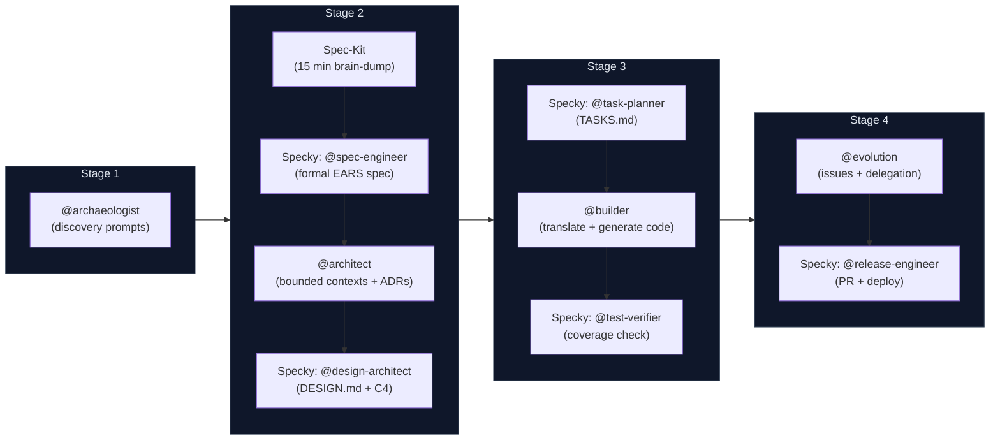

# SDLC Flow — Personas × Agents × Stages

> **This is the missing map.** Your persona card tells you *what you own*. The agent kit tells you *how the AI helps*. This document tells you *when everything connects* — the full 8-hour flow with every handoff, every agent switch, and every deliverable in sequence.

Print this page. Pin it next to your screen. It is your GPS for the day.

## The Full Picture

```mermaid
flowchart TD
    subgraph OPEN["Opening (09:00–09:30)"]
        direction LR
        O1["All 10 personas<br/>Read TEAM-FLOW.md<br/>Read persona card<br/>Copy persona-kit to .github/"]
    end

    subgraph S1["Stage 1 — Archaeology (09:30–11:30) · @archaeologist"]
        direction TB
        S1A["🔑 RE leads exploration<br/>Tech Writer builds glossary<br/>EA maps system context<br/>DBA reads DDMs"]
        S1B["/archaeology-kickoff<br/>/extract-business-rules<br/>/map-dependencies<br/>/catalog-mysteries"]
        S1C["/discovery-report"]
        S1A --> S1B --> S1C
    end

    subgraph H1["Handoff #1 (11:30–12:00)"]
        H1A["RE hands discovery report<br/>to Software Architect<br/>PO confirms priorities"]
    end

    subgraph S2["Stage 2 — Modern Spec (13:00–14:30) · @architect"]
        direction TB
        S2A["🔑 SA leads design<br/>RE writes EARS reqs<br/>EA validates context<br/>PO prioritizes scope"]
        S2B["/carve-bounded-contexts<br/>/write-ears-spec<br/>/generate-adr<br/>/design-modular-monolith"]
        S2C["SPECIFICATION.md<br/>bounded-contexts.md<br/>ADRs · openapi.yaml"]
        S2A --> S2B --> S2C
    end

    subgraph H2["Handoff #2 (14:30–14:45)"]
        H2A["SA hands spec + design<br/>to Tech Lead + Developer<br/>DBA gets data model"]
    end

    subgraph S3["Stage 3 — Implementation (14:45–17:00) · @builder"]
        direction TB
        S3A["🔑 Dev leads coding<br/>DBA owns schema<br/>QA writes tests<br/>TL reviews PRs"]
        S3B["/translate-natural-to-java<br/>/generate-jpa-from-fdt<br/>/generate-equivalence-tests<br/>/implement-rest-controller<br/>/security-self-review"]
        S3C["Java services · JPA entities<br/>REST API · Next.js pages<br/>Tests green · Build green"]
        S3A --> S3B --> S3C
    end

    subgraph H3["Handoff #3 (17:00–17:15)"]
        H3A["TL hands working prototype<br/>to DevOps<br/>QA continues testing"]
    end

    subgraph S4["Stage 4 — Evolution (17:15–18:00) · @evolution"]
        direction TB
        S4A["🔑 TL dispatches issues<br/>DevOps writes Terraform<br/>QA validates CI gates<br/>Dev reviews AI PRs"]
        S4B["/write-github-issue<br/>/delegate-to-copilot-agent<br/>/review-agent-pr<br/>/final-experience-report"]
        S4C["CI/CD pipeline<br/>Terraform module<br/>AI PRs reviewed<br/>Retro notes"]
        S4A --> S4B --> S4C
    end

    subgraph CLOSE["Demo + Closing (18:00–20:00)"]
        CL1["TL + PO present<br/>3 min demo<br/>Retro forms"]
    end

    OPEN --> S1
    S1 --> H1
    H1 --> S2
    S2 --> H2
    H2 --> S3
    S3 --> H3
    H3 --> S4
    S4 --> CLOSE

    style OPEN fill:#0f172a,stroke:#334155,color:#e2e8f0
    style S1 fill:#1e3a5f,stroke:#334155,color:#e2e8f0
    style S2 fill:#1e3a5f,stroke:#334155,color:#e2e8f0
    style S3 fill:#1e3a5f,stroke:#334155,color:#e2e8f0
    style S4 fill:#1e3a5f,stroke:#334155,color:#e2e8f0
    style H1 fill:#7f1d1d,stroke:#ef4444,color:#fca5a5
    style H2 fill:#7f1d1d,stroke:#ef4444,color:#fca5a5
    style H3 fill:#7f1d1d,stroke:#ef4444,color:#fca5a5
    style CLOSE fill:#0f172a,stroke:#334155,color:#e2e8f0
```



## Stage-by-Stage: Who, What Agent, What Prompts, What Deliverables

### Stage 1 — Archaeology (09:30–11:30)

**Agent:** `@archaeologist` (Claude Opus 4.7, read-only)

| Persona | Role | What You Do | Prompts You Run |
|---------|------|-------------|-----------------|
| **Requirements Engineer** | 🔑 Protagonist | Open `legacy/` and drive systematic exploration. Extract business rules from every program. Own the business-rules catalog. | `/archaeology-kickoff`, `/extract-business-rules` |
| Tech Writer | Secondary | Build the domain glossary in real time. Every new term gets a definition. | Works alongside RE, no dedicated prompt |
| Enterprise Architect | Secondary | Map system boundaries: what external systems does the legacy call? Where do batch inputs come from? | `/map-dependencies` (scope = external interfaces) |
| DBA | Secondary | Focus on DDMs. Document field types, MU/PE structures, relationships between files. | `/map-dependencies` (scope = DDMs) |
| Product Owner | Observer | Listen and validate. When a business rule interpretation is proposed, confirm or challenge it. | — |
| Software Architect | Observer | Start thinking about which clusters of code might become bounded contexts. | — |
| Technical Lead | Observer | Note code quality patterns — what will be hard to translate in Stage 3? | — |
| QA Engineer | Observer | Note which rules have no documentation backup (these need extra testing later). | — |
| DevOps Engineer | Observer | Note infrastructure hints: batch schedules, file dependencies, environment variables. | — |

**Gate:** Before leaving Stage 1, the RE runs `/discovery-report`. If any of the 4 input artifacts is missing, the prompt refuses to generate the report. This is the quality gate.

**Handoff #1 (11:30):** The Requirements Engineer walks the Software Architect through the discovery report in a 5-minute standup. The PO confirms which findings are highest priority.

---

### Stage 2 — Modern Spec (13:00–14:30)

**Agent:** `@architect` (Claude Opus 4.7, read-only)

| Persona | Role | What You Do | Prompts You Run |
|---------|------|-------------|-----------------|
| **Software Architect** | 🔑 Protagonist | Evaluate carving hypotheses from the discovery report. Draw C4 diagrams. Define module boundaries. | `/carve-bounded-contexts`, `/design-modular-monolith` |
| Requirements Engineer | Secondary | Transform confirmed business rules into EARS requirements. Every REQ needs a source trace. | `/write-ears-spec` |
| Enterprise Architect | Secondary | Validate the system context diagram. Review ADRs for enterprise alignment. | `/generate-adr` (integration-related decisions) |
| Product Owner | Secondary | Prioritize requirements. With 2 hours for implementation, the team cannot build everything. | Participates in `/carve-bounded-contexts` discussions |
| Technical Lead | Observer | Plan implementation order: which bounded context first? What are the dependencies? | — |
| All others | Observer | Review the emerging specification. Flag anything incomplete from your perspective. | — |

**Gate:** SPECIFICATION.md exists with ≥10 EARS requirements. At least 3 ADRs. Bounded context map with Mermaid diagram. OpenAPI skeleton.

**Handoff #2 (14:30):** The Software Architect walks the Tech Lead and Developer through the design in a 5-minute standup. The DBA gets the data model section. The QA Engineer gets the acceptance criteria.

---

### Stage 3 — Implementation (14:45–17:00)

**Agent:** `@builder` (Claude Sonnet 4.6, full edit + run access)

| Persona | Role | What You Do | Prompts You Run |
|---------|------|-------------|-----------------|
| **Developer** | 🔑 Protagonist | Write code. Translate Natural to Java, build REST endpoints, create Next.js pages. Every commit traces to a REQ-ID. | `/translate-natural-to-java`, `/implement-rest-controller` |
| DBA | Secondary | Own the data layer. Review JPA entities, write Flyway migrations, validate PostgreSQL schema. | `/generate-jpa-from-fdt` |
| QA Engineer | Secondary | Write tests alongside the Developer. Monitor coverage. Run equivalence tests. | `/generate-equivalence-tests` |
| Technical Lead | Secondary | Review code as it lands. Check for standards violations. Merge PRs. Run security review before Stage 4. | `/security-self-review` |
| Software Architect | Secondary | Validate implementation matches the design. If the Developer deviates from bounded context boundaries, flag it. | — |
| Product Owner | Observer | Available for domain clarification. "Should this reject or warn?" — only the PO can answer. | — |
| All others | Observer | Available when their expertise is needed. | — |

**Gate:** `mvn verify` passes. `npm run build` passes. ≥60% backend test coverage. At least 3 REST endpoints working. At least 2 Next.js pages.

**Handoff #3 (17:00):** The Tech Lead confirms the prototype works and walks the DevOps Engineer through the codebase structure. The QA Engineer continues testing.

---

### Stage 4 — Evolution (17:15–18:00)

**Agent:** `@evolution` (Claude Sonnet 4.6, edit + GitHub access)

| Persona | Role | What You Do | Prompts You Run |
|---------|------|-------------|-----------------|
| **Technical Lead** | 🔑 Protagonist | Write GitHub Issues for Copilot Agent. Review AI-generated PRs. Own the merge decision. Prepare the demo. | `/write-github-issue`, `/delegate-to-copilot-agent`, `/review-agent-pr` |
| DevOps Engineer | Secondary | Write the GitHub Actions workflow. Create Terraform modules for Azure. | Works directly, no dedicated prompt |
| QA Engineer | Secondary | Validate quality gates in the CI pipeline. Review test results from AI-generated PRs. | — |
| Developer | Secondary | Review AI-generated code. You know the codebase best — spot errors automated checks miss. | Assists with `/review-agent-pr` |
| Tech Writer | Secondary | Polish the README. Write the demo script. Ensure retrospective notes capture learnings. | — |
| Product Owner | Secondary | Prioritize what must work for the demo vs. what can be deferred. Prepare the narrative. | — |
| All others | Observer | Contribute retrospective observations. | `/final-experience-report` (everyone answers) |

**Gate:** CI pipeline runs. At least 1 Terraform module. At least 1 AI-generated PR reviewed. Demo script ready.

---

## The Handoff Checklist

Every handoff is a 5-minute standup between the outgoing and incoming protagonists. Use this checklist:

| Handoff | From → To | Artifact Passed | Question to Confirm |
|---------|-----------|-----------------|---------------------|
| **#1** (Stage 1 → 2) | RE → SA | `discovery-report.md` | "Do you have enough to carve contexts?" |
| **#2** (Stage 2 → 3) | SA → TL + Dev | `SPECIFICATION.md` + `modular-monolith-design.md` | "Do you know which context to build first?" |
| **#3** (Stage 3 → 4) | TL → DevOps | Working prototype (green build) | "Can you run this locally? What do you need to deploy?" |

If the answer to the confirmation question is **no**, the team has 10 minutes to fill the gap before the next stage starts. Use the 20-minute rule: if still stuck after 10 more minutes, escalate to a facilitator.

## How Persona-Kits and Agent-Kits Work Together

```
You are a Developer.

Step 1: Read your PERSONA CARD         → personas/06-developer.md
        (what you own, your handoffs, your rubric)

Step 2: Copy your PERSONA-KIT          → persona-kits/07-developer/.github/ → .github/
        (your personal Copilot agent, prompts, skills)

Step 3: Check AGENTS I USE             → "Agents I Use" table in your persona card
        (your role at each stage: Protagonist/Secondary/Observer)

Step 4: When a new stage starts        → Open the AGENT-KIT README for that stage
                                          agent-kits/03-builder/README.md
        (how to activate, prompts to run, Definition of Done)

Step 5: Activate the STAGE AGENT       → Select @builder in Copilot Chat
        (the agent loads from .github/agents/builder.agent.md)

Step 6: Run PROMPTS                    → /translate-natural-to-java, /generate-jpa-from-fdt
        (the agent guides you through the work)

Step 7: At the end of the stage        → Check the DEFINITION OF DONE
        (agent-kit README lists the gate criteria)

Step 8: HANDOFF                        → Walk the next protagonist through your deliverables
```

Your **persona-kit agent** (e.g., `@developer`) knows your role deeply — Java idioms, Spring patterns, testing conventions. The **stage agent** (e.g., `@builder`) knows the *process* — which prompts to run, what deliverables to produce, what the Definition of Done looks like. Use both. They complement each other.

## Quick Reference Card

| Time | Stage | Agent | Protagonist | Key Prompt | Key Deliverable |
|------|-------|-------|-------------|------------|-----------------|
| 09:30 | 1 - Archaeology | `@archaeologist` | Requirements Engineer | `/discovery-report` | `discovery-report.md` |
| 13:00 | 2 - Modern Spec | `@architect` | Software Architect | `/design-modular-monolith` | `SPECIFICATION.md` + design |
| 14:45 | 3 - Implementation | `@builder` | Developer | `/translate-natural-to-java` | Working prototype |
| 17:15 | 4 - Evolution | `@evolution` | Technical Lead | `/write-github-issue` | CI/CD + AI PR reviewed |

---

## How the 4 Stage Agents Work With Specky SDD and Spec-Kit

The kit has three layers of AI tooling. They are not alternatives — they are complementary and used at specific moments.

| Tool | What It Is | When to Use | Cheat Sheet |
|------|-----------|-------------|-------------|
| **4 Stage Agents** (`@archaeologist`, `@architect`, `@builder`, `@evolution`) | VS Code Copilot agents with stage-specific prompts | Throughout the day — one agent per stage | [`agent-kits/`](agent-kits/README.md) |
| **Specky SDD** (`@spec-engineer`, `@design-architect`, `@implementer`, etc.) | 10-phase pipeline engine with quality gates and LGTM reviews | Primarily in Stages 2 and 3 for formal artifacts | [`cheat-sheets/specky-workflow.md`](cheat-sheets/specky-workflow.md) |
| **Spec-Kit** (`spec-kit new`, `spec-kit init`) | Quick natural-language drafting tool | First 15 minutes of Stage 2 for brain-dump | [`SETUP.md` Step 9](SETUP.md) |

### The Recommended Flow



### Stage-by-Stage: When to Use What

**Stage 1 — Archaeology**
Use only `@archaeologist`. Specky is not involved — there are no formal artifacts to pipeline yet. This is pure discovery.

**Stage 2 — Modern Spec** (this is where all three tools converge)

| Step | Tool | What It Produces |
|------|------|-----------------|
| 1. Brain-dump (15 min) | **Spec-Kit** `spec-kit new "feature"` | Quick draft spec in natural language |
| 2. PO review (10 min) | Human | Confirmed priorities and scope |
| 3. Initialize pipeline | **Specky** `/specky-migration` or `sdd_init` | `.specs/` folder + CONSTITUTION.md |
| 4. Carve bounded contexts | **@architect** `/carve-bounded-contexts` | `bounded-contexts.md` with Mermaid diagram |
| 5. Write formal EARS spec | **Specky** `@spec-engineer` + **@architect** `/write-ears-spec` | SPECIFICATION.md with REQ-IDs |
| 6. Generate ADRs | **@architect** `/generate-adr` | `ADRs/adr-NNN-*.md` |
| 7. Design modular monolith | **@architect** `/design-modular-monolith` + **Specky** `@design-architect` | DESIGN.md + openapi.yaml |
| 8. Quality gate | **Specky** `@quality-reviewer` | ANALYSIS.md (LGTM review) |

The `@architect` agent and Specky's `@spec-engineer` / `@design-architect` work together: the stage agent guides the team's thinking (carving, deciding, evaluating), while Specky formalizes the output into pipeline-compliant artifacts.

**Stage 3 — Implementation**

| Step | Tool | What It Produces |
|------|------|-----------------|
| 1. Plan tasks | **Specky** `@task-planner` | TASKS.md with dependency order |
| 2. Translate + build | **@builder** prompts | Java services, JPA entities, REST API, Next.js pages |
| 3. Generate tests | **@builder** `/generate-equivalence-tests` | JUnit + Vitest test files |
| 4. Verify coverage | **Specky** `@test-verifier` | Coverage report against REQ-IDs |
| 5. Security review | **@builder** `/security-self-review` | OWASP checklist |

The `@builder` agent writes code. Specky ensures the code traces to requirements and meets quality gates.

**Stage 4 — Evolution**

| Step | Tool | What It Produces |
|------|------|-----------------|
| 1. Write + delegate issues | **@evolution** prompts | GitHub Issues for Copilot Agent |
| 2. Review AI PRs | **@evolution** `/review-agent-pr` | Review with classified findings |
| 3. Release prep | **Specky** `@release-engineer` | PR with spec summary + release gate |
| 4. Team retro | **@evolution** `/final-experience-report` | Agent experience report |

### Quick Decision: Which Tool Right Now?

| I need to... | Use |
|---|---|
| Explore legacy code | `@archaeologist` |
| Quick-draft a feature idea | **Spec-Kit** |
| Write formal EARS requirements | **Specky** `@spec-engineer` + `@architect` `/write-ears-spec` |
| Draw C4 diagrams | **Specky** `@design-architect` |
| Decide on bounded contexts | `@architect` `/carve-bounded-contexts` |
| Translate Natural to Java | `@builder` `/translate-natural-to-java` |
| Check test coverage against REQs | **Specky** `@test-verifier` |
| Write a GitHub Issue for Copilot | `@evolution` `/write-github-issue` |
| Run the full 10-phase pipeline | **Specky** `/specky-orchestrate` |

---

## Where to Find Everything

| What you need | Where it lives |
|---|---|
| Your role and handoffs | [`personas/<your-role>.md`](personas/) |
| Your Copilot agent + prompts + skills | [`persona-kits/<your-role>/`](persona-kits/) |
| The stage agent for the current stage | [`agent-kits/<NN>-<stage>/README.md`](agent-kits/) |
| The agent file Copilot loads | [`.github/agents/<agent>.agent.md`](.github/agents/) |
| The prompts you invoke | [`.github/prompts/<agent>/`](.github/prompts/) |
| The deliverable templates | `01-arqueologia/templates/`, `02-spec-moderna/templates/`, `04-evolucao/templates/` |
| Specky SDD cheat sheet | [`cheat-sheets/specky-workflow.md`](cheat-sheets/specky-workflow.md) |
| Spec-Kit quick start | [`SETUP.md` Step 9](SETUP.md) |
| Full 10×4 persona-agent matrix | [`docs/persona-agent-matrix.md`](docs/persona-agent-matrix.md) |
| Agent architecture explanation | [`docs/4-agents-explained.md`](docs/4-agents-explained.md) |
| Daily timeline and handoff rules | [`TEAM-FLOW.md`](TEAM-FLOW.md) |

---

| Previous | Home | Next |
|----------|------|------|
| [Team Flow](TEAM-FLOW.md) | [Team Kit Home](README.md) | [Agent Kits](agent-kits/README.md) |
