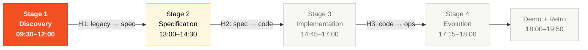
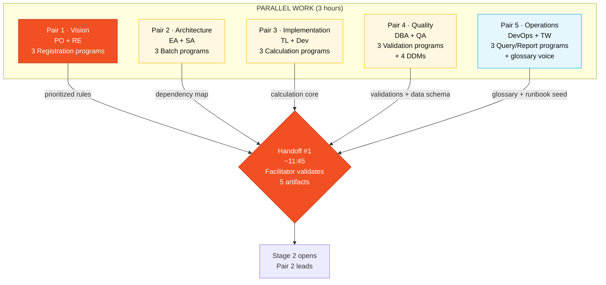

# Stage 1 — Digital Archaeology

> **This is the only stage of the day you cannot skip.** Everything that comes after — the spec, the code, the deploy — depends on what your pair extracts here. In the previous workshop edition, several teams wrote specs without reading the legacy and discovered too late they had lost 29 years of business rules. This time, the gate is enforced: CI and the rubric will not let you proceed without tracing every requirement to a `.NSN` or `.ddm` file.

## Where this fits in the SDLC



**You are in Stage 1 (Discovery in the SDLC).** The output of this stage feeds Stage 2 (Specification) directly. Without a clean delivery here, Handoff #1 fails and the whole team stalls.

## Who works here (all 5 pairs, in parallel)



All 5 pairs work **in parallel**, each on their own 3 programs. Nobody is idle. At the end, each pair contributes its piece to the 5 consolidated artifacts.

## What you will produce in 3 hours

By the end of Stage 1 your pair will have produced **five verifiable artifacts** inside [`01-arqueologia/`](.):

1. `glossary.md` — at least 30 domain terms.
2. `business-rules-catalog.md` — at least 15 business rules, **each with its source program** filled in.
3. `dependency-map.md` — a Mermaid diagram covering all 15 Natural programs.
4. `mysteries-found.md` — at least 5 hidden rules with evidence (file + line).
5. `discovery-report.md` — a consolidated synthesis that becomes Stage 2's input.

A facilitator (blue lanyard) circulates around **11:45** and validates these artifacts against the [`LEGACY-EXPLORATION-CHECKLIST.md`](LEGACY-EXPLORATION-CHECKLIST.md). Anything in red and your pair does not open Stage 2.

---

## Why this matters

A legacy system rarely has up-to-date documentation. What it has is **code**, and the code carries business rules nobody wrote down anywhere else. If you modernize looking only at the modernization brief, you rewrite a modern version of **the brief**, not of the system. And the system is what's in production.

SIFAP is 29 years old. It has 2003 tax rules still in force. It has crop-season calculations that only make sense if you know the history. It has a report that the federal audit body has accepted for 23 years with the same layout. You cannot modernize what you haven't read.

Digital archaeology exists for exactly this: extract knowledge from the code before you touch it.

---

## How to think about this (mental model before the steps)

Think of SIFAP as **a city the five of you are going to excavate in 3 hours**. Each pair is an archaeology team responsible for one neighborhood. Nobody has time to dig the whole city alone, so the rule is simple:

- **Each pair owns 3 programs.** Fifteen programs divided by five pairs = three each. No orphans.
- **Everything you find goes into a shared notebook** (the template files in this folder). Other pairs will read what you wrote to build the spec next.
- **Found something weird? Write it down.** Mysteries are points. But only if you cite the exact location (file + line).
- **Don't try to understand everything.** Try to understand the **business rules** the program implements. Ignore the Natural's I/O, paging, error handling. What matters is the `IF` that hides a rule.

A good result is not "I read everything". A good result is "I extracted what matters from 3 programs and left evidence the others can use".

---

## Where the legacy lives

Inside the kit itself, at [`../../legacy/`](../../legacy/):

| Resource | Path | Quantity |
|----------|------|----------|
| Natural programs | [`../../legacy/natural-programs/`](../../legacy/natural-programs/) | 15 `.NSN` files |
| Adabas DDMs | [`../../legacy/adabas-ddms/`](../../legacy/adabas-ddms/) | 4 `.ddm` files |
| Partial documentation (1997-2018) | [`../../legacy/legacy-docs/`](../../legacy/legacy-docs/) | 3 outdated documents |
| System README | [`../../legacy/README.md`](../../legacy/README.md) | 1 file |
| Terminal demo | [`../../legacy/demo/sifap-terminal.html`](../../legacy/demo/sifap-terminal.html) | open in browser |

> The documents in `legacy-docs/` are in Portuguese on purpose — they are part of the immersion. They represent what the client had archived between 1997 and 2018.

---

## Who reads what (mandatory split)

Each pair leads 3 programs. **No program may be left unread.**

| Pair | Programs | Why these |
|------|----------|-----------|
| **1 · Vision** (PO + RE) | `CADBENEF.NSN`, `CADDEPEND.NSN`, `CADPROG.NSN` | Registrations are the **entities** that become EARS subjects. Skip these and the rest has no REQ-IDs to anchor to. |
| **2 · Architecture** (EA + SA) | `BATCHPGT.NSN`, `BATCHREL.NSN`, `BATCHCON.NSN` | Batch programs reveal the **entire business flow**. Bounded contexts come from here. |
| **3 · Implementation** (TL + Dev) | `CALCBENF.NSN`, `CALCCORR.NSN`, `CALCDSCT.NSN` | Calculations are the **financial core**. You will reproduce them in Java in Stage 3 — you need to know exactly what they do. |
| **4 · Quality** (DBA + QA) | `VALBENEF.NSN`, `VALDOCS.NSN`, `VALELEG.NSN` | Validations **become tests**. Whoever reads validation rules here is writing the Stage 3 test strategy. |
| **5 · Operations** (DevOps + TW) | `CONSBENF.NSN`, `RELPGT.NSN`, `RELAUDIT.NSN` | Queries and reports reveal **what the user sees** — input for the glossary and the runbook. |

> The 4 DDMs belong to Pair 4 (DBA + QA), with review by the others. Each DDM becomes a PostgreSQL table; the mapping you propose today decides whether Stage 3 has to redo work.

---

## Step by step (3 hours, clocked)

### Hour 1 — Reconnaissance (09:15 → 10:15)

**The goal of the first hour is to understand the terrain.** You're not extracting rules yet, you're building the map.

1. **Whole team, first 15 minutes:** open [`../../legacy/README.md`](../../legacy/README.md) and read SIFAP's history. **Why this step exists:** if you don't know `RELPGT.NSN` is the report the audit body has accepted since 2003, you might propose "modernizing the layout" and break a 23-year-old external audit. Context prevents dumb decisions.

2. **Pairs 1 and 5 in collaboration:** open each of the 15 `.NSN` programs in skim mode (comments and constants only) and start populating [`glossary.md`](glossary.md). **How to think:** you're not understanding programs, you're **cataloguing vocabulary**. Any cryptic abbreviation (`DSCT`, `BENF`, `PE`, `MU`, `CTC`) is a glossary entry. Target: 30+ terms by end of day.

3. **Pair 2:** start drawing the [`dependency-map.md`](dependency-map.md). Use Copilot Chat with the prompt: *"List every CALLNAT occurrence across these 15 files and draw a Mermaid diagram."* You'll discover, for example, that `BATCHPGT` calls `VALELEG`, `CALCBENF`, `CALCCORR`, and `CALCDSCT`. That graph is the base for Stage 2's bounded contexts.

4. **Pair 4 with Pair 3 as reviewer:** open the 4 DDMs at [`../../legacy/adabas-ddms/`](../../legacy/adabas-ddms/). For each DDM, list every field with type and length, explicitly marking `MU` (multi-value) and `PE` (periodic group). **Why this matters:** these two Adabas constructs don't exist in pure relational PostgreSQL. When you see `MU TELEFONES`, you know it becomes a `beneficiary_phone` table in Stage 3.

> **At the end of Hour 1**, do a 2-minute stand-up: each pair says in one sentence what they discovered. If a pair is lost, this is when to ask for help — not at 11:30.

### Hour 2 — Extraction (10:15 → 11:15)

**Now you enter extraction mode.** Each pair reads its 3 programs deeply and documents business rules.

5. **Each pair in parallel, 3 programs each:** open the `.NSN` files in your list (see the table above) and look for business rules. **What counts as a business rule:**
 - An `IF` that decides something in the domain (e.g., *"if the state is in the Northeast and the program is Drought, base value × 1.2"*)
 - A numeric constant with no explanation (e.g., `0.075` in a tax calculation)
 - A status transition with a rule (e.g., *"only A to S, never I to A"*)
 - A special treatment for a case (e.g., *"if CPF starts with 999, it's a test"*)

 **What is NOT a business rule:** report pagination, output formatting, Adabas cursor manipulation, file opening. Ignore them.

6. **Useful prompts for Copilot Chat** (paste the `.NSN` content into chat first, then each prompt):
 - *"Explain this Natural program line by line. Focus on business decisions, ignore I/O."*
 - *"Which business rules does this code implement? List each one with the line range."*
 - *"Is there any numeric constant with no explanation? For each one, suggest what it represents."*
 - *"Is there any condition that looks like a workaround or undocumented special case?"*
 - *"Compare this program with `other-file.NSN`. Is there duplicated logic?"*

7. **Document as you go.** Every rule found becomes **one row** in [`business-rules-catalog.md`](business-rules-catalog.md) with:
 - `BR-NNN` (sequential numbering)
 - One-sentence rule description
 - **`Source Program` filled in** with `legacy/natural-programs/FILE.NSN#L<start>-L<end>` (preferred format) or at minimum the file name
 - DDM fields involved
 - Risk level (CRITICAL / HIGH / MEDIUM / LOW)

 **Rows with empty `Source Program` are invalid and sink your team in the rubric.** No exceptions.

### Hour 3 — Synthesis (11:15 → 12:00)

**Now you turn discoveries into consolidated artifacts.** The pair that led each artifact finalizes; the others review.

8. **Pair 5 (Tech Writer leads):** consolidate the glossary. Each term needs a one-sentence definition. Terms from the legacy cite the program where they appear. Target: 30+ terms.

9. **Pair 2 (Enterprise Architect leads):** finalize `dependency-map.md`. The Mermaid diagram must cover all **15 programs**, no orphans. Use different colors for batch, online, and report programs.

10. **Pair 1 (Requirements Engineer leads):** consolidate `business-rules-catalog.md`. Merge rules from the 5 pairs, deduplicate, categorize. Verify that **100% of rows have `Source Program` filled in**.

11. **Pair 1 (Product Owner leads):** prioritize the rules in `discovery-report.md`. Which 5–8 are the **essential** ones the Stage 3 prototype must preserve? Hard decision but necessary — you won't migrate everything in 2 coding hours.

12. **Pair 4 (QA Engineer leads):** consolidate `mysteries-found.md`. List at least 5 mysteries with:
 - The mystery (one sentence)
 - Where it is (file + line range)
 - Why it matters (what breaks if the rule isn't preserved)

---

## Concrete example — from legacy to catalog row

To make the pattern stick, here's a real example. Say while reading `CALCDSCT.NSN` you find:

```natural
* CHECK DEDUCTION CAP
IF #TIPO-DSCT NE 'J'
 IF #VLR-TOTAL-DSCT > (#VLR-BRUTO * 0.30)
 COMPUTE #VLR-TOTAL-DSCT = #VLR-BRUTO * 0.30
 END-IF
END-IF
```

The hidden rule here: **deductions are capped at 30% of the gross amount, except judicial deductions (type 'J'), which have no cap.** This becomes two things:

**One row in `business-rules-catalog.md`:**

| ID | Rule | Source Program | DDM Fields | Risk Level | Notes |
|----|------|----------------|------------|------------|-------|
| BR-013 | Total deduction cannot exceed 30% of gross amount, except judicial deductions (type J) | `legacy/natural-programs/CALCDSCT.NSN#L142-L148` | `PAGAMENTO.VLR-BRUTO`, `PAGAMENTO.VLR-TOTAL-DSCT`, `PAGAMENTO.TIPO-DSCT` | CRITICAL | Financial rule; violating the cap creates loss. Type 'J' = legal exception. |

**A future REQ-ID in Stage 2** (already in the `source_legacy` format):

```yaml
REQ-PAY-013:
 pattern: state-driven
 text: "While the deduction type is NOT 'J' (judicial), SIFAP shall cap
 total deductions at 30% of the payment's gross amount."
 source_legacy: legacy/natural-programs/CALCDSCT.NSN#L142-L148
 acceptance:
 - "Given gross R$ 1000 and deductions R$ 400 type I, applied deduction is R$ 300."
 - "Given gross R$ 1000 and deductions R$ 400 type J, applied deduction is R$ 400."
```

Notice the **traceability**: you read one catalog row, jump straight to the exact line in the Natural program, and from the Natural program to the REQ-ID. Nobody has to guess where the rule came from. That's the product of good archaeology.

---

## Mystery hunt (extra points)

There are **10 hidden business rules**, **3 easter eggs**, and **4 inconsistencies** planted in the code by the facilitator team. See [`mysteries-checklist.md`](mysteries-checklist.md) — it's the hunt list (without answers).

**Minimum quota to pass:** 5 mysteries documented in `mysteries-found.md` with file + line + impact. Finding more than 8 earns rubric points on dimension A1 (up to 32 possible).

If your pair stalls for 90 minutes without finding any mystery, raise your hand — a facilitator (blue lanyard) can give a calibrated hint.

---

## Common pitfalls (what NOT to do)

| ❌ If you're doing this | ✅ Do this instead |
|-------------------------|--------------------|
| Reading programs alphabetically without dividing them between pairs | Each pair takes its 3 programs per the table. 15 ÷ 5 = 3. |
| Trying to understand every `MOVE` and `READ LOGICAL` | Focus on `IF`, constants, status transitions. Ignore I/O. |
| Documenting a rule without citing file and line | Every catalog row needs `Source Program`. Empty = invalid. |
| Ignoring the 3 old documents in `legacy-docs/` | They're outdated, but they show what the original team *thought* at the time. Worth reading. |
| Leaving the catalog for Hour 3 | Document as you discover. Short-term memory betrays you. |
| Treating any line of code as a "business rule" | A business rule is a **domain** decision, not an implementation detail. |

---

## How you know you're done (Definition of Done)

Before the facilitator arrives at 11:45, your pair must be able to check **all** these boxes:

- [ ] [`glossary.md`](glossary.md) with 30+ terms, each with a 1-sentence definition.
- [ ] [`business-rules-catalog.md`](business-rules-catalog.md) with ≥ 15 rules, **100% with `Source Program` filled in**.
- [ ] [`dependency-map.md`](dependency-map.md) with Mermaid diagram covering all 15 programs, no orphans.
- [ ] [`mysteries-found.md`](mysteries-found.md) with ≥ 5 mysteries, each with file + line + impact.
- [ ] [`discovery-report.md`](discovery-report.md) fully filled, no placeholders.

Any red box and the team **does not open Stage 2**. It's not punishment — it's protection. Specs without legacy grounding break in Stage 3.

---

## Next step

When the facilitator validates the checklist at 11:45, **Pair 2 (Architecture)** leads Stage 2 with the Stage 1 artifacts as input. **Pair 1 (Vision)** stays on to sign off scope. The other pairs keep contributing per [`02-spec-moderna/GUIDE.md`](../02-spec-moderna/GUIDE.md).

The `business-rules-catalog.md` you just produced **is** the input of `SPECIFICATION.md`. Each rule becomes (or doesn't, with justification) a REQ-ID. Without a solid catalog, Stage 2 turns into guesswork.

---

## Quick reference

```
Stuck? → 20-minute rule (TEAM-FLOW.md §6)
Don't know which program to open? → "Who reads what" table on this page
Valid catalog? → every row needs Source Program
EARS without source_legacy? → CI blocks the PR + rubric drops to Insufficient
Copilot Chat cheat sheet? → cheat-sheets/copilot-3-modes.md
Right model (Haiku/Sonnet)? → cheat-sheets/model-routing.md
```

---

## Navigation

| Previous | Home | Next |
|----------|------|------|
| [Team Flow](../TEAM-FLOW.md) | [Stage 1](README.md) | [Stage 2 — Spec](../02-spec-moderna/GUIDE.md) |
