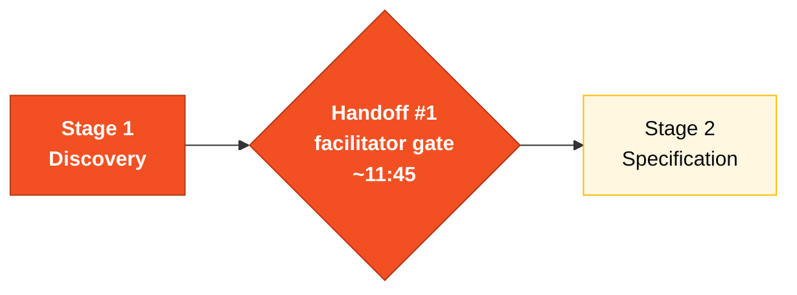

# Legacy Exploration Checklist

> **Hard gate before Stage 2.** No EARS requirement is accepted without a reference to a Natural program or DDM file. Greenfield requirements (no legacy parallel) must be marked `[GREENFIELD]` and justified in writing in the spec.
>
> Why? In the previous workshop edition, several teams skipped legacy exploration and wrote specs based only on the modernization brief. The result was specs that didn't preserve real business rules from 29 years of SIFAP. **This time, the gate is enforced.**

## Where this fits in the SDLC



This checklist is the **gate at H1**. A facilitator (blue lanyard) walks your pair through this matrix. Anything red, you don't open Stage 2.

## Who works here

Every pair contributes — **Pair 1 (Vision)** owns the rule catalog and ultimately answers to the facilitator. Pair 4 (Quality) owns the DDM mapping. Pair 5 (Operations / Tech Writer) owns glossary voice and the discovery report.

---

## 1. The hard rule

```
Every REQ-ID in your SPECIFICATION.md MUST have a `source_legacy` line that
points to one of:
 - a specific .NSN program in legacy/natural-programs/ (and ideally a line range)
 - a specific .ddm file in legacy/adabas-ddms/
 - the literal string [GREENFIELD] with a 1-line justification
```

CI rejects PRs to `develop` if any REQ-ID is missing the `source_legacy` line. Facilitators sample at H2 (Handoff #2, ~14:30).

---

## 2. The 15 Natural programs — who reads what

Each pair owns 3 programs. **No program may be left unread.**

| Pair | Programs to read | Why |
|------|------------------|-----|
| **1 · Vision** (PO + RE) | `CADBENEF.NSN`, `CADDEPEND.NSN`, `CADPROG.NSN` | Registration logic = the core entities that become EARS subjects |
| **2 · Architecture** (EA + SA) | `BATCHPGT.NSN`, `BATCHREL.NSN`, `BATCHCON.NSN` | Batch flows reveal module boundaries (bounded contexts) |
| **3 · Implementation** (TL + Dev) | `CALCBENF.NSN`, `CALCCORR.NSN`, `CALCDSCT.NSN` | Calculations are where modern code will live; you must reproduce them |
| **4 · Quality** (DBA + QA) | `VALBENEF.NSN`, `VALDOCS.NSN`, `VALELEG.NSN` | Validations become tests; DBA also maps fields from DDMs |
| **5 · Operations** (DevOps + TW) | `CONSBENF.NSN`, `RELPGT.NSN`, `RELAUDIT.NSN` | Read paths inform glossary and runbook |

### Per-program checklist (mark in `business-rules-catalog.md`)

For every program your pair owns, fill these 5 fields:

- [ ] Program name + author + last-modified year
- [ ] Inputs (which DDMs it reads)
- [ ] Outputs (which DDMs it writes)
- [ ] Other programs it calls (CALLNAT chain)
- [ ] **At least 1 business rule extracted as a row in `business-rules-catalog.md`** with `Source Program` and ideally a line range

Empty `Source Program` = invalid row.

---

## 3. The 4 DDMs — field mapping

Pair 4 (DBA + QA) leads. Every other pair contributes review.

| DDM | Owner | Target PostgreSQL artifact |
|-----|-------|----------------------------|
| `BENEFICIARIO.ddm` | Pair 4 | `beneficiary` table |
| `PAGAMENTO.ddm` | Pair 4 | `payment` table |
| `PROGRAMA-SOCIAL.ddm` | Pair 4 | `social_program` table |
| `AUDITORIA.ddm` | Pair 4 | `audit_event` table |

For each DDM:

- [ ] Listed every field with type (A/N/D/etc.) and length
- [ ] Marked `MU` (multi-value) and `PE` (periodic group) fields explicitly
- [ ] Proposed PostgreSQL mapping (column type, nullability, relation table for MU/PE)
- [ ] Identified at least 1 anti-pattern (denormalization, magic constants, …)

---

## 4. Mystery hunt — minimum quota

There are **10 hidden business rules**, **3 easter eggs**, and **4 inconsistencies** planted in the legacy code. See [`mysteries-checklist.md`](mysteries-checklist.md) for the hunt list (without answers).

**Quota to pass the gate:** at least **5 mysteries** documented in `mysteries-found.md` with:

- The mystery itself (one sentence)
- Where you found it (file + line range)
- Why it matters (impact if not preserved)

---

## 5. Verification before opening Stage 2

At ~11:45 a facilitator checks your pair's work against this matrix. Red rows block the team from Stage 2.

| Artifact | Path | Gate criterion |
|----------|------|---------------|
| Glossary | `01-arqueologia/glossary.md` | ≥ 30 terms, each with a `legacy source` if it came from code |
| Business rules catalog | `01-arqueologia/business-rules-catalog.md` | ≥ 15 rules, **100% with non-empty `Source Program`** |
| Dependency map | `01-arqueologia/dependency-map.md` | Mermaid graph covering all 15 `.NSN` programs (no orphans) |
| Mysteries found | `01-arqueologia/mysteries-found.md` | ≥ 5 mysteries with file+line evidence |
| Discovery report | `01-arqueologia/discovery-report.md` | All sections filled (no placeholders) |

---

## 6. Required spec-format snippet (carry into Stage 2)

When you start writing EARS in Stage 2, **every requirement must follow this format**:

```yaml
REQ-PAY-001:
 pattern: event-driven
 text: "When a payment cycle is generated, SIFAP shall create payment records
 for every beneficiary with status ACTIVE."
 source_legacy: legacy/natural-programs/BATCHPGT.NSN#L120-L168
 acceptance: "10 active + 2 suspended beneficiaries produces 10 payment records."
```

Greenfield case (no legacy parallel):

```yaml
REQ-AUTH-001:
 pattern: ubiquitous
 text: "SIFAP shall authenticate users via OAuth2 with JWT tokens."
 source_legacy: "[GREENFIELD] Legacy used terminal session auth; modern API needs token auth."
 acceptance: "Unauthenticated requests return 401."
```

> Spec without `source_legacy` line = invalid. Specky validators in CI enforce this.

---

## Common pitfalls

| ❌ | ✅ |
|----|----|
| "I read most of the programs" | Every pair must complete all 3 of its programs |
| Filling `Source Program` with just `BATCHPGT.NSN` and moving on | Aim for `BATCHPGT.NSN#L<start>-L<end>` — line range matters in Stage 3 |
| Skipping the DDMs because "Pair 4 does that" | Every pair reviews at least one DDM during Hour 1 |

## How you know you're done

Every box in §2, §3, §4, §5 is checked. Facilitator signed off. Team moves to lunch knowing Stage 2 will open clean.

## Next step

After lunch, **Pair 2 (Architecture)** opens [Stage 2 — Modern Specification](../02-spec-moderna/GUIDE.md). Pair 1 stays on for scope sign-off.

## Navigation

| Previous | Home | Next |
|----------|------|------|
| [Stage 1 — Guide](GUIDE.md) | [Stage 1](README.md) | [Stage 2 — Spec](../02-spec-moderna/GUIDE.md) |

— Paula
