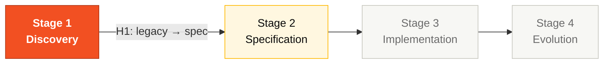

# Stage 1 — Archaeology

> **You can't skip this stage.** Every requirement you write in Stage 2 must trace to a `.NSN` or `.ddm` file. CI enforces it. Facilitators verify at Handoff #1 (~11:45).

This is the discovery phase of the SDLC. Three hours of structured reading, mapping, and cataloguing the legacy SIFAP. You exit with five artifacts that feed Stage 2.

## Where this fits in the SDLC

## Who works here

All 5 pairs in parallel. Lead is **Pair 1 (Vision)** plus **Pair 5 (Operations / Tech Writer)** as the writing voice. See [GUIDE.md](GUIDE.md) for per-pair program ownership.

## What's in this folder

| File | Purpose |
|------|---------|
| [`GUIDE.md`](GUIDE.md) | **Start here.** Step-by-step guide for Stage 1 |
| [`LEGACY-EXPLORATION-CHECKLIST.md`](LEGACY-EXPLORATION-CHECKLIST.md) | **Hard gate.** Per-pair program ownership + DoD matrix |
| [`glossary.md`](glossary.md) | Domain term glossary template (≥30 terms) |
| [`business-rules-catalog.md`](business-rules-catalog.md) | Business rules catalog template (`Source Program` mandatory) |
| [`dependency-map.md`](dependency-map.md) | Mermaid dependency map template |
| [`discovery-report.md`](discovery-report.md) | End-of-stage consolidated report |
| [`mysteries-checklist.md`](mysteries-checklist.md) | Hunt list — what to look for (no answers) |
| [`mysteries-found.md`](mysteries-found.md) | Log of mysteries your team discovered |

The legacy code itself lives at [`../../legacy/`](../../legacy/) — bundled with the kit, never edited.

## Quick path

1. Read [`GUIDE.md`](GUIDE.md) (10 min).
2. Open the [`LEGACY-EXPLORATION-CHECKLIST.md`](LEGACY-EXPLORATION-CHECKLIST.md) and find your pair's 3 programs.
3. Start filling the templates as you read.
4. At ~11:45, a facilitator validates your work against the checklist.

## Next step

When Handoff #1 passes, **Pair 2 (Architecture)** opens [Stage 2 — Specification](../02-spec-moderna/GUIDE.md). The `business-rules-catalog.md` you produced **becomes** the input of `SPECIFICATION.md`.

## Navigation

| Previous | Home | Next |
|----------|------|------|
| [Team Flow](../TEAM-FLOW.md) | [Kit (EN)](../README.md) | [Stage 1 — Guide](GUIDE.md) |

— Paula
