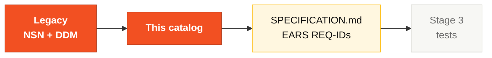

# Business Rules Catalog — SIFAP Legacy

> Record every business rule you extract from the Natural/Adabas code here. Each rule must be traceable back to its source.
>
> **Hard rule:** rows with empty `Source Program` are **invalid** and don't count toward the Stage 2 gate. Always prefer the format `legacy/natural-programs/FILE.NSN#L<start>-L<end>`. Minimum accepted: the `.NSN` file name.

## Where this fits in the SDLC

This catalog is the bridge from raw legacy to formal EARS. Pair 1 (Vision) owns the file; every pair contributes rows.

## Who works here

- **Pair 1 (Vision)** consolidates and prioritizes
- **All pairs** contribute rows from their 3 programs (see GUIDE.md)
- **Pair 5 (Operations / Tech Writer)** polishes wording for consistency

## How to fill a row

1. Give it the next `BR-NNN` ID (sequential).
2. Describe the rule in **one sentence**.
3. Fill `Source Program` with `legacy/natural-programs/FILE.NSN#L<start>-L<end>` (preferred) or at least the file name.
4. List the DDM fields touched.
5. Pick a risk level. When in doubt, lean higher.
6. Add a one-line note if there's a gotcha (special case, dependency, history).

## Risk levels

| Level | Description |
|-------|-------------|
| **CRITICAL** | Financial or security rule — error causes direct loss |
| **HIGH** | Core business rule — affects the main flow |
| **MEDIUM** | Validation or formatting rule — affects data quality |
| **LOW** | Presentation or convenience rule — limited impact |

## Rules found

| ID | Business Rule | Source Program | DDM Fields | Risk | Notes |
|----|---------------|----------------|------------|------|-------|
| BR-001 | | | | | |
| BR-002 | | | | | |
| BR-003 | | | | | |
| BR-004 | | | | | |
| BR-005 | | | | | |
| BR-006 | | | | | |
| BR-007 | | | | | |
| BR-008 | | | | | |
| BR-009 | | | | | |
| BR-010 | | | | | |
| BR-011 | | | | | |
| BR-012 | | | | | |
| BR-013 | | | | | |
| BR-014 | | | | | |
| BR-015 | | | | | |

> Add more rows as needed. Remember: there are **10 hidden rules** planted in the code!

## Example row (delete before submitting)

| ID | Business Rule | Source Program | DDM Fields | Risk | Notes |
|----|---------------|----------------|------------|------|-------|
| BR-013 | Total deduction cannot exceed 30% of gross amount, except judicial deductions (type J) | `legacy/natural-programs/CALCDSCT.NSN#L142-L148` | `PAGAMENTO.VLR-BRUTO`, `PAGAMENTO.VLR-TOTAL-DSCT`, `PAGAMENTO.TIPO-DSCT` | CRITICAL | Type 'J' = legal exception, no cap applies. |

## Rules by category

### Financial calculations
<!-- List rules about value calculations, benefits, etc. -->

### Status validations
<!-- List rules about status transitions (A, S, C, I, D) -->

### Authorization rules
<!-- List who-can-do-what rules -->

### Temporal rules
<!-- List rules with deadlines, dates, periods -->

## Common pitfalls

| ❌ | ✅ |
|----|----|
| "Source Program: legacy" | At minimum the `.NSN` file name; preferred: file#L<start>-L<end> |
| Two rows describing the same rule | Deduplicate during Hour 3 synthesis |
| 1-paragraph rule descriptions | One sentence. Anything longer goes in `Notes`. |
| Implementation detail labeled as a business rule | Domain decision only — ignore I/O, paging, format |

## How you know you're done

- [ ] At least 15 rows filled
- [ ] 100% of rows have `Source Program`
- [ ] At least 1 row per pair-owned program
- [ ] At least 5 rules tagged CRITICAL or HIGH

## Summary

- Total rules found: ___
- Critical rules: ___
- Rules with duplication: ___
- Hidden rules (undocumented): ___

## Next step

This catalog feeds Stage 2's `SPECIFICATION.md`. Pair 2 (Architecture) reads it Monday afternoon to write REQ-IDs in EARS format. Every catalog row should become (or be explicitly rejected as) a REQ-ID.

## Navigation

| Previous | Home | Next |
|----------|------|------|
| [Stage 1 — Guide](GUIDE.md) | [Stage 1](README.md) | [Stage 2 — Spec](../02-spec-moderna/GUIDE.md) |
