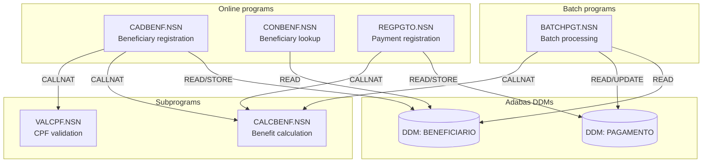
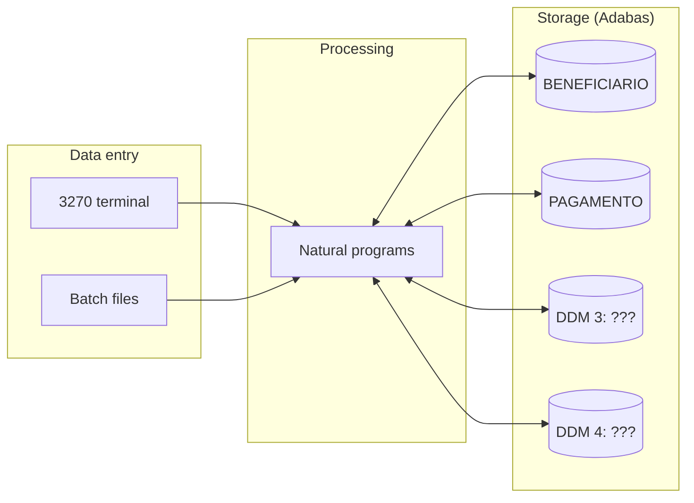

# Dependency Map — SIFAP Legacy

> Use Mermaid diagrams to map dependencies between Natural programs and Adabas DDMs. The goal is to visualize "who calls whom" and "who reads/writes what".

## Where this fits in the SDLC

The dependency map is **Pair 2 (Architecture)**'s primary input. The clusters you see in this graph are the candidate bounded contexts in Stage 2.

## Who works here

- **Pair 2 (Architecture)** leads
- **All pairs** contribute as they read their 3 programs (note which programs they call via `CALLNAT`)

## How to think about it

Don't try to make a pretty graph. Try to surface **groups** of programs that talk to each other a lot. Those groups will become modules in Stage 3. If you see one program that everything depends on, that's either a god object (anti-pattern) or a legitimate core service (e.g., `VALCPF.NSN`).

## Program dependency diagram

> Replace the example below with your team's real map.
> Tip: search for `CALLNAT` and `PERFORM` across the code to find inter-program calls.

> **Instruction**: this is only an initial example with 6 programs. Your team must map all **15 programs** and **4 DDMs**.

## Data flow diagram (DDMs)

> Replace "DDM 3: ???" and "DDM 4: ???" with the actual names you find.

## Dependency table

| Program | Calls (CALLNAT) | Reads (READ) DDMs | Writes (STORE/UPDATE) DDMs | Notes |
|---------|-----------------|-------------------|----------------------------|-------|
| CADBENF.NSN | | | | |
| CONBENF.NSN | | | | |
| REGPGTO.NSN | | | | |
| BATCHPGT.NSN | | | | |
| CALCBENF.NSN | | | | |
| VALCPF.NSN | | | | |
| | | | | |
| | | | | |
| | | | | |
| | | | | |
| | | | | |
| | | | | |
| | | | | |
| | | | | |
| | | | | |

## Circular dependencies

> List any circular dependency you find (program A calls B which calls A):

- None found yet.

## Orphan programs

> Programs that are not called by anyone (possible entry points or dead code):

- To investigate.

## Common pitfalls

| ❌ | ✅ |
|----|----|
| Stopping at 6 programs because the example shows 6 | Cover all 15; that's the gate criterion |
| Drawing every `MOVE` as an arrow | Only `CALLNAT`, `PERFORM`, and DDM read/write |
| Forgetting the 4 DDMs | Add them — they're nodes too |

## How you know you're done

- [ ] All 15 `.NSN` programs in the diagram
- [ ] All 4 DDMs in the diagram
- [ ] No orphans (or, if any, listed and explained)
- [ ] Circular dependencies (if any) flagged

## Next step

Pair 2 (Architecture) uses this graph to define **bounded contexts** in [`02-spec-moderna/GUIDE.md`](../02-spec-moderna/GUIDE.md). The visible clusters here are the strongest candidates.

## Navigation

| Previous | Home | Next |
|----------|------|------|
| [Stage 1 — Guide](GUIDE.md) | [Stage 1](README.md) | [Stage 2 — Spec](../02-spec-moderna/GUIDE.md) |
