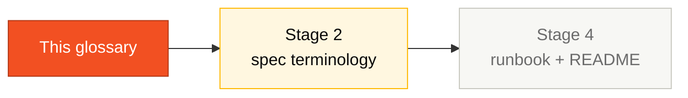

# Glossary — SIFAP Legacy

> Fill this table with every term, abbreviation, and acronym found in the Natural/Adabas code.
> **Target: minimum 30 terms.**

## Where this fits in the SDLC

The glossary survives the whole day. Stage 2 uses it for consistent naming in the spec. Stage 4 uses it in the runbook. Stage 1's job is just to get it started — 30+ terms.

## Who works here

**Pair 5 (Operations / Tech Writer)** owns the voice and final cleanup. **Pair 1 (Vision)** contributes terms while reading registration programs. **All pairs** add terms when they encounter unfamiliar abbreviations.

## How to fill it

- **Term**: the abbreviation or acronym exactly as it appears in code
- **Expansion**: full meaning
- **Program**: which `.NSN` or `.ddm` file you found it in
- **Context**: short explanation of how/where the term is used

## Terms found

| # | Term | Expansion | Program | Context |
|---|------|-----------|---------|---------|
| 1 | | | | |
| 2 | | | | |
| 3 | | | | |
| 4 | | | | |
| 5 | | | | |
| 6 | | | | |
| 7 | | | | |
| 8 | | | | |
| 9 | | | | |
| 10 | | | | |
| 11 | | | | |
| 12 | | | | |
| 13 | | | | |
| 14 | | | | |
| 15 | | | | |
| 16 | | | | |
| 17 | | | | |
| 18 | | | | |
| 19 | | | | |
| 20 | | | | |
| 21 | | | | |
| 22 | | | | |
| 23 | | | | |
| 24 | | | | |
| 25 | | | | |
| 26 | | | | |
| 27 | | | | |
| 28 | | | | |
| 29 | | | | |
| 30 | | | | |

> Add more rows as needed. Don't stop at 30!

## Example row (delete before submitting)

| # | Term | Expansion | Program | Context |
|---|------|-----------|---------|---------|
| 1 | DSCT | Desconto (Deduction) | CALCDSCT.NSN | Variable suffix for deduction-related fields and the program name itself |

## Naming pattern observations

- Prefix/suffix patterns the team identified: [e.g., `CAD*` = registration; `CALC*` = calculation; `VAL*` = validation; `BATCH*` = batch; `CONS*` = query; `REL*` = report]
- Ambiguous terms that need expert validation: [list]
- Terms inherited from Portuguese legal/financial vocabulary: [list]

## Common pitfalls

| ❌ | ✅ |
|----|----|
| Definitions in 3 paragraphs | One sentence — anything longer goes elsewhere |
| Skipping common terms because "everyone knows" | If it's domain-specific, include it (e.g., what is a "cycle"?) |
| Listing the same term twice with different spellings | Pick one canonical form; note variations in Context |

## How you know you're done

- [ ] At least 30 terms
- [ ] Each term has expansion + program + 1-line context
- [ ] No duplicates
- [ ] Pair 5 has cleaned the voice for consistency

## Next step

This glossary is the **canonical vocabulary** for the rest of the day. Stage 2 spec uses these names. Stage 3 code uses these names. Stage 4 docs use these names.

## Navigation

| Previous | Home | Next |
|----------|------|------|
| [Stage 1 — Guide](GUIDE.md) | [Stage 1](README.md) | [Stage 2 — Spec](../02-spec-moderna/GUIDE.md) |
