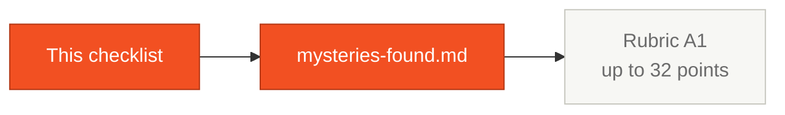

# Mysteries Checklist — SIFAP

> There are **10 hidden business rules** and **3 easter eggs** planted in the legacy code. The more your team finds, the higher the score on rubric dimension A1.

## Where this fits in the SDLC

## Who works here

**Pair 4 (QA)** consolidates the find list, but **every pair** contributes as they read their 3 programs. Hidden rules are distributed across all 15 programs and the 4 DDMs.

## How scoring works

- Each mystery is worth 1–3 points depending on difficulty
- Total possible: **32 points**
- Mysteries are distributed across the 15 `.NSN` programs and the 4 DDMs
- No mystery is documented in `legacy-docs/` — the docs are deliberately out of date

## Hidden business rules (10)

Tick [x] when found:

- [ ] **MYS-001** (★★): A program silently modifies a beneficiary's status based on a demographic criterion. Where? Why?
- [ ] **MYS-002** (★): A numeric limit is hardcoded in the code but contradicts the capacity defined in the DDM. What is the limit? In which program?
- [ ] **MYS-003** (★★★): A mysterious variable is used in calculations but was never documented — nobody knows where the constant came from. Which variable?
- [ ] **MYS-004** (★★★): In a specific month of the year, the benefit calculation changes completely. Which month? What changes?
- [ ] **MYS-005** (★★★): The system uses a rounding technique that causes systematic cent loss. Which technique? Where?
- [ ] **MYS-006** (★★): One deduction type ignores a limit rule that applies to all others. Which type? Why?
- [ ] **MYS-007** (★): Certain CPFs are accepted without real validation. Which ones? Bug or feature?
- [ ] **MYS-008** (★): Beneficiaries from one specific region skip ALL eligibility checks. Which region?
- [ ] **MYS-009** (★★): The batch processing follows an order that isn't the most logical, but other systems now depend on it. What order?
- [ ] **MYS-010** (★★★): One audit event type is systematically hidden from reports. Which type? Intentional or bug?

## Easter eggs (3)

- [ ] **EGG-001** (★): A commented-out code block references a 1990s economic policy that was never removed. Which policy?
- [ ] **EGG-002** (★): A program has a special validation function that accepts certain documents without verification. Looks like a test backdoor. Where?
- [ ] **EGG-003** (★): Dead code references an integration with a company that no longer exists. Which company?

## Doc-vs-code inconsistencies (bonus)

- [ ] **INC-001**: A documented limit diverges from what the code allows
- [ ] **INC-002**: The original architecture document doesn't mention a data structure added later
- [ ] **INC-003**: Critical calculation rules don't appear in any document
- [ ] **INC-004**: Two programs use different rounding methods for the same kind of value

## Scoring

| Range | Rating |
|-------|--------|
| 26–32 points | Excellent — complete archaeology |
| 18–25 points | Solid — good investigation |
| 10–17 points | Satisfactory — basics found |
| 0–9 points | Needs improvement — dig deeper |

## How to think about the hunt

The mysteries are **planted on purpose**. They reflect the kind of undocumented rules that exist in every 29-year-old legacy system. Finding them isn't a stunt — it's the skill you need to safely modernize anything in production.

When you read a program, three questions surface mysteries:

1. **Is there a constant with no comment?** Magic number = possible mystery.
2. **Is there an `IF` based on a date, month, region, or CPF prefix?** Special-case = possible mystery.
3. **Does the documentation say one thing and the code do another?** Inconsistency = mystery.

## Tips

- Use **Copilot Chat** to ask about each program: "Is there any hidden logic in this code?"
- Compare what the **documentation says** with what the **code does** — inconsistencies are intentional
- The DDMs also have clues in their comments
- If you get stuck, raise your hand — after 90 minutes the facilitator can give a calibrated hint

## How you know you're done

You've reached at least 5 mysteries documented in `mysteries-found.md` with file + line + impact. Anything above that is bonus points.

## Next step

Document everything in [`mysteries-found.md`](mysteries-found.md). Pair 4 (QA) leads the consolidation during Hour 3.

## Navigation

| Previous | Home | Next |
|----------|------|------|
| [Stage 1 — Guide](GUIDE.md) | [Stage 1](README.md) | [Mysteries Found](mysteries-found.md) |
