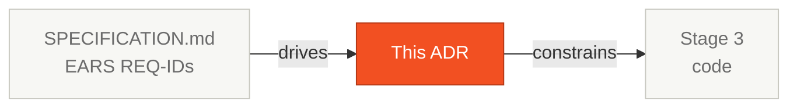

# ADR-XXX: [Decision Title]

**Date**: 2026-05-19
**Status**: Proposed | Accepted | Rejected | Superseded by ADR-YYY
**Deciders**: [Names of team members involved]

## Where this fits in the SDLC

ADRs document **why** the team chose this path over alternatives. Pair 2 (Architecture) writes; Pair 5 (Tech Writer) clarity-passes.

## Context

> Describe the problem or need motivating this decision. Include constraints, requirements, and relevant background. Be specific — "we need a database" is not enough.

[Write here]

## Options considered

### Option 1: [Name]
- **Description**: [How it would work]
- **Pros**: [List]
- **Cons**: [List]

### Option 2: [Name]
- **Description**: [How it would work]
- **Pros**: [List]
- **Cons**: [List]

### Option 3: [Name] (optional)
- **Description**: [How it would work]
- **Pros**: [List]
- **Cons**: [List]

## Decision

> State the decision clearly and directly.
> Example: "We decided to use PostgreSQL 16 as the relational database."

**We decided to [action/choice].**

## Rationale

> Explain WHY this option was chosen over the others. Connect to requirements, constraints, and context.

[Write here]

## Consequences

### Positive
- [Positive consequence 1]
- [Positive consequence 2]

### Negative
- [Negative consequence 1 — and how to mitigate]
- [Negative consequence 2 — and how to mitigate]

### Risks
- [Risk identified and contingency plan]

## References

- [Link or relevant document]
- [Related EARS requirement: REQ-XXX]
- [Related business rule: BR-XXX]

## How you know it's good

| ❌ Weak ADR | ✅ Strong ADR |
|-------------|----------------|
| "We'll use Spring Boot" | "Among Spring Boot, Quarkus, Micronaut: chose Spring Boot for the client team familiarity and Spring Modulith support for modular monolith" |
| Only the chosen path described | Three options with explicit pros/cons |
| Consequences section empty | Both positive and negative consequences listed |
| No date or status | Date, status, and deciders filled in |

## Next step

Cite this ADR-NNN in `SPECIFICATION.md` wherever the decision constrains a requirement. Pair 3 (Implementation) reads ADRs before opening Stage 3.

## Navigation

| Previous | Home | Next |
|----------|------|------|
| [Stage 2 — Guide](GUIDE.md) | [Stage 2](README.md) | [Scope Decisions](scope-decisions.md) |
