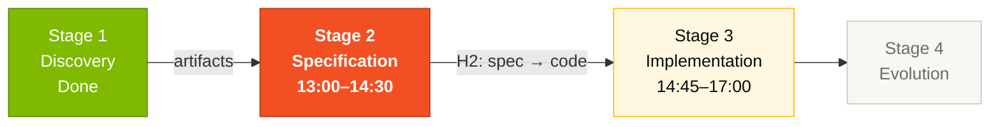
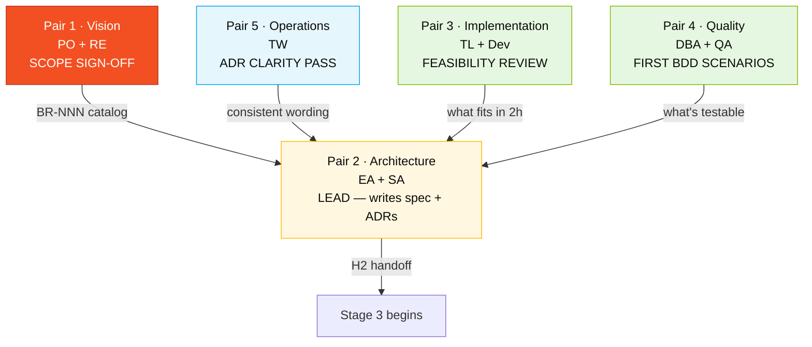
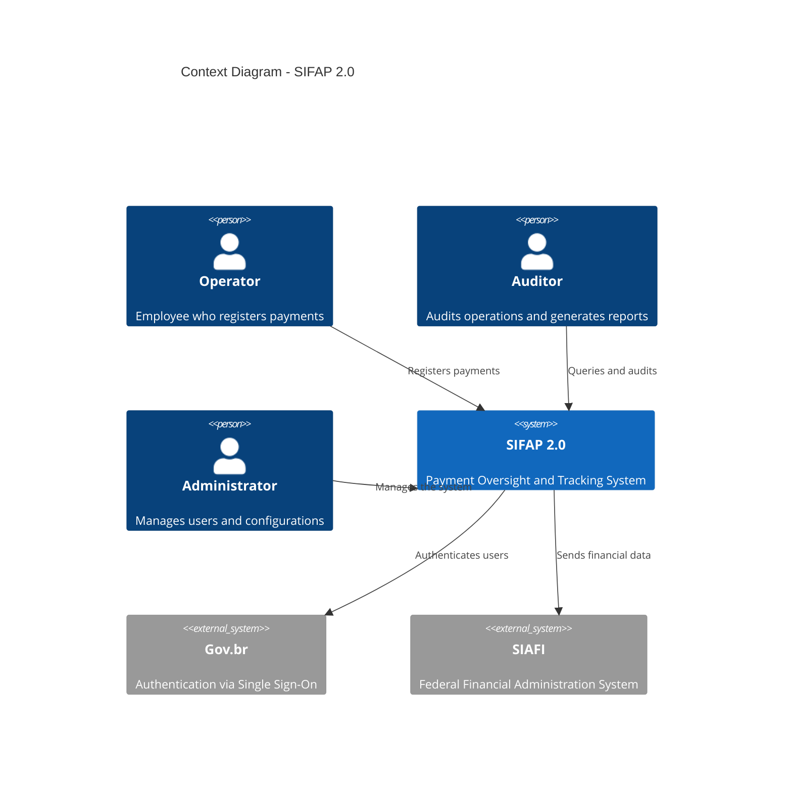
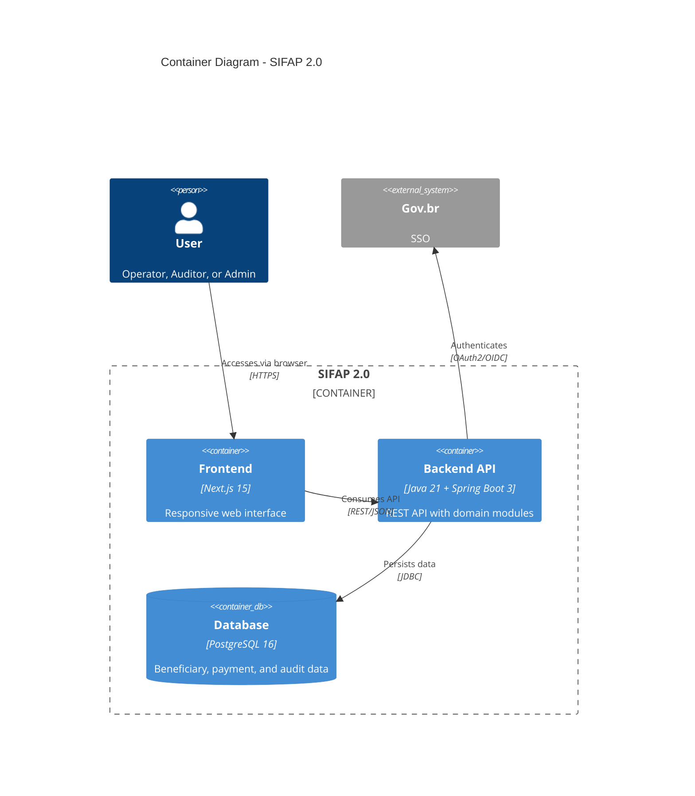

# Stage 2 — Modern Specification

> **Hard rule.** Every EARS requirement in your `SPECIFICATION.md` must include a `source_legacy:` line pointing to a `.NSN` or `.ddm` file inside [`../../legacy/`](../../legacy/), **or** be marked `source_legacy: "[GREENFIELD] <one-line justification>"`. CI rejects PRs that violate this. Facilitators sample at Handoff #2 (~14:30).
>
> Why? In the previous edition some teams wrote specs from the modernization brief alone, skipping legacy reading. Their prototypes lost real business rules. This time, traceability is the gate.

## Where this fits in the SDLC



## Who works here



## Objective

Transform Stage 1 discoveries into a modern, structured technical specification using EARS notation for requirements, ADRs for architecture decisions, and C4 diagrams for visualization. Every artifact must trace back to legacy evidence or declare its greenfield nature.

## Why this matters

A spec without traceability becomes a wish list. In two months a developer asks "where does this requirement come from?" and nobody knows. In two years an audit asks "did you preserve the deduction cap from CALCDSCT?" and nobody can prove it.

The format you adopt here — EARS + `source_legacy` + ADR — is what makes the spec **survive the day**. It's also what makes Stage 3 fast: a developer with a clear REQ-ID linked to a legacy line knows exactly what to build.

## How to think about Stage 2

Imagine your job as **translating** rather than inventing. Pair 1 already extracted the rules in Stage 1. Pair 2's job is to dress those rules in a format that:

- A machine can validate (`sdd_validate_ears`)
- A developer can implement directly
- A QA engineer can turn into a test on the spot
- An auditor can trace back to its 1997 origin

When you're tempted to "make up" a requirement, stop. Either it's in the catalog (then cite it) or it's truly new (then mark `[GREENFIELD]` and justify). No third option.

## Gold-standard reference

Before you start, study the reference specification at [`../../../03-spec-sifap-moderno/SPECIFICATION.md`](../../../03-spec-sifap-moderno/SPECIFICATION.md). It shows the format and level of detail expected. Your specification should follow the same structure — including the `source_legacy:` field on every requirement.

---

## EARS notation — Easy Approach to Requirements Syntax

EARS is a method for writing requirements without ambiguity. There are **6 patterns** that eliminate vague language. Specky validates each requirement programmatically via `sdd_validate_ears`.

### Pattern 1: Ubiquitous (always true)

> **The [system] shall [action].**

SIFAP example:
> SIFAP shall store all payment records with a UTC timestamp.

Use when: the rule ALWAYS holds, with no condition.

### Pattern 2: Event-driven (when something happens)

> **When [event], the [system] shall [action].**

SIFAP example:
> When a beneficiary is registered, SIFAP shall validate the CPF using the modulo-11 algorithm from Receita Federal.

Use when: the rule only applies after a specific event.

### Pattern 3: State-driven (while a condition holds)

> **While [condition], the [system] shall [action].**

SIFAP example:
> While a payment has status PENDING, SIFAP shall allow cancellation by a user with the OPERATOR profile.

Use when: the rule only holds during a state.

### Pattern 4: Optional (if the user chooses)

> **Where [optional condition], the [system] shall [action].**

SIFAP example:
> Where the operator chooses to export the report, SIFAP shall generate a CSV file with UTF-8 encoding.

Use when: the functionality is not mandatory — it depends on a user choice.

### Pattern 5: Unwanted behavior (what shall NOT happen)

> **The [system] shall not [unwanted action].**

SIFAP examples:
> SIFAP shall not allow deletion of records from the audit table.
> SIFAP shall not process payments for beneficiaries with status CANCELLED.

Use when: you need to document explicit restrictions or prohibitions.

### Pattern 6: Complex (combination of conditions)

> **While [condition], when [event], where [optional condition], the [system] shall [action].**

SIFAP example:
> While the beneficiary has status ACTIVE, when a payment cycle is generated in December, SIFAP shall calculate the 13th salary using a differentiated formula.

Use when: multiple conditions combine.

### Bad vs. good requirement

| Bad (vague) | Good (EARS) |
|-------------|-------------|
| "The system must be secure" | "SIFAP shall mask CPF in logs using the format `***.***.XXX-**`" |
| "Payments must be processed" | "When a cycle is generated, SIFAP shall create payment records for all beneficiaries with status ACTIVE" |
| "Complete audit" | "When any entity is changed, SIFAP shall write an audit record with prior and posterior state in JSON format" |

### Every requirement must be TESTABLE

When writing a requirement, ask: "How would I test this automatically?" If you can't answer, the requirement is too vague.

| Requirement | Test |
|-------------|------|
| REQ-BEN-01: "SIFAP shall validate CPF with modulo-11" | Invalid CPF returns error 400 |
| REQ-PAY-03: "When a cycle is generated, create payments for ACTIVE beneficiaries" | 10 active + 2 suspended = 10 payments |
| REQ-AUD-01: "SIFAP shall not allow DELETE on audit" | DELETE returns error 403 |

---

## Concrete example — from legacy rule to test

To make the format stick, here's a full cycle from `CALCDSCT.NSN` legacy code → Stage 3 test.

### 1. Rule found in Stage 1

In `CALCDSCT.NSN` the team discovered:
```natural
* CHECK DEDUCTION CAP
IF #TIPO-DSCT NE 'J'
 IF #VLR-TOTAL-DSCT > (#VLR-BRUTO * 0.30)
 COMPUTE #VLR-TOTAL-DSCT = #VLR-BRUTO * 0.30
 END-IF
END-IF
```

**Interpretation**: deductions are capped at 30% of the gross amount, EXCEPT judicial deductions (type 'J').

### 2. EARS requirement (Stage 2)

Using **Unwanted Behavior** + **Event**:

```yaml
REQ-PAY-DSCT-01:
 pattern: unwanted
 text: "SIFAP shall not allow the total of non-judicial deductions to exceed 30%
 of the payment's gross amount."
 source_legacy: legacy/natural-programs/CALCDSCT.NSN#L142-L148
 acceptance:
 - "Non-judicial deduction of 35% is truncated to 30%."

REQ-PAY-DSCT-02:
 pattern: event-driven
 text: "When a judicial deduction is applied, SIFAP shall add the value to the
 total deductions without applying the 30% cap."
 source_legacy: legacy/natural-programs/CALCDSCT.NSN#L142-L148
 acceptance:
 - "Judicial deduction of 50% is accepted in full."
 - "Mix of judicial (20%) + non-judicial (25%) = 45% total accepted."
```

### 3. Code (Stage 3)

```java
public BigDecimal calculateTotalDeductions(List<Deduction> deductions, BigDecimal grossAmount) {
 BigDecimal judicialTotal = deductions.stream()
 .filter(d -> "JUDICIAL".equals(d.type()))
 .map(Deduction::amount)
 .reduce(BigDecimal.ZERO, BigDecimal::add);

 BigDecimal otherTotal = deductions.stream()
 .filter(d -> !"JUDICIAL".equals(d.type()))
 .map(Deduction::amount)
 .reduce(BigDecimal.ZERO, BigDecimal::add);

 BigDecimal maxOther = grossAmount.multiply(new BigDecimal("0.30"));
 otherTotal = otherTotal.min(maxOther); // Cap at 30%

 return judicialTotal.add(otherTotal); // Judicial has no cap
}
```

### 4. Test (Stage 3)

```java
@Test
@DisplayName("REQ-PAY-DSCT-01: Non-judicial deductions capped at 30%")
void nonJudicialDeductionsCappedAt30Percent() {
 var deductions = List.of(new Deduction("TAX", new BigDecimal("350.00")));
 assertThat(service.calculateTotalDeductions(deductions, new BigDecimal("1000.00")))
 .isEqualByComparingTo("300.00");
}

@Test
@DisplayName("REQ-PAY-DSCT-02: Judicial deductions bypass 30% cap")
void judicialDeductionsBypass30PercentCap() {
 var deductions = List.of(new Deduction("JUDICIAL", new BigDecimal("500.00")));
 assertThat(service.calculateTotalDeductions(deductions, new BigDecimal("1000.00")))
 .isEqualByComparingTo("500.00");
}
```

### Traceability

| Artifact | ID | Reference |
|----------|-----|-----------|
| Legacy rule | BR-013 | `CALCDSCT.NSN#L142-L148` |
| Requirement | REQ-PAY-DSCT-01/02 | `SPECIFICATION.md` |
| Code | `PaymentService.calculateTotalDeductions()` | `payment/application/` |
| Test | `PaymentServiceTest` (2 methods) | `payment/application/` |

**This cycle is what Specky enforces automatically via `sdd_check_sync`.** Code diverges from spec → hook detects it.

---

## ADRs — Architecture Decision Records

ADRs document important architecture decisions. For each decision, create a file using [`ADR-TEMPLATE.md`](ADR-TEMPLATE.md).

### When to create an ADR

- Technology choice (database, framework, etc.)
- Architecture pattern (modular monolith vs. microservices)
- Migration strategy (big bang vs. incremental)
- Significant trade-offs (performance vs. simplicity)

### Expected ADRs (minimum 3)

1. **ADR-001**: Architecture choice (e.g., modular monolith)
2. **ADR-002**: Data migration strategy
3. **ADR-003**: Authentication and authorization approach
4. ADR-004 to ADR-005: Additional team decisions

---

## C4 diagrams — context, containers, components

Use Mermaid to create at least the **Context (C4-L1)** and **Containers (C4-L2)** diagrams.

### Example C4-L1: Context diagram



### Example C4-L2: Container diagram



---

## Scope decisions

Use [`scope-decisions.md`](scope-decisions.md) to record what will be migrated, dropped, or evolved. **Pair 1 (PO) leads this**.

---

## Specky workflow — recommended

> **What is Specky?** A CLI that installs a set of **agents** (specialized chat assistants), **slash commands** (`/specky-migration`), and **MCP tools** (internal engines) into VS Code / Claude Code. You interact with the agents and slash commands — the MCP tools run underneath automatically.

**Specky** (https://github.com/paulasilvatech/specky) is the workshop's Spec-Driven Development engine. It validates EARS requirements programmatically and enforces quality.

### Installation (if not in the devcontainer)

```bash
npm install -g specky-sdd@latest
specky install --ide=copilot # VS Code + GitHub Copilot
# OR
specky install --ide=claude # Claude Code
```

### Verify the installation

```bash
specky doctor # All checks should be green
specky status # Shows the current pipeline phase
```

### Specky agents (invoke in chat)

| Agent | What it does | When to use |
|-------|--------------|-------------|
| `@specky-orchestrator` | Coordinates the full pipeline | To run the complete flow |
| `@spec-engineer` | Writes SPECIFICATION.md in EARS | Phase 2 — requirements |
| `@design-architect` | Generates DESIGN.md + C4 diagrams | Phase 4 — architecture |
| `@sdd-clarify` | Resolves EARS ambiguities | When a requirement is confusing |
| `@requirements-engineer` | Extracts requirements from docs/code | Convert Stage 1 → requirements |

### Slash commands (shortcuts)

| Command | Description |
|---------|-------------|
| `/specky-greenfield` | New project from scratch |
| `/specky-brownfield` | Feature in an existing system |
| `/specky-migration` | Legacy modernization ← **use this one** |
| `/specky-specify` | Specify EARS requirements |

### Recommended Stage 2 workflow

```
1. @specky-orchestrator "run migration pipeline for SIFAP 2.0"
 → Creates the structure in .specs/001-sifap-modernization/

2. @requirements-engineer
 → Imports rules from Stage 1 and converts them to EARS

3. @spec-engineer
 → Generates a complete SPECIFICATION.md with 20-30 EARS requirements

4. sdd_validate_ears
 → Validates that each requirement follows one of the 6 EARS patterns

5. @design-architect
 → Generates DESIGN.md with C4 L1+L2 and ADRs

6. @sdd-clarify (if needed)
 → Resolves detected ambiguities
```

### If Specky is NOT available

No problem — write the EARS requirements manually in `SPECIFICATION.md` following the 6 patterns above. The format is plain text.

---

## Common pitfalls

| ❌ | ✅ |
|----|----|
| Writing requirements without `source_legacy:` | Every REQ-ID has it; CI rejects PR otherwise |
| "The system must be performant" (vague) | "The system shall respond to 95% of `/beneficiaries` queries in < 500ms" |
| One ADR that says "we'll use Spring Boot" | ADRs document a **decision** with alternatives considered |
| Skipping the C4 because "we don't have time" | At minimum C4-L1; level 2 is 15 minutes more |
| Pair 2 working solo, ignoring Pair 1 sign-off | PO approves scope before H2, in writing |

## How you know you're done (Definition of Done)

By the end of Stage 2, your team must have:

- [ ] `SPECIFICATION.md` with EARS requirements, every one carrying `source_legacy:`
- [ ] 3 to 5 ADRs (e.g., `ADR-001.md`, `ADR-002.md`, etc.)
- [ ] C4 diagram in Mermaid (inside SPECIFICATION.md or in a separate file)
- [ ] Documented scope decisions in [`scope-decisions.md`](scope-decisions.md)
- [ ] Pair 1 (PO) signed off in writing on scope
- [ ] `sdd_validate_ears` returns 0 errors (or all 6 patterns recognized)

## Next step

When Pair 1 signs off scope at 14:30, **Pair 3 (Implementation) + Pair 4 (Quality)** open [Stage 3 — Implementation](../03-implementacao/GUIDE.md) in parallel. Pair 5 starts drafting the CI scaffolding.

## Quick reference

```
EARS rejected by CI? → cite legacy file in source_legacy: line
ADR template? → ADR-TEMPLATE.md in this folder
Need help with C4? → cheat-sheets/specky-workflow.md
Which Claude model? → cheat-sheets/model-routing.md (Opus for ADR decisions)
```

## Navigation

| Previous | Home | Next |
|----------|------|------|
| [Stage 1](../01-arqueologia/README.md) | [Stage 2](README.md) | [Stage 3](../03-implementacao/GUIDE.md) |

— Paula
