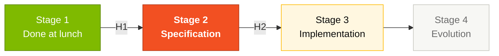

# Stage 2 — Modern Specification

> Every requirement here MUST trace back to a `.NSN` or `.ddm` file from Stage 1, or be marked `[GREENFIELD]`. CI enforces it. Facilitators sample at Handoff #2 (~14:30).

## Where this fits in the SDLC

## Who works here

Lead: **Pair 2 (Architecture)**. Pair 1 (Vision) signs off scope. Pair 5 (Operations / Tech Writer) does ADR clarity pass. Pairs 3 and 4 comment on feasibility.

## What's in this folder

| File | Purpose |
|------|---------|
| [`GUIDE.md`](GUIDE.md) | **Start here.** Step-by-step guide for Stage 2 |
| [`ADR-TEMPLATE.md`](ADR-TEMPLATE.md) | Architecture Decision Record template |
| [`scope-decisions.md`](scope-decisions.md) | What to migrate, drop, or evolve |

You'll also produce a `SPECIFICATION.md` (EARS), C4 diagrams, and 3+ ADRs in this folder during Stage 2.

## Quick path

1. Read [`GUIDE.md`](GUIDE.md) (10 min).
2. Open the `business-rules-catalog.md` from Stage 1 — it's your input.
3. Write EARS requirements following the 6 patterns.
4. Draft 3 ADRs from the [`ADR-TEMPLATE.md`](ADR-TEMPLATE.md).
5. Fill [`scope-decisions.md`](scope-decisions.md) with Pair 1's prioritization.

## Next step

When Handoff #2 passes at 14:30, **Pair 3 (Implementation) + Pair 4 (Quality)** open [Stage 3 — Implementation](../03-implementacao/GUIDE.md) in parallel.

## Navigation

| Previous | Home | Next |
|----------|------|------|
| [Stage 1](../01-arqueologia/README.md) | [Kit (EN)](../README.md) | [Stage 2 — Guide](GUIDE.md) |

— Paula
