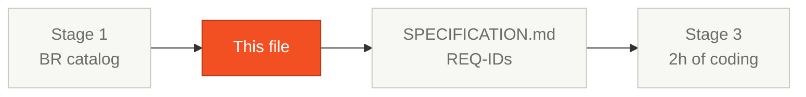

# Scope Decisions — SIFAP 2.0

> For every feature found in Stage 1, decide: **Migrate**, **Drop**, or **Evolve**.
>
> - **Migrate**: bring to SIFAP 2.0 as-is (same logic, new technology)
> - **Drop**: don't bring — obsolete or unnecessary
> - **Evolve**: bring AND improve (new UX, new flow, new capability)

## Where this fits in the SDLC

## Who works here

**Pair 1 (Product Owner) leads.** Pair 2 (Architecture) validates technical viability. Pair 3 (TL) flags "this won't fit in 2 hours". This file is signed by the PO before Handoff #2.

## How to think about scope

You have 2 hours of coding in Stage 3. With Copilot Agent that's a lot — but it isn't infinite. The default trap is "let's migrate everything". You can't. Pick the **3–5 features** that protect the monthly payment cycle, drop the rest, and document the call.

Rule of thumb: if a feature doesn't touch the **monthly payment cycle** or **financial integrity**, it's probably backlog.

---

## Decisions per feature

| # | Feature | Decision | Justification | BR-XXX | Priority |
|---|---------|----------|---------------|--------|----------|
| 1 | Beneficiary registration | Migrate / Drop / Evolve | | | High / Med / Low |
| 2 | Beneficiary lookup | | | | |
| 3 | Payment registration | | | | |
| 4 | Batch processing | | | | |
| 5 | Benefit calculation | | | | |
| 6 | CPF validation | | | | |
| 7 | Reports | | | | |
| 8 | Audit | | | | |
| 9 | User management | | | | |
| 10 | | | | | |
| 11 | | | | | |
| 12 | | | | | |

> Add rows for every feature identified.

---

## New features (not in legacy)

> List features SIFAP 2.0 should have that didn't exist in the legacy:

| # | New feature | Justification | Priority | Complexity |
|---|-------------|---------------|----------|------------|
| N1 | | | | |
| N2 | | | | |
| N3 | | | | |

---

## Scope summary

| Decision | Count | Percent |
|----------|-------|---------|
| Migrate | | |
| Drop | | |
| Evolve | | |
| **Total** | | 100% |

## Scope risks

> Risks of the decisions taken:

| Risk | Probability | Impact | Mitigation |
|------|-------------|--------|------------|
| | High / Med / Low | High / Med / Low | |

## Common pitfalls

| ❌ | ✅ |
|----|----|
| "Migrate all" with no cuts | Cut to 3–5 features. Backlog the rest. |
| Decisions with no BR-XXX reference | Every row points to at least one rule in the Stage 1 catalog |
| PO disappears at lunch and signs at 14:25 | PO sits with Pair 2 during Stage 2 and signs progressively |

## Approval

- [ ] Pair 1 (Product Owner) approved scope decisions
- [ ] Pair 2 (Enterprise Architect) validated technical viability
- [ ] Pair 3 (Technical Lead) confirmed "fits in 2 hours"
- [ ] Team agreed on priorities

## Next step

After PO sign-off, this file is the **scope contract** for Stage 3. Pair 3 (Implementation) builds **only what's in the Migrate / Evolve rows** with Priority = High.

## Navigation

| Previous | Home | Next |
|----------|------|------|
| [Stage 2 — Guide](GUIDE.md) | [Stage 2](README.md) | [Stage 3 — Guide](../03-implementacao/GUIDE.md) |
