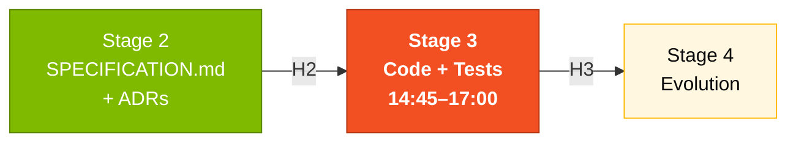
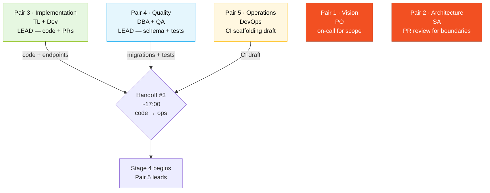

# Stage 3 — Implementation

> **Quality over quantity.** One well-built endpoint with tests, validation, and documentation is worth more than five broken ones. Pair 3 (Implementation) leads the backend + frontend; Pair 4 (Quality) leads the data layer + tests. They run in parallel.

## Where this fits in the SDLC



## Who works here



## Objective

Extend the working SIFAP 2.0 prototype by implementing the features prioritized in Stage 2. The prototype already has the base structure — your team adds features, fixes bugs, and writes tests.

## Why this matters

Stage 3 is where every team's quality of Stages 1 and 2 becomes visible. Pair 3 reads the EARS requirements and feels immediately whether they're testable. They open the BR catalog and see whether the legacy is documented. If yes, coding feels like translation. If no, coding feels like guessing.

Your job in Stage 3 is to **finish**. A pretty endpoint that doesn't compile is worth zero. A messy endpoint that passes the test and ships is worth a lot. Pick the right battles.

## How to think about Stage 3

The prototype is already running. Don't rebuild it. **Read the existing code**, copy its style, extend it with the REQ-IDs from Stage 2.

Three rules:

1. **One REQ-ID = one feature branch = one PR.** Don't lump three requirements into one merge.
2. **Test as you code.** Not at 16:55. The QA pair writes the BDD scenario before the code; the developer implements until the test passes.
3. **Use Copilot deliberately.** Chat to understand, Edits to produce, Agent to delegate. See [`cheat-sheets/copilot-3-modes.md`](../cheat-sheets/copilot-3-modes.md).

---

## Getting started (first 15 minutes)

### 1. Bring up the environment

```bash
# At the repository root (04-prototipo-sifap-moderno/)
docker compose up -d
```

This starts:
- **PostgreSQL 16** on port 5432
- **Backend (Java 21 + Spring Boot 3)** on port 8080
- **Frontend (Next.js 15)** on port **3000** (local) or **3001** (root docker-compose)

> **Warning**: If you ran `docker compose up` from the workspace ROOT (recommended), the frontend is at **http://localhost:3001**. If you ran it from inside `04-prototipo-sifap-moderno/`, it is at **http://localhost:3000**.

### 2. Verify everything works

- Backend health: http://localhost:8080/actuator/health
- Swagger UI: http://localhost:8080/swagger-ui.html
- Frontend: http://localhost:3001 (or 3000 if local compose)

### 3. Default credentials

| User | Password | Profile | What they can do |
|------|----------|---------|------------------|
| `admin` | `client2026` | ADMIN | Everything: manage users, configurations |
| `operator1` | `client2026` | OPERATOR | Register beneficiaries, record payments |
| `auditor1` | `client2026` | AUDITOR | Query, generate reports, audit |

### 4. Test the API in Swagger

1. `POST /api/v1/auth/login` with `{"username": "admin", "password": "client2026"}`
2. Copy the returned JWT token
3. Click "Authorize" in Swagger and paste the token
4. Test the beneficiary and payment endpoints

---

## Backend structure

The backend follows a **modular monolith** architecture with 4 modules and 3 layers each:

```
src/main/java/br/gov/client/sifap/
|
|-- beneficiary/ # Module: Beneficiaries
| |-- domain/ # Entities and business rules
| |-- application/ # Services and DTOs
| |-- infrastructure/ # Controllers, Repositories, JPA Entities
|
|-- payment/ # Module: Payments
|-- audit/ # Module: Audit
|-- admin/ # Module: Administration
```

### Layers (inside out)

| Layer | Responsibility | Examples |
|-------|----------------|----------|
| **domain** | Pure business rules, no framework dependency | Status enums, repository interfaces, value objects |
| **application** | Use cases, orchestration | Services, Request/Response DTOs |
| **infrastructure** | Technical details, I/O | REST controllers, JPA Entities, Spring Data Repositories |

### Golden rule

The `domain` layer **never** imports classes from `infrastructure`. Flow is always: Controller → Service → Repository (interface in domain, implementation in infrastructure).

---

## How to add a new feature (5 steps)

### Step 1: Create or update the domain entity

```java
// src/.../payment/domain/PaymentStatus.java
public enum PaymentStatus {
 PENDING, APPROVED, REJECTED, CANCELLED
}
```

**Why**: status is pure domain. No framework dependency. Lives in `domain/`.

### Step 2: Create the service

```java
// src/.../payment/application/PaymentService.java
@Service
public class PaymentService {
 // Inject the repository, implement the logic
}
```

**Why**: orchestration lives in `application/`. The service uses the repository **interface** from `domain/`.

### Step 3: Create the controller

```java
// src/.../payment/infrastructure/PaymentController.java
@RestController
@RequestMapping("/api/v1/payments")
public class PaymentController {
 // Inject the service, expose the endpoints
}
```

**Why**: HTTP is an infrastructure concern. Lives in `infrastructure/`.

### Step 4: Create the database migration

```sql
-- src/main/resources/db/migration/V2__add_payment_status.sql
ALTER TABLE payments ADD COLUMN status VARCHAR(20) DEFAULT 'PENDING';
```

**Important**: Use Flyway. **Never modify existing migrations** — always create new ones (V2__, V3__, etc.).

### Step 5: Write tests

```java
// src/test/.../payment/application/PaymentServiceTest.java
@SpringBootTest
class PaymentServiceTest {
 @Test
 void shouldCalculatePaymentCorrectly() {
 // Arrange, Act, Assert
 }
}
```

---

## Workflow with Copilot Edits

To implement features quickly:

1. **Select the relevant files** in VS Code (Ctrl+click).
2. **Open Copilot Edits** (Ctrl+Shift+I).
3. **Describe the change** in natural language:
 > "Add a PUT /api/v1/beneficiaries/{id}/status endpoint that allows
 > changing the beneficiary's status. Validate that the status transition is valid
 > (ACTIVE → SUSPENDED is allowed, INACTIVE → ACTIVE is not). Create the test."
4. **Review the diff** before accepting — verify it follows the architecture.
5. **Run the tests** to confirm.

---

## Concrete example — REQ-ID to PR

Imagine `SPECIFICATION.md` has:

```yaml
REQ-PAY-DSCT-01:
 pattern: unwanted
 text: "SIFAP shall not allow the total of non-judicial deductions to exceed 30%
 of the payment's gross amount."
 source_legacy: legacy/natural-programs/CALCDSCT.NSN#L142-L148
```

### What Pair 3 does

1. Create branch `feat/REQ-PAY-DSCT-01-deduction-cap`.
2. Implement `PaymentService.calculateTotalDeductions()` in `application/`.
3. Open PR with title `REQ-PAY-DSCT-01: cap non-judicial deductions at 30%`.

### What Pair 4 does (in parallel)

1. Write the test `nonJudicialDeductionsCappedAt30Percent` and `judicialDeductionsBypass30PercentCap` in `PaymentServiceTest`.
2. Add seed data if needed (deductions of types I, T, J).
3. Approve the PR when tests pass and code follows boundaries.

### What Pair 2 does (on review)

- Verify imports don't cross bounded contexts.
- Verify domain layer doesn't import infrastructure.

### What Pair 1 does (on demo prep)

- Adds a demo line: "show a payment with mixed J + non-J deductions; verify cap applies only to non-J".

This is what "one REQ-ID = one PR = one demo moment" looks like in practice.

---

## Tests

### Run all tests

```bash
cd 04-prototipo-sifap-moderno/backend
./mvnw test
```

### Requirements

- **Docker must be running** — tests use Testcontainers to spin up a real PostgreSQL
- Java 21 installed (or use the devcontainer)

### Test types

| Type | Where | What it tests |
|------|-------|---------------|
| Unit | `*ServiceTest.java` | Isolated business logic |
| Integration | `*ControllerTest.java` | Full endpoint (HTTP → DB) |
| Repository | `*RepositoryTest.java` | Custom queries |

---

## Frontend

### Run the frontend locally

```bash
cd 04-prototipo-sifap-moderno/frontend
npm install
npm run dev
```

Open http://localhost:3000.

### Frontend architecture

Next.js 15 with App Router and Server Components:

```
src/app/
|-- layout.tsx # Root layout
|-- page.tsx # Home page
|-- (auth)/
| |-- login/page.tsx # Login page
|-- (dashboard)/
| |-- beneficiaries/ # Beneficiary CRUD
| |-- payments/ # Payment CRUD
| |-- audit/ # Audit logs
| |-- admin/ # User management
```

### Server Components pattern

- **Server Components** (default): fetch data on the server, no JavaScript on the client
- **Client Components** (`"use client"`): only when interactivity is needed (forms, modals)

---

## Traceability: requirement → code → test

For every feature, keep traceability:

| EARS Requirement | Code | Test |
|------------------|------|------|
| REQ-BEN-01: "SIFAP shall validate CPF with modulo-11" | `Cpf.java` (domain) | `CpfTest.java` — 11 tests |
| REQ-PAY-03: "When a cycle is generated, create payments for ACTIVE beneficiaries" | `PaymentCycleService.generate()` | `PaymentCycleServiceTest.generate_openCycle` |
| REQ-AUD-01: "When an entity is changed, write an audit record" | `AuditService.record()` | `SifapApplicationIntegrationTest` |

Document each feature in the commit: "Implements REQ-XXX". Closes the spec → code → test loop.

---

## Troubleshooting

| Problem | Solution |
|---------|----------|
| `docker compose up` fails | Check: Docker Desktop running? Ports 5432/8080/3000 free? Try `docker compose down && docker compose up -d` |
| Backend can't connect to PostgreSQL | Check postgres container health: `docker compose ps` |
| Frontend shows "Failed to load" | Is backend running? Test: `curl http://localhost:8080/actuator/health` |
| Login returns "Invalid credentials" | Use admin / client2026. Check V4__auth.sql ran (Flyway) |
| Testcontainers test fails | Docker Desktop must be running. Alternative: unit test with Mockito |
| Migration fails on startup | NEVER edit existing migration. Create a new one (V5__, V6__...) |
| `mvn test-compile` import error | Check package structure: domain/ → application/ → infrastructure/ |
| Swagger UI doesn't appear | Try http://localhost:8080/swagger-ui/index.html |

---

## Common pitfalls

| ❌ | ✅ |
|----|----|
| One huge branch with all changes | One REQ-ID = one branch = one PR |
| Tests written at 16:55 | Tests as you code; Pair 4 writes them in parallel |
| Cross-context imports (`payment` importing `beneficiary.infrastructure`) | Only through domain interfaces |
| Editing existing Flyway migrations | New migrations only (V5__, V6__...) |
| Using Agent for what Edits does in 5 min | Agent for full features; Edits for multi-file refactors |

## How you know you're done (Definition of Done)

By the end of Stage 3:

- [ ] Working backend with at least 2 new endpoints implemented (traced to REQ-IDs)
- [ ] Frontend with at least 1 new screen or significant improvement
- [ ] `./mvnw test` green
- [ ] `docker compose up` works — any reviewer can boot the system
- [ ] Swagger UI shows all endpoints documented
- [ ] At least 1 business rule from Stage 1 implemented and tested
- [ ] Pair 4 confirms ≥ 70% backend coverage, ≥ 60% frontend

## Next step

At 17:00, **Pair 5 (DevOps + Tech Writer)** takes the lead for [Stage 4 — Evolution](../04-evolucao/GUIDE.md). Pair 3 stays involved for Agent Mode delegation. Pair 4 owns the final coverage gate.

## Quick reference

```
Container won't start? → docker compose down && up -d
Migration broke? → create new migration, never edit
Cross-context import? → Pair 2 reviews before merge
Which Copilot mode? → cheat-sheets/copilot-3-modes.md
Test failing? → read error; if NPE check mocks; if assertion check expected value
```

## Navigation

| Previous | Home | Next |
|----------|------|------|
| [Stage 2](../02-spec-moderna/README.md) | [Stage 3](README.md) | [Stage 4](../04-evolucao/GUIDE.md) |

— Paula
