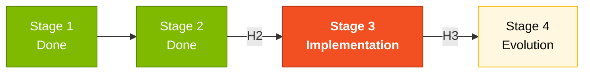

# Stage 3 — Implementation

> Build the SIFAP 2.0 prototype — Java 21 backend, Next.js 15 frontend, PostgreSQL 16 database — using GitHub Copilot in all 3 modes.

## Where this fits in the SDLC

## Who works here

Two lead pairs **in parallel**:
- **Pair 3 (Implementation)** — TL + Dev, owns code and PRs
- **Pair 4 (Quality)** — DBA + QA, owns schema, migrations, tests

Pair 5 (Operations) drafts the CI pipeline. Pair 1 (Vision) on-call to clarify scope. Pair 2 (Architecture) reviews PRs that touch bounded-context boundaries.

## What's in this folder

| File | Purpose |
|------|---------|
| [`GUIDE.md`](GUIDE.md) | **Start here.** Step-by-step coding guide |

The actual code lives in [`../../../04-prototipo-sifap-moderno/`](../../../04-prototipo-sifap-moderno/) (backend + frontend + docker-compose).

## Quick path

1. Read [`GUIDE.md`](GUIDE.md) (15 min).
2. `docker compose up -d` from `04-prototipo-sifap-moderno/`.
3. Verify backend + frontend running.
4. Pick the first REQ-ID from `SPECIFICATION.md` and implement it (with tests).

## Next step

At 17:00, **Pair 5 (Operations)** takes the wheel for [Stage 4 — Evolution](../04-evolucao/GUIDE.md). Pair 3 stays involved for Copilot Agent Mode delegation.

## Navigation

| Previous | Home | Next |
|----------|------|------|
| [Stage 2](../02-spec-moderna/README.md) | [Kit (EN)](../README.md) | [Stage 3 — Guide](GUIDE.md) |

— Paula
