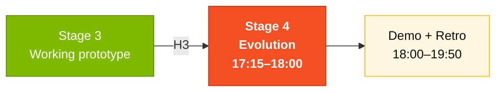
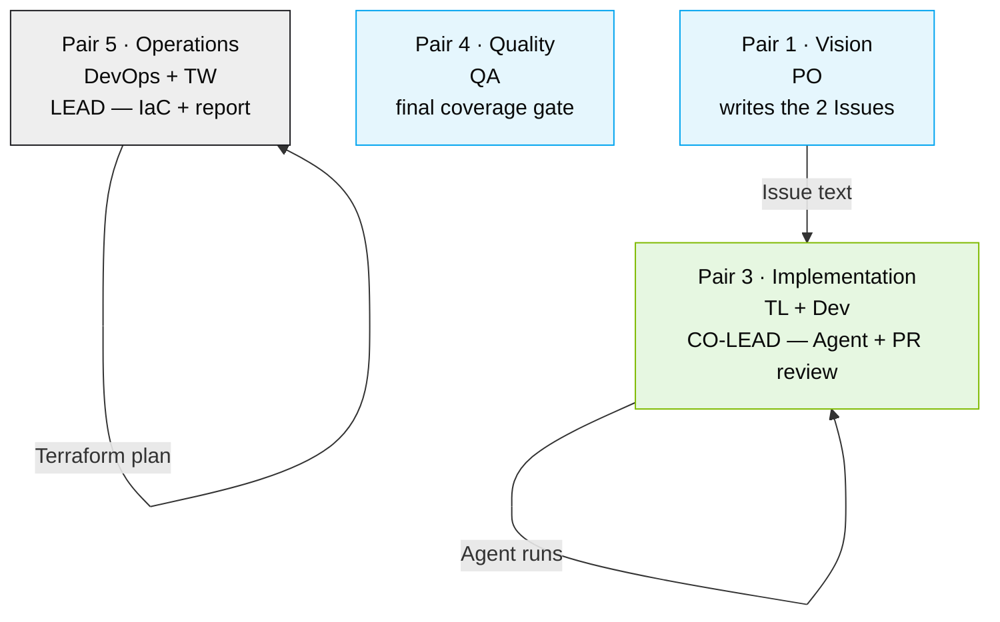

# Stage 4 — Evolution with Agents

> Use **GitHub Copilot Agent Mode** to implement complete features via Issues and Pull Requests, and explore infrastructure as code (Terraform) for Azure deployment.

## Where this fits in the SDLC



## Who works here



## Part 1 — GitHub Copilot Agent Mode (30 min)

### What is Agent Mode?

**Copilot Agent Mode** is the third mode of GitHub Copilot (after Chat and Edits). In Agent Mode you:

1. **Write a GitHub Issue** describing the complete feature
2. **Trigger the Agent** in VS Code (via the Copilot panel → "Start Agent" or through Copilot Workspace on github.com)
3. **The Agent analyzes the entire codebase**, plans the changes, and implements code + tests + docs
4. **Opens a Pull Request** for you to review

Think of the Agent as a **very fast junior developer** — it does the heavy lifting, but YOU review everything before merging.

> **Difference between the 3 modes:**
> - **Chat**: you ask, Copilot answers (exploration, questions)
> - **Edits**: you select files and describe the change, Copilot edits (guided implementation)
> - **Agent**: you describe the entire feature via an Issue, Copilot implements it on its own (delegation)

### Why this matters

In Stage 3 you used your hands. In Stage 4 you learn to use a teammate-shaped tool. The same Issue text that takes Pair 3 thirty minutes to scope can be delegated to the Agent in five minutes. But — and this is the lesson — the Agent fails the same way a junior developer fails: when the Issue is vague.

The Agent is a multiplier of clarity. Vague Issue → vague PR → bad demo. Clear Issue → clean PR → talkable demo moment.

### How to think about Agent Mode

Imagine you're writing instructions for someone who has never seen your project. They have access to all the files, but no context for why anything is the way it is. The Issue is the **only** input. Give them:

- A clear title
- The "why"
- Functional requirements as a checklist
- Technical constraints (architecture, libraries, file locations)
- Acceptance criteria
- File references

Anything you leave out, the Agent makes up. And it tends to make up plausible-but-wrong things.

### How to write a good Issue for the Agent

A well-written Issue is 80% of success. Follow this format:

---

#### Real example: Payment notification by email

```markdown
## Title
Add email notification on payment confirmation

## Description
When a payment is confirmed (status changing from PENDING to APPROVED),
the system must send a notification email to the beneficiary informing
them of the amount and the payment date.

## Functional Requirements
- [ ] When a payment's status changes to APPROVED, send an email
- [ ] The email must contain: beneficiary name, amount, date, payment number
- [ ] If sending fails, log it in the audit log (do not block the payment)
- [ ] The email template must be configurable

## Technical Requirements
- [ ] Create an EmailService in the payment/application module
- [ ] Use Spring Mail configured via application.yml
- [ ] Create a unit test mocking the email send
- [ ] Create an integration test with MailHog (Docker container)
- [ ] Add the SMTP_HOST variable to docker-compose.yml

## Architecture
- Follow the existing modular structure (domain/application/infrastructure)
- The EmailService must be injected into PaymentService
- Use Spring events (ApplicationEvent) to decouple

## Acceptance Criteria
- [ ] Unit test passing
- [ ] Integration test passing
- [ ] Working docker compose up with MailHog
- [ ] Email received in MailHog when approving a payment via Swagger

## Context
- Backend: Java 21 + Spring Boot 3
- Relevant module: src/.../payment/
- References: PaymentService.java, PaymentController.java
```

---

### Checklist for writing Issues

Before submitting the Issue to the Agent, check that:

- [ ] **Clear title** — describes the feature in one sentence
- [ ] **Description with context** — the Agent needs the "why"
- [ ] **Requirements as a checklist** — verifiable items
- [ ] **Technical requirements** — where in the code, which patterns to follow
- [ ] **Acceptance criteria** — how to know it's done
- [ ] **File references** — help the Agent find the right code

### Agent workflow

1. **Create the Issue** on GitHub using the format above.
2. **Trigger the Agent** (via Copilot Workspace or VS Code).
3. **Wait for the PR** — the Agent works and opens a PR.
4. **Review the PR** using the checklist below.
5. **Request changes** if needed (comment on the PR).
6. **Merge** when you're satisfied.

---

### How to review an Agent PR

When the Agent opens a PR, review it carefully:

#### Correctness
- [ ] Does the code compile without errors?
- [ ] Do the tests pass? (`./mvnw test`)
- [ ] Does the feature work as described in the Issue?

#### Architecture
- [ ] Does it follow the modular structure (domain/application/infrastructure)?
- [ ] Are there no circular imports between modules?
- [ ] Does the domain layer avoid importing classes from infrastructure?

#### Quality
- [ ] Are class, method, and variable names clear?
- [ ] Is there proper error handling?
- [ ] Is there input validation (Bean Validation)?
- [ ] Are there no hardcoded credentials?

#### Tests
- [ ] Are there unit tests for the business logic?
- [ ] Are there integration tests for the endpoints?
- [ ] Do tests cover error cases (not only the happy path)?

#### Documentation
- [ ] Do new endpoints appear in Swagger?
- [ ] Is there JavaDoc on public methods?
- [ ] Has the README been updated if needed?

---

## Part 2 — Terraform and infrastructure (10 min)

### Overview

The Terraform modules for Azure deployment live in [`../../../05-terraform-azure/`](../../../05-terraform-azure/):

```
05-terraform-azure/
|-- main.tf # Root module
|-- variables.tf # Input variables
|-- outputs.tf # Outputs
|-- modules/
| |-- resource-group/ # Azure resource group
| |-- container-registry/ # ACR for Docker images
| |-- container-apps/ # Azure Container Apps
| |-- postgresql/ # Azure Database for PostgreSQL
| |-- key-vault/ # Azure Key Vault for secrets
| |-- monitoring/ # Application Insights + Log Analytics
```

### What to explore

1. **Read `main.tf`** — understand how modules connect.
2. **Look at the variables** — which parameters are configurable?
3. **Study the outputs** — what does Terraform export?
4. **Check Key Vault** — how are secrets managed?

### Terraform in practice

| Module | What it provisions | Azure resource |
|--------|--------------------|----------------|
| `compute/` | Java backend | App Service (B1 dev, P1v3 prod) |
| `database/` | Database | PostgreSQL Flexible Server |
| `frontend/` | Next.js frontend | Static Web App |
| `registry/` | Docker images | Azure Container Registry |
| `security/` | Secrets | Key Vault |
| `observability/` | Monitoring | Application Insights + Log Analytics |
| `identity/` | Identity | Azure AD / Entra ID |

To explore (you don't need to apply):

```bash
cd 05-terraform-azure/envs/dev
terraform init # Initialize providers
terraform plan # Show what WOULD be created (without applying)
```

Example `terraform plan` output:
```
Plan: 12 to add, 0 to change, 0 to destroy.

 + azurerm_resource_group.sifap
 + azurerm_postgresql_flexible_server.sifap
 + azurerm_service_plan.sifap
 + azurerm_linux_web_app.sifap_backend
 + azurerm_static_web_app.sifap_frontend
 + azurerm_key_vault.sifap
 + azurerm_application_insights.sifap
 + azurerm_container_registry.sifap
 ...
```

> **Workshop scope**: Explore and understand. **Do NOT** apply (`terraform apply`) — that creates real Azure resources with real cost. `terraform plan` is enough.

### When the Agent fails

Common problems:

| Symptom | Likely cause | What to do |
|---------|--------------|-----------|
| PR doesn't compile | Issue lacked enough technical context | Add: expected architecture, reference files, patterns to follow |
| Tests missing in the PR | Issue didn't ask for tests | Add a checkbox: "Include unit and integration tests" |
| Imports cross bounded contexts | Agent ignores module boundaries | Reject the PR; add: "Respect domain/application/infrastructure boundaries" |
| PR has incorrect logic | Ambiguous requirement | Rewrite the requirement in EARS and open a new Issue |
| Agent stalls or takes too long | Codebase too large | Narrow the scope: point to specific files |

**Golden rule**: When the Agent gets it wrong, the cause is almost always in the Issue. Improve the Issue before trying again.

### CI/CD: GitHub Actions

```
.github/workflows/
|-- ci.yml # Build + test on every PR
|-- cd-staging.yml # Automatic deploy to staging
|-- cd-production.yml # Production deploy (manual approval)
```

- **CI**: runs on every Pull Request. Steps: checkout → setup Java 21 → build → test → lint. Failure blocks the merge.
- **CD-staging**: runs after merge to `develop`. Steps: build Docker image → push to ACR → deploy to Container Apps.

---

## Common pitfalls

| ❌ | ✅ |
|----|----|
| Vague Issue, blame the Agent | Spend 10 minutes on the Issue, save 30 in PR cleanup |
| Merging without review because "it's just the Agent" | Review like any other PR — Agent is a teammate, not a magic wand |
| Running `terraform apply` "to see what happens" | `plan` only. Apply costs real money. |
| Pair 5 writing the experience report alone at 18:55 | Pair 5 (TW) starts the report at 17:30 as the Agent runs |

## How you know you're done (Definition of Done)

By the end of Stage 4:

- [ ] **2 Issues** created in the right format for the Agent
- [ ] **2 PRs** generated by the Agent (one per Issue)
- [ ] **1 merged feature** — at least one PR approved and merged
- [ ] **Agent experience report** filled in [`agent-experience-report.md`](agent-experience-report.md)
- [ ] **Terraform** explored — `terraform plan` runs without error

## Next step

18:00 — demo time. Pair 1 (PO) narrates the story. Pair 3 (Dev) drives the screen. Every persona contributes 30 seconds. Then retro, then close.

## Quick reference

```
Vague Agent PR? → improve the Issue, not the PR
Cross-context import? → reject + clarify boundaries in Issue
Don't run terraform apply → use `terraform plan` only
Honest report? → bad findings worth as much as good ones
```

## Navigation

| Previous | Home | Next |
|----------|------|------|
| [Stage 3](../03-implementacao/README.md) | [Stage 4](README.md) | [Agent Report](agent-experience-report.md) |

— Paula
