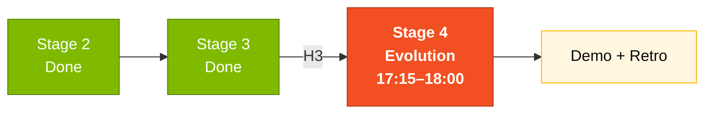

# Stage 4 — Evolution

> Add infrastructure as code (Terraform), CI/CD pipeline (GitHub Actions), and iterate using GitHub Copilot Agent Mode.

## Where this fits in the SDLC

## Who works here

**Pair 5 (DevOps + Tech Writer)** leads. **Pair 3 (TL + Dev)** co-leads on the Agent Mode delegation. **Pair 4 (QA)** runs the final coverage gate.

## What's in this folder

| File | Purpose |
|------|---------|
| [`GUIDE.md`](GUIDE.md) | **Start here.** Step-by-step Stage 4 guide |
| [`agent-experience-report.md`](agent-experience-report.md) | Template for documenting your team's Copilot Agent experience |

## Quick path

1. Read [`GUIDE.md`](GUIDE.md) (10 min).
2. Write 2 GitHub Issues following the format in the guide.
3. Trigger Copilot Agent Mode on those Issues.
4. Review the generated PRs; merge at least one.
5. Explore Terraform in [`../../../05-terraform-azure/`](../../../05-terraform-azure/) (no `terraform apply` — just `plan`).
6. Fill [`agent-experience-report.md`](agent-experience-report.md) honestly.

## Next step

At 18:00, demo time. Pair 1 (PO) narrates; Pair 3 (Dev) drives; everyone rehearsed.

## Navigation

| Previous | Home | Next |
|----------|------|------|
| [Stage 3](../03-implementacao/README.md) | [Kit (EN)](../README.md) | [Stage 4 — Guide](GUIDE.md) |

— Paula
