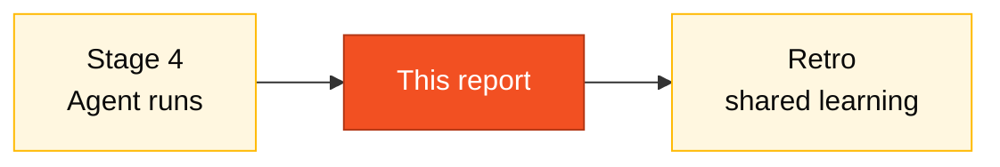

# GitHub Copilot Agent Experience Report

> Fill this in at the end of Stage 4. Be honest — we want to learn what works and what doesn't. A report that says "everything was great" is less valuable than one that says "the Agent failed here, here, and here".

## Where this fits in the SDLC

## Who fills this

**Pair 5 (Tech Writer)** writes; **Pair 3 (TL + Dev)** contributes the technical observations from running the Agent.

**Team**: [Team name]
**Date**: 2026-05-19
**Members**: [List members]

---

## 1. Issues created

### Issue 1
- **Title**: [Issue title]
- **Link**: [GitHub URL]
- **Short description**: [1-2 sentences]
- **Time to write the Issue**: ___ minutes

### Issue 2
- **Title**: [Issue title]
- **Link**: [GitHub URL]
- **Short description**: [1-2 sentences]
- **Time to write the Issue**: ___ minutes

---

## 2. PRs generated by the Agent

### PR 1 (from Issue 1)
- **Link**: [PR URL]
- **Time the Agent took**: ___ minutes
- **Files modified**: ___
- **Tests created?**: Yes / No
- **Required manual adjustments?**: Yes / No
- **Merged?**: Yes / No

### PR 2 (from Issue 2)
- **Link**: [PR URL]
- **Time the Agent took**: ___ minutes
- **Files modified**: ___
- **Tests created?**: Yes / No
- **Required manual adjustments?**: Yes / No
- **Merged?**: Yes / No

---

## 3. What worked well

> List what the Agent did well. Examples: understood the architecture, created good tests, followed patterns.

1. [What worked]
2.
3.

---

## 4. What surprised the team

> What didn't you expect? Positive or negative.

1. [Surprise]
2.
3.

---

## 5. What failed or disappointed

> Where did the Agent get it wrong, not understand, or produce poor code?

1. [Failure]
2.
3.

### Types of failure encountered

- [ ] Code didn't compile
- [ ] Tests failed
- [ ] Didn't follow project architecture
- [ ] Incorrect or circular imports
- [ ] Wrong business logic
- [ ] Missing error handling
- [ ] Credentials or sensitive data in code
- [ ] Other: ___

---

## 6. PR quality (1–5)

| Criterion | Score (1–5) | Comment |
|-----------|-------------|---------|
| Code correctness | | |
| Architecture adherence | | |
| Test quality | | |
| Documentation generated | | |
| Code clarity | | |
| **Overall average** | | |

Scale: 1=Awful, 2=Bad, 3=Acceptable, 4=Good, 5=Excellent

---

## 7. Would you use the Agent again?

- [ ] Yes, for everything — saves a lot of time
- [ ] Yes, for simple and well-defined tasks
- [ ] Maybe, but it needs heavy supervision
- [ ] No, I spend more time reviewing than implementing
- [ ] Not sure yet

**Justification**: [Explain your choice]

---

## 8. Recommendations for other teams

> If another team were to use the Agent for the first time, what would you tell them?

1. [Tip]
2.
3.

---

## 9. Comparison: Agent vs. Copilot Chat vs. manual

| Aspect | Agent Mode | Copilot Chat | Manual |
|--------|------------|-------------|--------|
| Speed | | | |
| Quality | | | |
| Control | | | |
| Learning | | | |
| When to use | | | |

---

## 10. Free-form comments

> Space for any additional observation about your experience with generative AI in development:

[Write here]

## Common pitfalls

| ❌ | ✅ |
|----|----|
| "It was great" with no specifics | Pin down what was great and where |
| Hiding failures to look good | Honest failures are the most valuable data |
| Skipping section 9 | The comparison is the point — it justifies tool choice tomorrow |

## How you know you're done

- [ ] Sections 1 and 2 filled with real Issue/PR links
- [ ] At least 3 entries in section 3 (what worked) AND section 5 (what failed)
- [ ] Section 6 scored
- [ ] Section 9 comparison filled
- [ ] No `[Write here]` placeholders left

## Next step

Pair 5 publishes this report. Pair 1 (PO) cites the highlights in the demo. Then retro at 19:10.

## Navigation

| Previous | Home | Next |
|----------|------|------|
| [Stage 4 — Guide](GUIDE.md) | [Stage 4](README.md) | [Kit (EN)](../README.md) |
