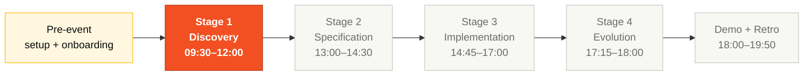

# Team Kit — English

> 🌐 **Languages:** **English (here)** · [Português 🇧🇷](../pt-br/README.md) · [Español 🇲🇽](../es/README.md)

> **Start here if you are a workshop participant.**
>
> 1. Read [`TEAM-FLOW.md`](TEAM-FLOW.md) — how the 5 of you cover 10 personas in 5 pairs (10 minutes).
> 2. Read your two persona cards in [`personas/`](personas/) (15 minutes).
> 3. Open the Stage 1 guide at [`01-arqueologia/GUIDE.md`](01-arqueologia/GUIDE.md).

You and four teammates have one day to modernize a 29-year-old payment system. Five pairs, four stages, ten artifacts, one demo. This folder is the kit that keeps the five of you moving in the same direction.

## Where this fits in the SDLC



This kit covers everything from the moment you clone the repo to the moment your team demos a working SIFAP 2.0. The default highlight is Stage 1 because that's where you'll be at 09:30 sharp.

## Who works here (the 5 pairs)

```mermaid
flowchart TB
 classDef vision fill:#F25022,stroke:#B33816,color:#fff
 classDef arch fill:#FFF7E0,stroke:#FFB900,color:#0A0A0A
 classDef impl fill:#E6F7E1,stroke:#7FBA00,color:#0A0A0A
 classDef qual fill:#E5F6FD,stroke:#00A4EF,color:#0A0A0A
 classDef ops fill:#EEEEEE,stroke:#1B1B1F,color:#0A0A0A

 P1[Pair 1 · Vision<br/>PO + RE<br/>Discovery → Specification]:::vision
 P2[Pair 2 · Architecture<br/>EA + SA<br/>Specification → Design]:::arch
 P3[Pair 3 · Implementation<br/>TL + Dev<br/>Implementation → Evolution]:::impl
 P4[Pair 4 · Quality<br/>DBA + QA<br/>Implementation (data + tests)]:::qual
 P5[Pair 5 · Operations<br/>DevOps + TW<br/>Cross-cutting + Evolution]:::ops

 P1 -- H1 --> P2
 P2 -- H2 --> P3
 P2 -- H2 --> P4
 P3 -- H3 --> P5
 P4 -- H3 --> P5
```

Every person on the team picks **one pair (two personas)** and stays there the whole day. The two personas in a pair are co-responsible — no internal handoff, continuous collaboration. The horizontal handoffs (H1, H2, H3) are where the day either flows or breaks.

## Why this matters

Most modernization projects fail not because the team can't write Java, but because the team writes Java for the wrong problem. They modernize the brief, not the system. They lose 29 years of business rules buried in code that nobody reads. They demo something pretty that doesn't replace anything real.

This kit is built to keep that from happening to you. The legacy code travels with you. The traceability is enforced by CI. The handoffs are scheduled. The roles are explicit. You don't have to invent the process; you have to execute it.

## How to think about this kit

Think of it as a **toolbox plus a map**. The toolbox is the persona kits, prompts, devcontainer, scripts, and CI gates — everything pre-configured. The map is `TEAM-FLOW.md` plus the four stage guides — what the team does together, hour by hour.

You don't read this kit cover to cover. You read the parts your pair needs, when your pair needs them. Three rules:

1. **Read your two persona cards first.** Without that, you'll pick the wrong tool for the wrong stage.
2. **Trust the handoffs.** Pair 1's job isn't to "finish" the spec — it's to feed Pair 2 a clean spec. Pair 3 doesn't deploy — Pair 5 does. Each pair has a recipient downstream.
3. **The legacy is mandatory.** Every requirement in Stage 2 traces back to a `.NSN` or `.ddm` file. CI enforces it. Skip Stage 1 and you'll fail the gate at 14:30.

## Folder structure

| Path | Purpose |
|------|---------|
| [`TEAM-FLOW.md`](TEAM-FLOW.md) | **Read first.** Daily timeline, handoffs, escalation rules |
| [`01-arqueologia/`](01-arqueologia/) | Stage 1 — legacy code archaeology guide, templates, and the hard gate |
| [`02-spec-moderna/`](02-spec-moderna/) | Stage 2 — EARS specification (every REQ needs `source_legacy:`), ADRs, scope |
| [`03-implementacao/`](03-implementacao/) | Stage 3 — Java + Next.js implementation guide |
| [`04-evolucao/`](04-evolucao/) | Stage 4 — Terraform IaC, CI/CD, Copilot Agent Mode |
| [`personas/`](personas/) | The 10 persona cards — read both of yours before starting |
| [`cheat-sheets/`](cheat-sheets/) | Quick-reference cards: Copilot 3 modes, Specky, model routing |

Shared assets at the kit root (`legacy/`, `persona-kits/`, `.github/`, `scripts/`, `.devcontainer/`, `plugins/`) are not translated — they are code, not pedagogy. Reach them from this folder using `../`.

## What's in this English mirror

This folder is the **didactic** English version. The source English files at `06-kit-repositorio-times/<original-path>` are terse references; the files here are the expanded, partner-style versions a developer can actually read and act on.

| You want… | Go to |
|-----------|-------|
| The 10-minute "what do I do today" answer | [`TEAM-FLOW.md`](TEAM-FLOW.md) |
| Your role in detail | [`personas/`](personas/) (pick the two for your pair) |
| Step-by-step instructions for the current stage | [`0X-stage/GUIDE.md`](01-arqueologia/GUIDE.md) |
| A 1-page reminder during the day | [`cheat-sheets/`](cheat-sheets/) |

## How to use this kit

```bash
# 1. Copy the kit into your team's empty repository
cp -r 06-kit-repositorio-times/. ~/team-XX-repo/

# 2. Bootstrap (clones reference materials, sets up symlinks, verifies tools)
cd ~/team-XX-repo
./scripts/setup.sh

# 3. Open in VS Code
code .
# Then: Ctrl+Shift+P > "Dev Containers: Reopen in Container"
```

Inside the devcontainer:

```bash
# 1. Read the team flow first (10 minutes)
cat en/TEAM-FLOW.md

# 2. Read BOTH of your persona cards (15 minutes) — one per persona in your pair
cat en/personas/XX-persona-A.md
cat en/personas/YY-persona-B.md

# 3. Copy BOTH Copilot agent kits into your repo's .github/
cp -r persona-kits/XX-persona-A/.github/* .github/
cp -r persona-kits/YY-persona-B/.github/* .github/

# 4. Open the Stage 1 guide and start
cat en/01-arqueologia/GUIDE.md
```

## References

- [Workshop Blueprint](../../01-blueprint/WORKSHOP-BLUEPRINT.md) — overall event design
- [SIFAP Modern Specification](../../03-spec-sifap-moderno/SPECIFICATION.md) — gold-standard spec example
- [Reference Prototype](../../04-prototipo-sifap-moderno/README.md) — running Java + Next.js codebase
- [Facilitator Playbook](../../07-playbook-facilitacao/README.md) — what facilitators are doing
- [Evaluation Rubric](../../07-playbook-facilitacao/EVALUATION-RUBRIC.md) — how your team is scored

## Navigation

| Previous | Home | Next |
|----------|------|------|
| [Kit root](../README.md) | [Workspace root](../../README.md) | [Team Flow](TEAM-FLOW.md) |

— Paula
