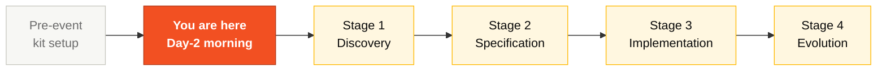
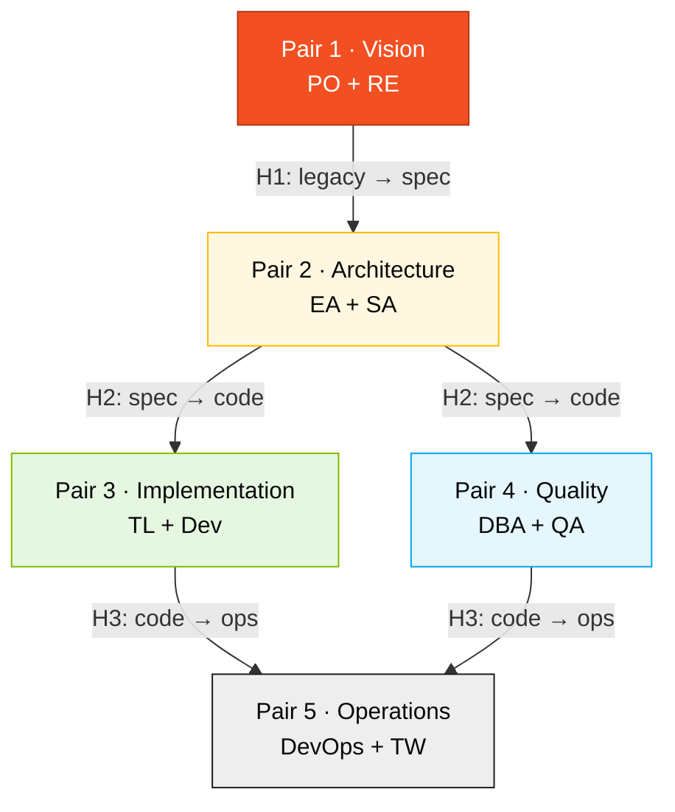
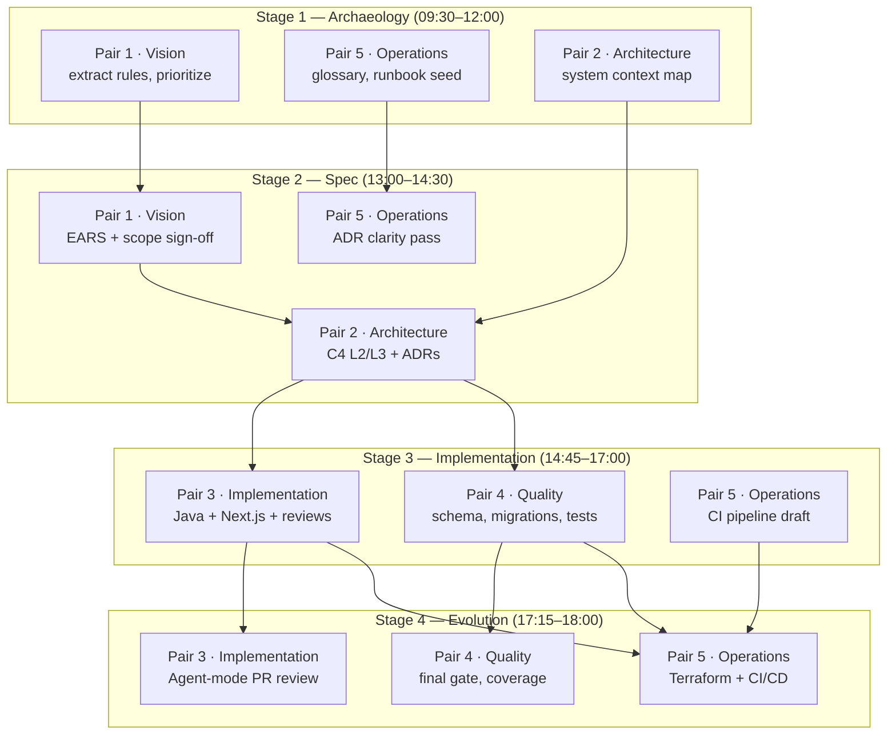

# Team Flow — How the 5 of You Cover 10 Personas

> **Read this before you read your persona cards.** Your two personas only make sense inside this flow. Pin this page to your second monitor.

**this edition: 20 teams · 5 people per team · 2 personas per person · 5 pairs covering the full SDLC.**

A team of 5 with 10 personas only works if every person knows:

1. **Which SDLC phase** each of their two personas leads.
2. **Who feeds them work** (the upstream pair).
3. **Who they hand off to** (the downstream pair).
4. **When to ask for help** (the 20-minute rule).

This document answers all four.

## Where this fits in the SDLC



You enter the day knowing your pair, your persona kits installed, your devcontainer working. From there, you cycle through four stages, each with a clear lead pair and clear handoffs.

## Who works here (all 5 pairs)



## Why this matters

In the previous edition, the most common failure pattern was not technical. It was coordination. Pair 3 started coding before Pair 2 had finished the bounded contexts. Pair 5 woke up at Stage 4 and discovered nobody had drafted the pipeline. Pair 1 disappeared after lunch and Stage 4's demo had nobody to narrate it.

The fix is this document. Five pairs, four handoffs, eight hours. Each pair has a lead stage, but **nobody is ever idle**. The "support" columns below tell you exactly what your pair does when it isn't leading.

## How to think about the day

Imagine a relay race where the baton is the work itself. Pair 1 holds the baton during Stage 1. At H1 (11:30), Pair 1 hands it to Pair 2. Pair 2 holds it until H2 (14:30), then passes to Pairs 3 and 4 in parallel. At H3 (17:00), they pass to Pair 5 for the final leg.

Two non-obvious rules:

- **The baton doesn't stop while you're "supporting".** When Pair 5 is supporting Stage 1, they're already drafting the glossary and the runbook seed. When Pair 3 is supporting Stage 2, they're estimating complexity and pushing back on requirements that won't fit.
- **The handoff is a real ceremony.** 5 minutes, face to face, the outgoing pair walks the incoming pair through what they built and what's still fuzzy. No "just read the doc". Talk it through.

---

## 1. The 5 pairs and their SDLC phase

Each person picks **one pair** (two personas). The two personas in a pair are co-responsible — no internal handoff between them, they collaborate continuously.

| # | Pair | Personas | SDLC phase owned | Color |
|---|------|----------|------------------|-------|
| 1 | **Vision** | Product Owner + Requirements Engineer | Discovery + Specification | Red |
| 2 | **Architecture** | Enterprise Architect + Software Architect | Specification + Design | Yellow |
| 3 | **Implementation** | Technical Lead + Developer | Implementation + Evolution | Green |
| 4 | **Quality** | DBA + QA Engineer | Implementation (data + tests) | Blue |
| 5 | **Operations** | DevOps Engineer + Tech Writer | Cross-cutting + Evolution | Black |

> Persona cards: see [`personas/`](personas/). Full kits (prompts, MCP, hooks): see [`../persona-kits/`](../persona-kits/).

### Pair internal split (suggested, not enforced)

| Pair | Persona A focus | Persona B focus |
|------|-----------------|-----------------|
| 1 · Vision | **PO**: scope, value, priorities, demo script | **RE**: EARS requirements, acceptance criteria, REQ-IDs |
| 2 · Architecture | **EA**: C4 L1 (system context), topology ADRs | **SA**: C4 L2/L3 (containers + components), bounded contexts |
| 3 · Implementation | **TL**: standards, PR review, agent orchestration | **Dev**: Java + TypeScript code, unit tests |
| 4 · Quality | **DBA**: PostgreSQL schema, Flyway migrations | **QA**: BDD scenarios, coverage gates, contract tests |
| 5 · Operations | **DevOps**: Terraform, GitHub Actions, secrets | **TW**: glossary, ADR clarity pass, runbook, README |

Rotate inside the pair every ~45 min so no single person owns all the knowledge. If you and your partner end Stage 3 with one of you not having opened the IDE all day, you did the pair wrong.

---

## 2. Daily timeline (8 hours, Day 2)

```
09:00 09:30 12:00 13:00 16:00 17:00
 |-----|-----------------------| |-----|------------|---------|
 | S1 Stage 1 Archaeology | LUNCH | S2 Spec S3 Implem S4 Evol
```

| Time | Block | Lead pairs | Supporting pairs |
|------|-------|------------|------------------|
| **09:00–09:30** | Opening + setup | All | Read TEAM-FLOW, your persona cards, copy your kit |
| **09:30–10:30** | Stage 1 — Archaeology (mine) | **Pair 1** (PO+RE), **Pair 5** (TW) | Pair 2 maps system context; Pairs 3, 4 read prototype |
| **10:30–11:30** | Stage 1 — Synthesis | **Pair 1** (PO+RE) | Pair 2 starts C4 L1 draft; Pair 5 consolidates glossary |
| **11:30–12:00** | **Handoff #1** legacy → spec | Pair 1 → Pair 2 | Pair 5 supports ADR clarity |
| **12:00–13:00** | LUNCH | — | — |
| **13:00–14:30** | Stage 2 — Modern Spec | **Pair 2** (EA+SA) | Pair 1 validates scope; Pair 5 ADR clarity |
| **14:30–14:45** | **Handoff #2** spec → code | Pair 2 → Pairs 3 + 4 | Pair 1 signs off scope |
| **14:45–17:00** | Stage 3 — Implementation | **Pair 3** (TL+Dev), **Pair 4** (DBA+QA) | Pair 5 starts pipeline draft |
| **17:00–17:15** | **Handoff #3** code → ops | Pair 3 → Pair 5 | Pair 4 continues final tests |
| **17:15–18:00** | Stage 4 — Evolution | **Pair 5** (DevOps+TW), **Pair 3** (TL+Dev) | Pair 4 final coverage gate |
| **18:00–18:30** | Demo prep | Pair 1 + Pair 3 | All rehearse 30 seconds each |
| **18:30–19:10** | **Demos** (20 teams × ~3 min) | Whole team | — |
| **19:10–19:50** | Retrospective | All | Each persona fills their form |
| **19:50–20:00** | Closing | — | — |

> No one is idle. Pairs that are not "lead" in a stage have concrete supporting work — see §4.

---

## 3. Handoff map (pair-level swimlanes)



### Reading the map

- **Arrows are blocking dependencies.** Without Pair 2 delivering ADRs, Pairs 3 and 4 cannot start the right work.
- **Vertical position is time.** Higher = earlier in the day.
- **Each handoff is a 5-minute walkthrough** between the outgoing and incoming pair. No "just read the doc". Talk it through.

---

## 4. What each pair does in every stage

No pair sits idle. Even when not "leading", each pair has explicit support work.

| Pair | Stage 1 (Archaeology) | Stage 2 (Spec) | Stage 3 (Implementation) | Stage 4 (Evolution) |
|------|----------------------|---------------|--------------------------|---------------------|
| **1 · Vision** | **Lead.** Extract rules; PO prioritizes scope. | Validates EARS; signs off scope at H2. | On-call to clarify requirements. Builds demo narrative. | Demo dry-run. |
| **2 · Architecture** | Map system context (C4 L1 draft). | **Lead.** C4 L2/L3 + ADRs. | On-call for boundary questions; reviews PRs touching contracts. | Validates IaC against ADRs. |
| **3 · Implementation** | Read prototype, set conventions (branches, PR template, DoD). | Comment on feasibility; estimate complexity. | **Lead.** Code, tests, integration. | **Co-lead.** Agent-mode delegation, PR review. |
| **4 · Quality** | Read DDMs, plan schema mapping. | Comment on data implications; write first BDD scenarios. | **Lead.** Schema, migrations, test coverage. | Final coverage gate; contract tests in CI. |
| **5 · Operations** | Glossary, runbook seed, README skeleton. | ADR clarity pass; consistent writing voice. | Draft CI pipeline scaffolding. | **Lead.** Terraform + CI/CD complete; runbook finalized. |

---

## 5. First 30 minutes — per-pair checklist

At 09:00, **every pair** does the same 4 things in the first 30 minutes. Then specialization starts.

| Step | Action | Time |
|------|--------|------|
| 1 | Read [`TEAM-FLOW.md`](TEAM-FLOW.md) (this file) | 10 min |
| 2 | Read your two cards in [`personas/`](personas/) | 10 min |
| 3 | Copy your Copilot kit: `cp -r ../persona-kits/XX-persona-A/.github/* .github/` (repeat for persona B) | 5 min |
| 4 | Open Copilot Chat, run the smoke-test prompt from one of your cards | 5 min |

### 09:30 starting move by pair

| Pair | 09:30 action |
|------|--------------|
| **1 · Vision** | PO opens [`../../01-blueprint/WORKSHOP-BLUEPRINT.md`](../../01-blueprint/WORKSHOP-BLUEPRINT.md); RE opens [`../legacy/natural-programs/`](../legacy/natural-programs/) and starts the rule catalog. |
| **2 · Architecture** | EA opens [`../legacy/legacy-docs/`](../legacy/legacy-docs/) and starts C4 L1; SA prepares bounded-context candidates. |
| **3 · Implementation** | TL sets branch strategy, PR template, definition of done; Dev runs `docker compose up` on the prototype. |
| **4 · Quality** | DBA opens [`../legacy/adabas-ddms/`](../legacy/adabas-ddms/) and starts field mapping; QA reads existing test layout in [`../../04-prototipo-sifap-moderno/`](../../04-prototipo-sifap-moderno/). |
| **5 · Operations** | DevOps opens [`../../05-terraform-azure/`](../../05-terraform-azure/) and reviews modules; TW opens [`01-arqueologia/glossary.md`](01-arqueologia/glossary.md) template. |

---

## 6. The 20-minute rule

> **If you (or your pair) are stuck on the same problem for 20 minutes, stop and ask.**

The rule applies to everyone. Asking is not weakness; silent struggle is.

### Escalation ladder

| Stuck for | Talk to |
|-----------|---------|
| 5 min | Try Copilot Chat with a different framing, or your pair partner |
| 10 min | Talk to your direct upstream/downstream **pair** (see §3) |
| 20 min | Talk to **Pair 3** (TL drives team coordination) |
| 30 min | Raise your hand for a facilitator (blue-cord) |

### How to escalate (3-line format)

```
1. Goal: What I'm trying to achieve
2. Tried: What I already attempted (with results)
3. Block: What's stopping me right now
```

Bad: *"This isn't working."*
Good: *"Goal: validate CPF in `BeneficiaryService`. Tried: regex + Copilot suggestion (both fail on all-zeros). Block: not sure if mod-11 should reject 00000000000 explicitly."*

---

## 7. Definition of Done — per handoff

### Handoff #1 — Legacy → Spec (end of Stage 1, ~12:00)

**Owner:** Pair 1 (Vision)
**Receivers:** Pair 2 (Architecture), Pair 5 (Operations)

| Artifact | Located at | Done means |
|----------|-----------|------------|
| Glossary | [`01-arqueologia/glossary.md`](01-arqueologia/glossary.md) | ≥ 30 terms with definitions (Pair 5 owns voice) |
| Business rules catalog | [`01-arqueologia/business-rules-catalog.md`](01-arqueologia/business-rules-catalog.md) | ≥ 15 rules with source program references |
| Dependency map | [`01-arqueologia/dependency-map.md`](01-arqueologia/dependency-map.md) | Mermaid diagram covering all 15 Naturals |
| Mysteries found | [`01-arqueologia/mysteries-found.md`](01-arqueologia/mysteries-found.md) | ≥ 5 hidden rules identified with evidence |

### Handoff #2 — Spec → Code (end of Stage 2, ~14:30)

**Owner:** Pair 2 (Architecture)
**Receivers:** Pair 3 (Implementation), Pair 4 (Quality)

| Artifact | Located at | Done means |
|----------|-----------|------------|
| EARS specifications | [`02-spec-moderna/`](02-spec-moderna/) (per Spec-Kit) | ≥ 12 requirements with REQ-IDs |
| C4 diagrams | `02-spec-moderna/diagrams/` | Levels 1, 2, 3 in Mermaid |
| ADRs | `02-spec-moderna/ADRs/` | ≥ 3 ADRs (modular monolith, persistence, auth) |
| Scope sign-off | Recorded in PR | Pair 1 (PO) approved scope |

### Handoff #3 — Code → Ops (end of Stage 3, ~17:00)

**Owner:** Pair 3 (Implementation)
**Receivers:** Pair 5 (Operations)

| Artifact | Located at | Done means |
|----------|-----------|------------|
| Working backend | `../../04-prototipo-sifap-moderno/backend/` | `mvn test` green; OpenAPI documented |
| Working frontend | `../../04-prototipo-sifap-moderno/frontend/` | `npm test` green; main flows usable |
| Migrations | `backend/src/main/resources/db/migration/` | Flyway scripts numbered; idempotent (Pair 4 owns) |
| Coverage report | CI artifact | Backend ≥ 70%, frontend ≥ 60% lines (Pair 4 verifies) |

---

## 8. Communication patterns

| Pattern | When | Example |
|---------|------|---------|
| **Stand-up** | At each stage transition (4×) | 2-min round, one sentence per pair: "We finished X, doing Y, blocked by Z" |
| **Pair check-in** | Every 30 min inside a stage | "Are the two of us still aligned?" |
| **Pair-to-pair sync** | At handoffs | 5-minute walkthrough, no slides |
| **PR comments** | Async between pairs | Tag the receiving pair explicitly (`@pair-3`) |
| **Quiet hour** | Last 30 min of Stage 3 | No meetings; everyone codes/tests |

---

## 9. Anti-patterns (don't do this)

| ❌ Anti-pattern | ✅ Do instead |
|----------------|---------------|
| One persona in the pair does everything | Rotate every ~45 min; the other persona stays warm |
| Skipping a handoff — "I'll figure out their part too" | 5-minute pair-to-pair walkthrough at every transition |
| Pair 4 (Quality) waits until end of Stage 3 to start | Pair 4 writes BDD scenarios as soon as REQ-IDs exist (mid-Stage 2) |
| Pair 5 (Operations) idle until Stage 4 | Pair 5 drives glossary in S1, ADR clarity in S2, CI scaffolding in S3 |
| Pair 1 (Vision) disappears after Stage 1 | PO validates scope at H2 and runs demo dry-run in S4 |
| Pair 3 merges without review | Every PR has at least one cross-pair review |

---

## 10. Quick reference

```
Which pair am I? → §1 (5 pairs table)
What does my pair do in stage N? → §4 (per-pair per-stage matrix)
Stuck? → 20-minute rule (§6)
Need to hand off? → Done-criteria (§7)
Which Copilot mode? → cheat-sheets/copilot-3-modes.md
Which model? → cheat-sheets/model-routing.md
Which Spec-Kit agent? → cheat-sheets/specky-workflow.md
```

---

## Navigation

| Previous | Home | Next |
|----------|------|------|
| [Kit (EN)](README.md) | [Workspace root](../../README.md) | [Stage 1 — Archaeology](01-arqueologia/GUIDE.md) |

— Paula
