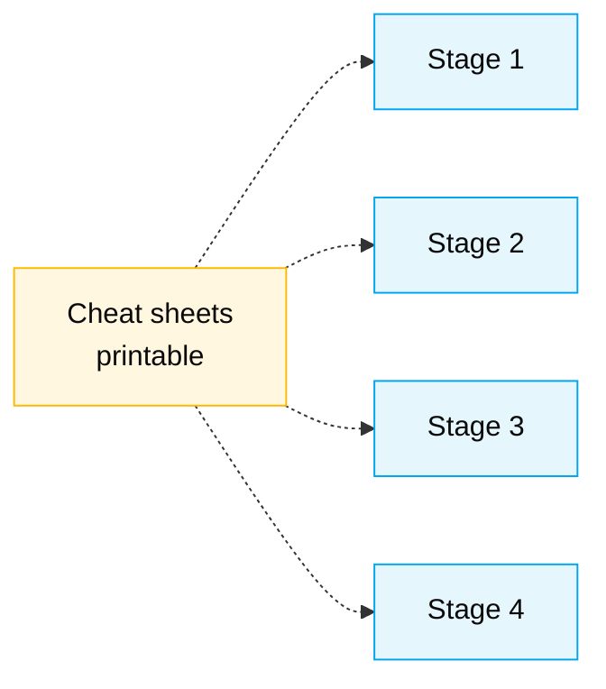

# Cheat Sheets

> One-page quick-reference cards designed to be printed and placed on each team's table. When in doubt mid-Stage, look here before asking.

## Where these fit in the SDLC

These aren't read once and put away. They sit beside the keyboard for the whole day.

## What's in this folder

| File | Topic | Who uses it most |
|------|-------|------------------|
| [`copilot-3-modes.md`](copilot-3-modes.md) | When to use Chat vs Edits vs Agent | Everyone — Developer most |
| [`specky-workflow.md`](specky-workflow.md) | Specky SDD 10-phase pipeline | RE, SA, TL |
| [`model-routing.md`](model-routing.md) | Which Claude model for which task | Everyone |

## When to use which cheat sheet

| Situation | Open |
|-----------|------|
| "Should I prompt Copilot Chat or open Edits?" | `copilot-3-modes.md` |
| "Which phase of Specky am I in?" | `specky-workflow.md` |
| "Why is the response slow / shallow?" | `model-routing.md` |
| "I want to delegate this to the Agent — what next?" | `copilot-3-modes.md` (Agent section) |
| "EARS pattern reminder" | `specky-workflow.md` |

## Navigation

| Previous | Home | Next |
|----------|------|------|
| [Personas](../personas/README.md) | [Kit (EN)](../README.md) | [Copilot 3 Modes](copilot-3-modes.md) |

— Paula
