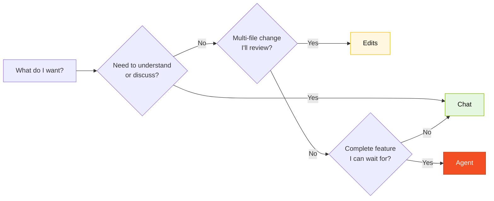

# GitHub Copilot in 3 Modes — Cheat Sheet

> **When to use this card:** every time you wonder "should I be in Chat, Edits, or Agent right now?" Keep it open beside your keyboard.

## Quick decision

| Situation | Mode | Why |
|-----------|------|-----|
| Understand code, discuss design, plan an approach | **Chat** | Conversation, low cost, reversible |
| Create/edit multiple related files at once | **Edits** | Multi-file view, you review the diff |
| Delegate a complete task (issue → PR) | **Agent** | Works on its own, you review at the end |

## Chat — Conversation

**Use when:** you don't yet know what you want; you want to understand; you want to discuss; you want to evaluate a trade-off.

**Phrases that work:**
- "Explain what this Natural program does line by line."
- "What are the risks of using `JSONB` to store the history of bank accounts?"
- "Summarize this DDM in 5 lines for someone who doesn't know Adabas."
- "Challenge the following ADR: `{paste ADR}`."

**Common mistakes:**
- Using Chat to generate a file. Use Edits.
- Accepting an answer without validating. Copilot hallucinates — always double-check.
- Prompts that are too short ("help"). Provide context: what you have, what you want, what you've already tried.

## Edits — Bulk editing

**Use when:** you know what you want; you need changes across several files; you have structured context.

**Phrases that work:**
- "Create the `beneficiary`, `agreement`, `payment` modules with a standard Spring Boot package structure."
- "Add a unit test for every public method of `PaymentService`."
- "Rename `Convenio` to `Agreement` across the whole project and update references."
- "For every existing Flyway migration, add a commented-out rollback."

**Common mistakes:**
- Scope that is too broad. Break it into steps.
- Not reviewing the diff. Always look before accepting.
- Mixing logic changes with renames. One PR per purpose.

## Agent — Delegation with autonomy

**Use when:** you have a well-described issue, you accept it will take time, and you are willing to review a PR generated by someone who isn't you.

**How to prepare:**
1. Write the issue with **context, acceptance criteria, and scope**.
2. Point to the relevant files ("read `docs/adr/001.md` before starting").
3. State what NOT to do ("do not change the PostgreSQL schema").

**Follow-up:** don't operate while the Agent is running. Let it go. Check every ~10 minutes that the path makes sense.

**Reviewing an Agent PR:** exactly like reviewing a human PR. A quick review is still a review.

**Common mistakes:**
- Vague issue → Agent delivers garbage.
- Firing the Agent for a 5-minute task that Edits would solve.
- Merging without review because "it's just the Agent."

## Rule of thumb

> If you didn't know it was AI, would you accept this code in your project? If not, reject or refine it. Copilot accelerates those who know; it doesn't replace judgment.

## Navigation

| Previous | Home | Next |
|----------|------|------|
| [Cheat sheets](README.md) | [Kit (EN)](../README.md) | [Model Routing](model-routing.md) |

— Paula
