# Specky SDD v3.4 — Cheat Sheet

> **When to use this card:** every time you're writing or validating a spec, an EARS, or an ADR. Repo: https://github.com/paulasilvatech/specky · Install: `npm install -g specky-sdd@latest`

## What it is

A Spec-Driven Development engine. 13 agents, 57 MCP tools, 16 hooks. **The pipeline is enforced** — you don't skip a phase.

## Quick setup

```bash
specky install --ide=copilot # VS Code + Copilot
specky install --ide=claude # Claude Code
specky doctor # Validate installation
```

## The 6 EARS patterns

| # | Pattern | Template | SIFAP example |
|---|---------|----------|---------------|
| 1 | **Ubiquitous** | The system shall [action] | SIFAP shall record an audit entry on every change |
| 2 | **Event-Driven** | When [X], the system shall [action] | When a cycle is generated, create payments for ACTIVE beneficiaries |
| 3 | **State-Driven** | While [X], the system shall [action] | While PENDING, allow cancellation |
| 4 | **Optional** | Where [choice], the system shall [action] | Where the user exports, generate UTF-8 CSV |
| 5 | **Unwanted** | The system shall not [action] | Do not allow DELETE on the audit log |
| 6 | **Complex** | While [X], when [Y], where [Z], the system shall [action] | In December, while ACTIVE, calculate the 13th-month bonus |

Validate: `sdd_validate_ears` (MCP tool) or `@spec-engineer` (agent)

## Pipeline — 10 phases

| # | Phase | Agent | Deliverable | Owner persona | Stage |
|---|-------|-------|-------------|---------------|-------|
| 0 | Init | `@sdd-init` | CONSTITUTION.md | TL | 2 |
| 1 | Discover | `@research-analyst` | RESEARCH.md | RE + EA | 2 |
| 2 | Specify | `@spec-engineer` | SPECIFICATION.md (EARS) | RE | 2 |
| 3 | Clarify | `@sdd-clarify` | CLARIFICATION-LOG.md | RE + PO | 2 |
| 4 | Design | `@design-architect` | DESIGN.md + C4 + ADRs | SA + EA | 2 |
| 5 | Tasks | `@task-planner` | TASKS.md + CHECKLIST.md | TL | 3 |
| 6 | Analyze | `@quality-reviewer` | ANALYSIS.md | QA | 3 |
| 7 | Implement | `@implementer` | Code | Dev | 3 |
| 8 | Verify | `@test-verifier` | Tests + coverage | QA | 3 |
| 9 | Release | `@release-engineer` | PR + deploy | DevOps | 4 |

LGTM gates: after Specify, Design, and Tasks. Review before moving on.

```mermaid
flowchart LR
 classDef s2 fill:#FFF7E0,stroke:#FFB900,color:#0A0A0A
 classDef s3 fill:#E6F7E1,stroke:#7FBA00,color:#0A0A0A
 classDef s4 fill:#EEEEEE,stroke:#1B1B1F,color:#0A0A0A

 P0[0 Init]:::s2 --> P1[1 Discover]:::s2 --> P2[2 Specify]:::s2 --> P3[3 Clarify]:::s2 --> P4[4 Design]:::s2
 P4 --> P5[5 Tasks]:::s3 --> P6[6 Analyze]:::s3 --> P7[7 Implement]:::s3 --> P8[8 Verify]:::s3
 P8 --> P9[9 Release]:::s4
```



## Slash commands

| Command | When to use |
|---------|-------------|
| `/specky-migration` | **MAIN** — SIFAP modernization |
| `/specky-specify` | Write EARS requirements |
| `/specky-design` | Generate architecture + diagrams |
| `/specky-tasks` | Break the design into tasks |
| `/specky-verify` | Validate tests against the spec |
| `/specky-release` | Create the final PR |

## Most-used MCP tools

| Tool | What it does |
|------|--------------|
| `sdd_init` | Creates `.specs/NNN-feature/` |
| `sdd_write_spec` | Generates SPECIFICATION.md |
| `sdd_validate_ears` | Validates the 6 EARS patterns |
| `sdd_generate_diagram` | Generates C4 in Mermaid |
| `sdd_write_design` | Generates DESIGN.md + ADRs |
| `sdd_write_tasks` | Generates sequenced TASKS.md |
| `sdd_check_sync` | Detects drift between spec and code |

## Hooks that will fire

- **no-code-without-spec**: blocks PRs without a spec reference
- **EARS-linter**: complains about requirements outside the 6 patterns
- **ADR-completeness**: requires the "path not chosen"
- **traceability-check**: ties requirement → test

When a hook blocks you: **read the message**. Adjust the artifact, don't force an override.

## Workshop flow

```
Stage 2 (1h30):
 @specky-orchestrator → Init → Discover → Specify → Clarify → Design

Stage 3 (2h15):
 @task-planner → Tasks → @implementer → Code → @test-verifier → Verify

Stage 4 (45min):
 @release-engineer → Release → PR
```

## Tips

- Don't jump to Code without going through Specify + Design.
- `specky doctor` should be all green before you start.
- If Specky isn't available: write EARS by hand — the format is plain text.
- Use `@specky-orchestrator` to let the pipeline guide you.

## Navigation

| Previous | Home | Next |
|----------|------|------|
| [Model Routing](model-routing.md) | [Cheat sheets](README.md) | [Kit (EN)](../README.md) |

— Paula
