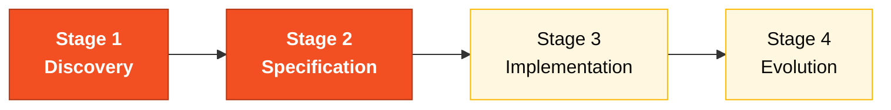

# Persona — Product Owner

> **Pair 1 · Vision · SDLC phases: Discovery + Specification.** You and the Requirements Engineer are co-responsible for translating SIFAP into executable scope across 8 hours.

## Where you fit in the SDLC

You lead Stages 1 and 2. You stay on-call in 3. You write the demo narrative in 4.

## Handoffs

| | Who | Artifact |
|---|---|---|
| **Receives from** | Stage 1 facilitators + legacy code | The SIFAP scenario itself |
| **Hands off to** | Pair 2 (Architecture) at H1 (11:30) | Prioritized rule catalog + scope decisions |
| **Stays on-call for** | Pair 3 (Implementation) during S3 | Scope clarifications |

## Who this person is

Owner of the "why". The one who keeps the team from getting lost building beautiful code for the wrong problem. In SIFAP 2.0 context, the PO knows 2.3 million beneficiaries depend on the system, knows the monthly cycle is sacred, and carries that priority into every technical decision.

## Mission in the workshop

Translate the SIFAP scenario into executable scope across the 8 hours of the day. Protect business value when the team starts wanting to rebuild the legacy line by line. Prioritize, cut, explain.

## Your role in the Agentic Legacy Modernization framework

This workshop applies the **Agentic Legacy Modernization** framework — an approach to legacy system modernization using AI agents specialized in each phase. The full pipeline is in [`../../01-blueprint/WORKSHOP-BLUEPRINT.md`](../../../01-blueprint/WORKSHOP-BLUEPRINT.md).

- **Relevant agents**: Discovery Agent (S1), Analysis Agent (S1-S2)
- **Framework phase**: Assessment and Code Archaeology → Application Carving
- **Your role**: Define carving scope and prioritize bounded contexts for migration

## Where you show up by stage

| Stage | You do this | Deliverable that depends on you |
|---|---|---|
| 1. Archaeology | Lead the glossary build and capture the "whys" of the rules. Maintain a list of open business questions. | Glossary + prioritized "list of mysteries" |
| 2. Greenfield Spec | Decide what goes into v1 and what becomes backlog. Hold the final vote on scope. | "Scope and Non-Scope" section of the spec |
| 3. Reconstruction | Validate that user stories still reflect the business as code emerges. Unblock functional questions. | Functional acceptance criteria per feature |
| 4. Evolution with Agent | Write the two issues the Agent will consume. Validate that the delivered PR solves the business need. | Two well-written issues in `.github/ISSUE_TEMPLATE/` |

## Tools and primitives

- **Copilot Chat** to refine user stories and acceptance criteria.
- **Specky** in Stage 2: the Vision and Requirements phase is the PO's natural ground.
- **Cowork** if you need to write executive briefings or decision notes.
- **Templates** from the `25-personas-primitives` repository — ready-made prompts for writing stories, scope cuts, and risk communication.

## Cheat sheets you use

- [`copilot-3-modes.md`](../cheat-sheets/copilot-3-modes.md) — when it's Chat (most of your day), when it's Edits (rare for you), when it's Agent (Stage 4).
- [`specky-workflow.md`](../cheat-sheets/specky-workflow.md) — especially phases 1 (Vision) and 2 (Requirements).

## How you do well

- Say "this is out of v1" three times a day without flinching.
- Connect each ADR to a concrete impact on the beneficiary or the operator.
- Protect the team's focus when someone suggests refactoring something that already works.
- Write the two Stage 4 issues with enough context for the Agent to work alone.

## How you get lost

- Get stuck on technical details that are not yours.
- Let the team rebuild the legacy program by program.
- Write vague issues and the Agent produces garbage.
- Don't cut scope and Stage 3 ends incomplete.

## If you took on two personas

- PO + **Requirements Engineer** is the natural combination. You write the rules; I structure and test them.
- PO + **Tech Writer** also works for teams with a more communicational profile.

## 3 example prompts

1. **(Chat)** "Analyze the CALCBENF.NSN program from legacy SIFAP and list the 5 business rules with the highest impact on the beneficiary. For each one, say whether it should be migrated, discarded, or evolved."
2. **(Chat)** "Review these 3 user stories and rewrite them as GitHub issues in the format Copilot Agent can consume. Include context, functional requirements as a checklist, and acceptance criteria."
3. **(Chat)** "The team wants to implement 8 features in 3 hours. Based on complexity, help me cut down to the 3 most critical for the monthly payment cycle."

## If you get stuck (emergency defaults)

- **Stuck on prioritization?** Apply: "If it affects the monthly payment cycle → v1. If not → backlog."
- **Don't know how to write an issue?** Copy the template from [`04-evolucao/GUIDE.md`](../04-evolucao/GUIDE.md) and adapt it.
- **Team wants everything in scope?** Say "we have 3 hours of implementation; pick 3 features."
- **Business question with no answer?** Document it as an assumption and move on.

## Dependencies — who depends on you

| Persona | Relationship | Artifact |
|---------|--------------|----------|
| Requirements Engineer | Depends on YOU | Rule prioritization to convert into EARS |
| Technical Lead | Depends on YOU | Defined scope to calibrate Stage 3 |
| Developer | Depends on YOU (S4) | Well-written issues for the Agent |
| Enterprise Architect | YOU depend on them | Integration map for scope decisions |

## How you are evaluated

- **Rubric A2 (Spec Coherence):** clear scope, documented non-scope.
- **Rubric A7 (Agent Experience):** issues with enough context for the Agent to produce a useful PR.
- Indirectly evaluated in **A6 (Collaboration):** PO who protects the team's focus.

## Navigation

| Previous | Home | Next |
|----------|------|------|
| [Personas](README.md) | [Team Flow](../TEAM-FLOW.md) | [02 Requirements Engineer](02-requirements-engineer.md) |

— Paula
