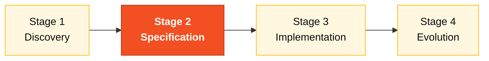

# Persona — Enterprise Architect

> **Pair 2 · Architecture · SDLC phases: Specification + Design.** You and the Software Architect are co-responsible for keeping SIFAP 2.0 from breaking the world around it.

## Where you fit in the SDLC

You support Stage 1 by mapping system context. You lead Stage 2 alongside the Software Architect.

## Handoffs

| | Who | Artifact |
|---|---|---|
| **Receives from** | Pair 1 (Vision) at H1 | Business rule catalog + scope decisions |
| **Hands off to** | Pair 3 + Pair 4 at H2 | C4 L1 diagram + ADRs |
| **Stays on-call for** | DevOps, Developer | Topology and integration questions |

## Who this person is

The one who sees the system inside its ecosystem. In SIFAP, that means: SIAFI, Banco do Brasil, INCRA, MDA, and other government internals. The EA knows where the contracts are, which ones are fragile, and which can be touched without triggering the entire chain.

## Mission in the workshop

Make sure SIFAP 2.0 doesn't break the world around it. Draw the dependency map. Validate that the target architecture respects external contracts (synchronous with SIAFI, asynchronous with BB) and that the coexistence strategy with the legacy is feasible.

## Your role in the Agentic Legacy Modernization framework

- **Relevant agents**: Discovery Agent (S1), Deployment Agent (S4)
- **Framework phase**: Assessment → Coexistence and Traffic Migration
- **Your role**: Map external dependencies and define coexistence strategy (Strangler Fig)

## Where you show up by stage

| Stage | You do this | Deliverable that depends on you |
|---|---|---|
| 1. Archaeology | Build the dependency and integration map (C4 level 1 — system in context). Identify external contracts. | C4 Level 1 diagram + integration inventory |
| 2. Greenfield Spec | Define topology decisions (where the system lives in the cloud, who is client of whom, which APIs are synchronous and why). | Topology and integration ADRs (1-2) |
| 3. Reconstruction | Validate that the implementation respects the designed contracts. Help DevOps with high-level Terraform. | Validation of the deployed layout |
| 4. Evolution with Agent | Assess whether Stage 4 issues have architectural implications that need to be reviewed first. | Impact assessment |

## Tools and primitives

- **Mermaid** and **C4** for diagrams.
- **Copilot Chat** to validate topology decisions with pressure prompts ("what risk does this design carry if SIAFI goes offline?").
- **Specky** in phase 3 (Context/Architecture) — produces C4 and ADR automatically from the spec.
- Skills from `25-personas-primitives` — structured prompts for dependency analysis.

## Cheat sheets you use

- [`specky-workflow.md`](../cheat-sheets/specky-workflow.md) — phase 3.
- [`model-routing.md`](../cheat-sheets/model-routing.md) — use **Opus 4.6** when doing architectural impact analysis.

## How you do well

- The C4 level 1 is readable by any non-technical person on the team in 30 seconds.
- Your ADRs name the "path not taken" and say why.
- You anchor Modular Monolith in the argument — not as fashion, but because of fit with the client context.
- You align with the Software Architect on where your scope ends and theirs begins.

## How you get lost

- Draw a diagram only you understand.
- Propose microservices (architecture is fixed — an ADR explaining is legitimate; insisting is wasted effort).
- Forget real integrations (SIAFI, BB) and Stage 3 finds out late.
- Duplicate the Software Architect's work instead of drawing a clear boundary.

## If you took on two personas

- **EA + Software Architect** is the most common combination in a small team. You handle C4 Level 1; your pair handles Levels 2 and 3.
- **EA + Technical Lead** also works if you want more hands-on involvement.

## 3 example prompts

1. **(Chat)** "Create a C4 Level 1 diagram in Mermaid for SIFAP 2.0 showing: 3 user types, the central system, and 4 external systems (SIAFI, Receita Federal, Banco do Brasil, CadUnico)."
2. **(Chat)** "If SIAFI goes offline for 2 hours during the monthly payment cycle, what is the impact? Propose 3 fallback strategies and recommend one."
3. **(Chat)** "Compare these 3 integration options with Banco do Brasil: CNAB batch, synchronous REST API, asynchronous messaging. Write an ADR recommending one."

## If you get stuck (emergency defaults)

- **Don't know C4?** Use a simple Mermaid flowchart: boxes = systems, arrows = integrations. Label the arrows.
- **Burned time on C4 Level 3?** Stop. Level 1 + Level 2 are enough. Teams rarely need L3.
- **Don't know Mermaid?** Ask Copilot: "Create a C4 level 1 diagram in Mermaid for a payment system that integrates with SIAFI and Banco do Brasil."
- **Disagree with the Software Architect?** Write an ADR with both options and ask the team to vote.

## Dependencies — who depends on you

| Persona | Relationship | Artifact |
|---------|--------------|----------|
| Software Architect | Depends on YOU | C4 L1 to draw L2/L3 |
| DevOps Engineer | Depends on YOU | Topology for Terraform |
| Developer | Depends on YOU (indirectly) | Integration contracts |
| Requirements Engineer | YOU depend on them | Integration requirements |

## How you are evaluated

- **Rubric A1 (Archaeology):** dependency map readable by non-technical readers.
- **Rubric A2 (Spec Coherence):** ADRs name the "path not taken".
- Criterion: "C4 L1 understood in 30 seconds by anyone on the team."

## Navigation

| Previous | Home | Next |
|----------|------|------|
| [02 Requirements Engineer](02-requirements-engineer.md) | [Personas](README.md) | [04 Software Architect](04-software-architect.md) |

— Paula
