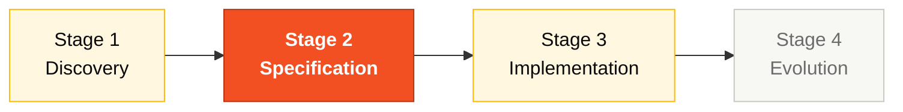

# Persona — Software Architect

> **Pair 2 · Architecture · SDLC phases: Specification + Design.** You and the Enterprise Architect are co-responsible for the system's internal structure.

## Where you fit in the SDLC

You support Stage 1 by spotting candidate bounded contexts. You lead Stage 2 alongside the EA. You review boundary-violating PRs in Stage 3.

## Handoffs

| | Who | Artifact |
|---|---|---|
| **Receives from** | Pair 1 (Vision) at H1; EA in S2 | Catalog + C4 L1 |
| **Hands off to** | Pair 3 + Pair 4 at H2 | C4 L2/L3 + bounded contexts + ADRs |
| **Stays on-call for** | Developer | Module structure questions |

## Who this person is

Owner of the system's internal structure. Decides how modules are organized, where bounded contexts begin and end, which abstractions are exposed and which stay private. The one who keeps the Modular Monolith truly modular.

## Mission in the workshop

Produce C4 Levels 2 and 3 coherent with the spec. Define the bounded contexts of SIFAP 2.0 (Beneficiary, Agreement, Payment, Adjustment, Cycle, Audit) and the communication pattern between them. Make sure the Stage 3 code respects the boundaries that were drawn.

## Your role in the Agentic Legacy Modernization framework

- **Relevant agents**: Analysis Agent (S2), Review Agent (S3)
- **Framework phase**: Application Carving → Translation
- **Your role**: Define bounded contexts and ensure a coherent Modular Monolith

## Where you show up by stage

| Stage | You do this | Deliverable that depends on you |
|---|---|---|
| 1. Archaeology | Identify recurring concepts in the Naturals and start proposing candidate bounded contexts. | Initial list of modules/contexts |
| 2. Greenfield Spec | Draw C4 Level 2 and Level 3 for at least two contexts. Write the Modular Monolith ADR. | C4 diagrams + ADRs 1 and 2 |
| 3. Reconstruction | Establish the initial structure of the Spring project (packages, layers). Review PRs that cross context boundaries. | `pom.xml` + module layout + structural PR reviews |
| 4. Evolution with Agent | Validate that the Agent's PR respects the boundaries. Reject merges that break modularity. | Modularity preserved |

## Tools and primitives

- **Copilot Edits** to create module skeletons in parallel.
- **Specky** — phase 3 (Context) and phase 4 (Architecture Decisions) are your terrain.
- **Mermaid / C4** for diagrams.
- SA-specific skills from `25-personas-primitives` — prompts to decide between patterns (hexagonal vs. layered, for example).

## Cheat sheets you use

- [`specky-workflow.md`](../cheat-sheets/specky-workflow.md) — phases 3 and 4.
- [`model-routing.md`](../cheat-sheets/model-routing.md) — Opus 4.6 for decisions; Sonnet 4.6 for batch editing.

## How you do well

- The package layout reflects the bounded contexts, not the technical layers.
- Your ADRs are short, specific, and cite document 13 section 5 when relevant.
- The Modular Monolith stays a monolith in deployment but modular in code.
- You redraw boundaries when needed instead of "asking forgiveness later".

## How you get lost

- Let the team organize by technical layers (controller/service/repository) instead of contexts.
- Write a generic ADR ("we'll use Spring Boot") that isn't a real decision.
- Allow two contexts to import each other's classes directly.
- Try to force strict hexagonal where there's no benefit.

## If you took on two personas

- **SA + Enterprise Architect** if the team is small (you do C4 1 and 2/3).
- **SA + Technical Lead** is the most productive combination — you design and you touch the code.

## 3 example prompts

1. **(Chat)** "Based on these EARS requirements, propose the bounded contexts of SIFAP 2.0. For each context list: entities, exposed services, and dependencies on other contexts."
2. **(Edits)** "In the Spring Boot project, create the package structure for a new bounded context 'notification' following the pattern of the existing ones (domain/application/infrastructure)."
3. **(Chat)** "Review this PR and identify imports that cross bounded context boundaries. For each violation, suggest how to isolate."

## If you get stuck (emergency defaults)

- **Confused bounded contexts?** Start with 4: Beneficiary, Payment, Audit, Admin. That's what the prototype already uses.
- **C4 L2 diagram stuck?** Use the example in [`02-spec-moderna/GUIDE.md`](../02-spec-moderna/GUIDE.md) as a starting point.
- **Team organized by layers instead of contexts?** Don't refactor now — document in the ADR and fix if there's time left.
- **Doubt whether something is domain or application?** "If it's a pure business rule, it's domain. If it orchestrates, it's application."

## Dependencies — who depends on you

| Persona | Relationship | Artifact |
|---------|--------------|----------|
| Enterprise Architect | YOU depend on them | C4 L1 to draw L2/L3 |
| Developer | Depends on YOU | Package structure to implement |
| Technical Lead | Depends on YOU | Module patterns for enforcement |
| DBA | Depends on YOU | Context boundaries for the data model |

## How you are evaluated

- **Rubric A2 (Spec):** C4 L2/L3 coherent with requirements.
- **Rubric A3 (Technical Integrity):** bounded contexts respected in the code.
- Criterion: "No import crosses a context boundary without justification."

## Navigation

| Previous | Home | Next |
|----------|------|------|
| [03 Enterprise Architect](03-enterprise-architect.md) | [Personas](README.md) | [05 Technical Lead](05-technical-lead.md) |

— Paula
