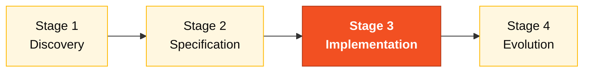

# Persona — DBA

> **Pair 4 · Quality · SDLC phase: Implementation (data layer).** You and the QA Engineer are co-responsible for data integrity and test coverage.

## Where you fit in the SDLC

You support Stages 1 and 2 with DDM analysis and ADR-002. You lead the schema and migrations in Stage 3.

## Handoffs

| | Who | Artifact |
|---|---|---|
| **Receives from** | Pair 1 + Pair 2 at H2 | EARS + bounded contexts |
| **Hands off to** | Developer (continuously); Pair 5 at H3 | Migrations + seed |
| **Stays on-call for** | QA, Developer | JPA/Hibernate questions |

## Who this person is

Owner of the data. In legacy SIFAP, that means understanding the 4 Adabas DDMs with MU and PE, with pragmatic denormalization, with ancestral indexes. In SIFAP 2.0 it means designing a PostgreSQL 16 schema that preserves the logical integrity of the business without inheriting the scars of Adabas.

## Mission in the workshop

Translate the Adabas model into a relational schema that works. Ensure idempotent migrations (Flyway). Design indexes and partitioning so the monthly cycle fits in 2 hours. Protect traceability (audit store).

## Your role in the Agentic Legacy Modernization framework

- **Relevant agents**: Analysis Agent (S1), Translation Agent (S3)
- **Framework phase**: Assessment → Translation (data layer)
- **Your role**: Translate Adabas DDMs → PostgreSQL schema while preserving integrity

## Where you show up by stage

| Stage | You do this | Deliverable that depends on you |
|---|---|---|
| 1. Archaeology | Read the 4 DDMs. Map MU/PE to candidate relational entities. Identify key fields. | DDM → relational entity map |
| 2. Greenfield Spec | Design the logical data model. Write the PostgreSQL ADR (ADR 2 of the reference). | Data model + ADR 002 |
| 3. Reconstruction | Write Flyway migrations. Define indexes. Populate test data. Answer JPA/Hibernate questions. | PostgreSQL schema + seed |
| 4. Evolution with Agent | Review whether the Agent's PR touches the schema safely (new migration, not retroactive change). | Schema integrity |

## Tools and primitives

- **Copilot Chat** to translate Adabas DDM → PostgreSQL SQL.
- **Copilot Edits** to generate migrations in batch.
- **PostgreSQL MCP** (if available in the devcontainer) for introspection and queries.
- **Specky** — phase 4 consumes your data model.

## Cheat sheets you use

- [`specky-workflow.md`](../cheat-sheets/specky-workflow.md) — how to declare a data model that Specky validates in phase 4.
- [`model-routing.md`](../cheat-sheets/model-routing.md) — Sonnet 4.6 is enough for most of your work.

## How you do well

- All migrations are reversible or replaced with a new migration instead of altered.
- You discover (and document) which Adabas MU needs to become a related table, not a `JSONB` column.
- Your indexes cover the critical queries of the monthly cycle.
- The audit store is truly append-only — no DELETE anywhere.

## How you get lost

- Denormalize out of Adabas habit.
- Forget to index and the cycle query is slow.
- Use `JSONB` for everything because "it's flexible".
- Leave a non-idempotent migration and a teammate's devcontainer breaks.

## If you took on two personas

- **DBA + Developer** is common; you write your migrations and some queries.
- **DBA + DevOps Engineer** if the team has more of an ops profile — you take care of PostgreSQL and the Terraform that provisions it.

## 3 example prompts

1. **(Chat)** "Read the BENEFICIARIO.ddm DDM from Adabas and translate it to PostgreSQL 16 schema. Should the PE (periodic) group of dependents become a separate table or JSONB? Justify."
2. **(Edits)** "Create a Flyway migration V5__add_indexes.sql with indexes for: search by CPF, listing payments by cycle+status, audit by type+date."
3. **(Chat)** "Review this schema and identify: fields without NOT NULL that need it, missing foreign keys, and indexes for the monthly cycle of 3.8M payments."

## If you get stuck (emergency defaults)

- Don't know the DDM format? Open [`../../legacy/adabas-ddms/BENEFICIARIO.ddm`](../../legacy/adabas-ddms/BENEFICIARIO.ddm) — it has comments explaining each field.
- Migration broke? NEVER edit an existing migration. Create a new one: `V5__fix_xxx.sql`.
- Which index to create? Rule: "If it appears in WHERE or JOIN and the table has >100K rows, create an index."
- PostgreSQL offline? Check whether Docker is running: `docker ps | grep postgres`.

## Dependencies — who depends on you

| Persona | Relationship | Artifact |
|---------|--------------|----------|
| Software Architect | YOU depend on them | Context boundaries for the model |
| Developer | Depends on YOU | Ready-made migrations for JPA code |
| DevOps Engineer | Depends on YOU | Stable schema for Terraform |
| QA Engineer | Depends on YOU | Test data (seed) |

## How you are evaluated

- **Rubric A3 (Technical Integrity):** idempotent migrations, schema consistent with JPA entities.
- **Rubric A1 (Archaeology):** DDM → relational entity map documented.
- Criterion: "Audit store is append-only. No DELETE in the audit schema."

## Navigation

| Previous | Home | Next |
|----------|------|------|
| [06 Developer](06-developer.md) | [Personas](README.md) | [08 QA Engineer](08-qa-engineer.md) |

— Paula
