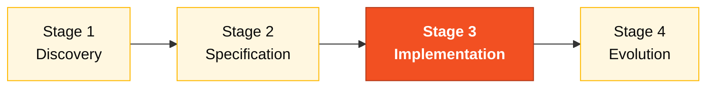

# Persona — QA Engineer

> **Pair 4 · Quality · SDLC phase: Implementation (tests + coverage).** You and the DBA are co-responsible. You turn requirements into executable tests.

## Where you fit in the SDLC

You support Stage 1 (critical-scenario list). You support Stage 2 (acceptance criteria per REQ-ID). You lead Stage 3 tests. You run the final coverage gate in Stage 4.

## Handoffs

| | Who | Artifact |
|---|---|---|
| **Receives from** | RE at H2 | Testable EARS requirements |
| **Hands off to** | Pair 5 at H3 | Test suite + green CI |
| **Stays on-call for** | Developer (continuously) | Test scaffolding |

## Who this person is

The one who turns a requirement into an executable test. In SIFAP 2.0, the one who makes sure the payment calculation rule survives any Stage 3 refactor and that the monthly cycle batch works within the expected boundaries.

## Mission in the workshop

Define the project's testing strategy. Write critical tests (not 100% coverage; the right ones). Validate spec → test traceability. Protect the team from a false green CI.

## Your role in the Agentic Legacy Modernization framework

- **Relevant agents**: Test Gen Agent (S3), Security Agent (S3)
- **Framework phase**: Translation and Test Generation → Validation
- **Your role**: Ensure test coverage and validate functional equivalence legacy → modern

## Where you show up by stage

| Stage | You do this | Deliverable that depends on you |
|---|---|---|
| 1. Archaeology | Identify critical scenarios from the Naturals (corner cases of the monthly cycle, BB rejection). | List of critical scenarios |
| 2. Greenfield Spec | Validate that each EARS requirement is testable. Propose concrete acceptance criteria. | Test criteria per requirement |
| 3. Reconstruction | Write unit and integration tests for the core (payment calculation, adjustment, reconciliation). Keep CI green. | Test suite + green pipeline |
| 4. Evolution with Agent | Require the Agent's PR to come with its own tests. Validate coverage of new scenarios. | Coverage coherent with the feature |

## Tools and primitives

- **Copilot Chat** to generate test scenarios from EARS requirements.
- **Copilot Edits** to generate JUnit skeletons in batch.
- **Testcontainers** for integration with real PostgreSQL.
- **Specky** — phase 9 (Test Strategy) is your territory.
- **GitHub Actions MCP** to monitor CI.

## Cheat sheets you use

- [`specky-workflow.md`](../cheat-sheets/specky-workflow.md) — phase 9.
- [`copilot-3-modes.md`](../cheat-sheets/copilot-3-modes.md) — you use Edits to create the skeleton and Chat to discuss what's missing.

## How you do well

- Coverage on the paths that matter: payment calculation, BB reconciliation, adjustments with dual approval.
- Fast tests — the entire suite runs in under two minutes.
- Tests that break on the first bug, not "tests that always pass".
- You say "this PR doesn't go in without a test" without drama.

## How you get lost

- Chase 100% coverage and lose Stage 3.
- Write tests that test the framework, not the domain.
- Accept mocks where Testcontainers was the right choice.
- Let CI sit red for 20 minutes waiting for someone to look.

## If you took on two personas

- **QA + Developer** is the most common and productive.
- **QA + Requirements Engineer** also works — you write the requirement and the test.
- Avoid **QA + DevOps** in the same brain: it overloads Stage 3 too much.

## 3 example prompts

1. **(Chat)** "For the EARS requirement 'When a cycle is generated, create payments for ACTIVE': generate 5 test scenarios covering happy path, no actives, suspended beneficiary, zero value, and database error."
2. **(Edits)** "In PaymentCycleServiceTest.java, add integration tests with Testcontainers that: insert a beneficiary, create a cycle, generate payments, and verify values."
3. **(Chat)** "Analyze current test coverage and identify the 3 most critical paths without tests. Prioritize by impact on the beneficiary."

## If you get stuck (emergency defaults)

- Don't know JUnit 5? Copy the pattern from `CpfTest.java` — `@Test`, `@DisplayName`, AssertJ assertions.
- Testcontainers not working? You need Docker running. Alternative: unit test with Mockito.
- Many scenarios, little time? Focus on 3: (a) create beneficiary, (b) generate payment, (c) status change. Those are the critical ones.
- CI red? Run `mvn test` locally first. If it passes locally but fails in CI, it's an environment issue (Docker/Testcontainers).

## Dependencies — who depends on you

| Persona | Relationship | Artifact |
|---------|--------------|----------|
| Requirements Engineer | YOU depend on them | Testable requirements with criteria |
| Developer | YOU depend on them | Code to test |
| Technical Lead | Depends on YOU | Green pipeline |
| DevOps Engineer | Depends on YOU | Reliable CI |

## How you are evaluated

- **Rubric A3 (Technical Integrity):** tests passing, CI green.
- **Rubric A2 (Spec):** every requirement has a verification criterion.
- Criterion: "Tests that break on the first bug, not tests that always pass."

## Navigation

| Previous | Home | Next |
|----------|------|------|
| [07 DBA](07-dba.md) | [Personas](README.md) | [09 DevOps Engineer](09-devops-engineer.md) |

— Paula
