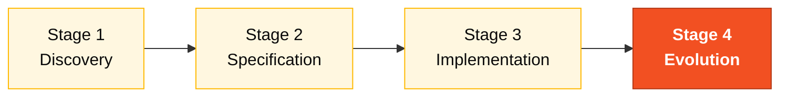

# Persona — DevOps Engineer

> **Pair 5 · Operations · SDLC: cross-cutting + Evolution.** You and the Tech Writer are co-responsible. You make sure code becomes something that runs.

## Where you fit in the SDLC

You're the only persona that **supports every stage** and then **leads Stage 4**. Cross-cutting from start to finish.

## Handoffs

| | Who | Artifact |
|---|---|---|
| **Receives from** | Pair 3 + Pair 4 at H3 | Working prototype + green tests |
| **Hands off to** | Demo team | Terraform plan + CI/CD + runbook |
| **Stays on-call for** | Whole team, all day | Devcontainer, build, pipeline |

## Who this person is

Owner of the path from code to something that runs. In the workshop, you are the one who makes sure `docker compose up` works on any machine on the team, that CI checks what matters, and that Terraform describes the target topology in Azure even if it isn't applied on the day.

## Mission in the workshop

Green pipeline. Reproducible build. Deploy described as code. Minimum functional observability (health check, structured logs).

## Your role in the Agentic Legacy Modernization framework

- **Relevant agents**: Deployment Agent (S4), Security Agent (S3)
- **Framework phase**: Coexistence and Traffic Migration
- **Your role**: Provision infrastructure and configure the CI/CD pipeline for continuous deployment

## Where you show up by stage

| Stage | You do this | Deliverable that depends on you |
|---|---|---|
| 1. Archaeology | Stabilize the devcontainer if anything is broken. Prepare docker-compose for PostgreSQL and auxiliary tools. | Stable devcontainer and compose |
| 2. Greenfield Spec | Write the deployment strategy ADR (ADR 5 of the reference) and participate in the infra design. | ADR 005 + Terraform draft |
| 3. Reconstruction | Maintain GitHub Actions for build and tests. Publish Docker image. Keep Terraform described. | Green pipeline + valid Terraform `plan` |
| 4. Evolution with Agent | If the Agent's PR touches the pipeline or infra, you are the person who validates. | Pipeline still green after the Agent |

## Tools and primitives

- **Copilot Chat** to generate GitHub Actions workflows.
- **Copilot Edits** for batch Terraform.
- **Azure / Terraform MCP** if enabled in the devcontainer.
- **Specky** — phase 10 (Deployment) goes through you.
- **Dev Containers** spec — you are the one who understands the `devcontainer.json`.

## Cheat sheets you use

- [`specky-workflow.md`](../cheat-sheets/specky-workflow.md) — phase 10.
- [`copilot-3-modes.md`](../cheat-sheets/copilot-3-modes.md) — you use Agent quite a bit for long CI chains.

## How you do well

- `docker compose up -d` brings up application + database in under 60s.
- The `main` pipeline runs lint + test + image build.
- Terraform `plan` runs without error even if it doesn't apply.
- Structured logs (JSON) and the `/actuator/health` endpoint already work in Stage 3.

## How you get lost

- Leave the devcontainer unstable and the team loses 1 hour at the start.
- CI that only runs unit tests (no image build, no lint).
- Terraform with 500 lines and no output that makes sense.
- A real secret in a versioned `.env`.

## If you took on two personas

- **DevOps + DBA** — you take care of Postgres + provisioning.
- **DevOps + Tech Writer** — in Stage 4, you document the runbook while monitoring the Agent.

## 3 example prompts

1. **(Chat)** "Create a GitHub Actions workflow `.github/workflows/ci.yml` that: runs on push, sets up Java 21 with Maven cache, runs tests, and builds a Docker image."
2. **(Edits)** "Optimize the backend Dockerfile: add a Maven dependency cache, shrink the final image with Alpine, and add a health check."
3. **(Chat)** "`docker compose up` takes 3 minutes to start. Analyze the Dockerfiles and `docker-compose.yml` and propose 3 optimizations."

## If you get stuck (emergency defaults)

- Docker compose won't start? Checklist: (1) Docker Desktop running? (2) Ports 5432/8080/3000 free? (3) `docker compose down && docker compose up -d` (4) `docker compose logs` to see the error.
- CI failing? Look at the GitHub Actions logs. Most common error: wrong Java version or cache miss.
- Terraform plan failing? Check: (1) did `terraform init` run? (2) provider version compatible? (3) required variables filled in?
- Don't know GitHub Actions? Copy the workflow at `.github/workflows/build.yml` and adapt it.

## Dependencies — who depends on you

| Persona | Relationship | Artifact |
|---------|--------------|----------|
| Technical Lead | YOU depend on them | Stable build for the pipeline |
| Enterprise Architect | YOU depend on them | Topology for Terraform |
| Developer | Depends on YOU | Working devcontainer, green CI |
| DBA | Depends on YOU (infra) | Provisioned PostgreSQL |
| QA Engineer | Depends on YOU | Pipeline to run tests |

## How you are evaluated

- **Rubric A3 (Technical Integrity):** `docker compose up` works, green CI.
- **Rubric A4 (Copilot):** use of Agent for complex pipelines.
- Criterion: "Reproducible build. Any machine on the team runs the compose in under 60s."

## Navigation

| Previous | Home | Next |
|----------|------|------|
| [08 QA Engineer](08-qa-engineer.md) | [Personas](README.md) | [10 Tech Writer](10-tech-writer.md) |

— Paula
