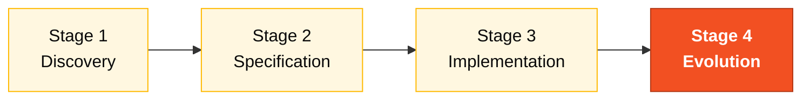

# Persona — Tech Writer

> **Pair 5 · Operations · SDLC: cross-cutting + Evolution.** You and the DevOps Engineer are co-responsible. You turn decisions into durable memory.

## Where you fit in the SDLC

You're the writing voice across all four stages. You lead the final Agent experience report in Stage 4.

## Handoffs

| | Who | Artifact |
|---|---|---|
| **Receives from** | All pairs, continuously | Discoveries, decisions, code |
| **Hands off to** | Demo team + facilitators | Glossary, ADRs, README, runbook, agent-experience-report |
| **Stays on-call for** | PO and Facilitator | Final report |

## Who this person is

The one who turns a decision into durable memory. Without a deliberate Tech Writer, ADRs become empty files, the README stays at "install the dependencies", and nothing of what was discovered survives the last hour of the workshop.

## Mission in the workshop

Keep documentation alive throughout the day — not at the end. A README that grows, ADRs written at the moment of the decision, a present change log. Write the Agent experience report in Stage 4.

## Your role in the Agentic Legacy Modernization framework

- **Relevant agents**: Documentation Agent (cross-cutting)
- **Framework phase**: All phases (continuous documentation)
- **Your role**: Maintain traceability and document decisions for the audit trail

## Where you show up by stage

| Stage | You do this | Deliverable that depends on you |
|---|---|---|
| 1. Archaeology | Maintain glossary and catalog in a readable format. Write the discovery report at the end of the stage. | Stage 1 report |
| 2. Greenfield Spec | Review the spec for consistency, terminology, and clarity. Format ADRs with the template. | Spec and ADRs in standard format |
| 3. Reconstruction | The project README becomes real, not a placeholder. Document decisions in `docs/` as they emerge. | Populated README + `docs/` |
| 4. Evolution with Agent | Watch the Agent work and write an honest report of the experience (what was good, what was bad, what you learned). | Final Stage 4 report |

## Tools and primitives

- **Copilot Chat** for style and clarity review.
- **Cowork** if you need to write a longer document.
- **markdown-writer** skill for structured READMEs and ADRs.
- **GitHub MCP** for commits to `docs/` while others touch the code.

## Cheat sheets you use

- [`specky-workflow.md`](../cheat-sheets/specky-workflow.md) — the plugin generates documentation in each phase, and you maintain consistency between what it produces and what the team writes by hand.
- [`model-routing.md`](../cheat-sheets/model-routing.md) — Haiku 4.5 for style review, Sonnet 4.6 for writing.

## How you do well

- Each ADR has: context, decision, consequences. No more, no less.
- The README evolves every hour, not just at the end.
- Project terminology is consistent (if it was called "cycle", it doesn't become "round" in the next paragraph).
- The Stage 4 report is honest about the Agent — it doesn't try to sell.

## How you get lost

- Wait for Stage 3 to end before starting to write.
- One-line ADRs ("we decided to use X").
- A README that still says "TODO: add instructions" at the end.
- An Agent report that just says "it worked well".

## If you took on two personas

- **Tech Writer + Product Owner** — you write the "why" of the project.
- **Tech Writer + DevOps Engineer** — you document while the pipeline runs.
- **Tech Writer + Requirements Engineer** is strong for a small team — you structure and write.

## 3 example prompts

1. **(Chat)** "Review this README and identify: sections with TODO, inconsistent terminology, outdated information (ports, credentials, endpoints). Propose corrections."
2. **(Edits)** "In the file `ADR-001.md`, complete the Context, Decision, and Consequences sections using the template at [`02-spec-moderna/ADR-TEMPLATE.md`](../02-spec-moderna/ADR-TEMPLATE.md)."
3. **(Chat)** "Create an honest report of the experience with Copilot Agent: what worked, what surprised, what failed. Base it on the template at [`04-evolucao/agent-experience-report.md`](../04-evolucao/agent-experience-report.md)."

## If you get stuck (emergency defaults)

- Don't know the ADR format? Open [`02-spec-moderna/ADR-TEMPLATE.md`](../02-spec-moderna/ADR-TEMPLATE.md) — copy and fill in.
- README empty? Start with: (1) what the system is, (2) how to run it, (3) available endpoints. The rest can grow.
- Glossary stalled? Ask Copilot: "List all the abbreviations found in the SIFAP `.NSN` files and expand each one."
- Empty Agent report? Open [`04-evolucao/agent-experience-report.md`](../04-evolucao/agent-experience-report.md) — the template has sections ready to fill in.

## Dependencies — who depends on you

| Persona | Relationship | Artifact |
|---------|--------------|----------|
| Everyone | YOU depend on them | Decisions and code to document |
| Product Owner | Depends on YOU | Glossary and readable reports |
| QA Engineer | Depends on YOU (indirectly) | Consistent terminology in the spec |
| Facilitator (Paula) | Depends on YOU | Final Stage 4 report |

## How you are evaluated

- **Rubric A2 (Spec):** consistent documentation, standardized terminology.
- **Rubric A7 (Agent):** honest and detailed report.
- Criterion: "README evolved every hour. ADRs have context, decision, and consequences. Nothing says TODO."

## Navigation

| Previous | Home | Next |
|----------|------|------|
| [09 DevOps Engineer](09-devops-engineer.md) | [Personas](README.md) | [Team Flow](../TEAM-FLOW.md) |

— Paula
