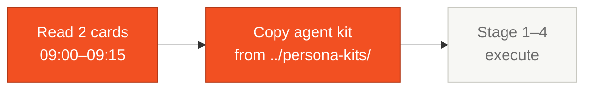

# Personas

> Read the **two** cards for your pair before the event starts (15 minutes total). They define your domain, your responsibilities, and how your Copilot agent behaves.

## Where this fits in the SDLC

## How the personas map to the 5 pairs

| Pair | Personas | Lead stage |
|------|----------|------------|
| 1 · Vision | [01 Product Owner](01-product-owner.md) + [02 Requirements Engineer](02-requirements-engineer.md) | S1 → S2 |
| 2 · Architecture | [03 Enterprise Architect](03-enterprise-architect.md) + [04 Software Architect](04-software-architect.md) | S2 |
| 3 · Implementation | [05 Technical Lead](05-technical-lead.md) + [06 Developer](06-developer.md) | S3 → S4 |
| 4 · Quality | [07 DBA](07-dba.md) + [08 QA Engineer](08-qa-engineer.md) | S3 |
| 5 · Operations | [09 DevOps Engineer](09-devops-engineer.md) + [10 Tech Writer](10-tech-writer.md) | S1, S2, S3, S4 |

## What's in this folder

| File | Role |
|------|------|
| [`01-product-owner.md`](01-product-owner.md) | Product Owner — scope and value |
| [`02-requirements-engineer.md`](02-requirements-engineer.md) | Requirements Engineer — EARS and testability |
| [`03-enterprise-architect.md`](03-enterprise-architect.md) | Enterprise Architect — system in context |
| [`04-software-architect.md`](04-software-architect.md) | Software Architect — internal structure |
| [`05-technical-lead.md`](05-technical-lead.md) | Technical Lead — code standards and unblocking |
| [`06-developer.md`](06-developer.md) | Developer — implementation and tests |
| [`07-dba.md`](07-dba.md) | DBA — database design and migrations |
| [`08-qa-engineer.md`](08-qa-engineer.md) | QA Engineer — test strategy and coverage |
| [`09-devops-engineer.md`](09-devops-engineer.md) | DevOps Engineer — CI/CD and IaC |
| [`10-tech-writer.md`](10-tech-writer.md) | Tech Writer — documentation and ADRs |

## Extended persona kits

For full Copilot agent implementations (custom agents, prompts, MCP configs), see [`../../persona-kits/`](../../persona-kits/). Copy your pair's two kits into your repo's `.github/` folder during the first 30 minutes.

## How to use these cards

1. After reading [`TEAM-FLOW.md`](../TEAM-FLOW.md), look at the 5-pair table.
2. Pick a pair with your partner.
3. Read **both** cards for that pair. Do not skip either.
4. Run the smoke-test prompt at the bottom of one of your cards.
5. Open Stage 1 guide.

## Next step

After picking your pair, both members open the relevant card on a split screen and read together. Then move to [Stage 1 — Guide](../01-arqueologia/GUIDE.md).

## Navigation

| Previous | Home | Next |
|----------|------|------|
| [Team Flow](../TEAM-FLOW.md) | [Kit (EN)](../README.md) | [01 Product Owner](01-product-owner.md) |

— Paula
