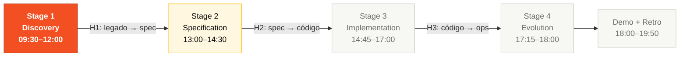
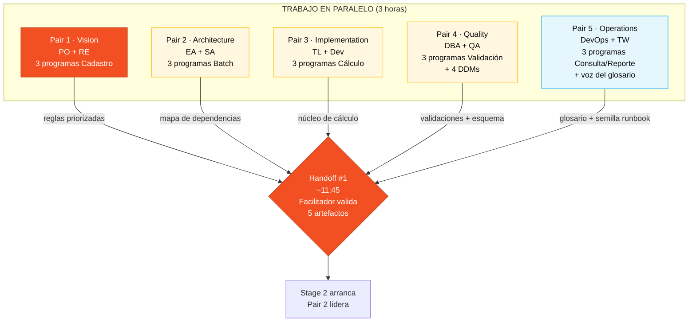

# Stage 1 — Arqueología Digital

> **Esta es la única etapa del día que no puedes saltarte.** Todo lo que viene después — la especificación, el código, el deploy — depende de lo que tu Pair extraiga aquí. En la edición anterior del workshop, varios equipos escribieron specs sin leer el legado y descubrieron demasiado tarde que perdieron reglas de negocio de 29 años. Esta vez el gate es obligatorio: el CI y la rúbrica no te dejan avanzar sin trazar cada requerimiento a un archivo `.NSN` o `.ddm`.

## Dónde encaja en el SDLC



**Estás en el Stage 1 (Discovery del SDLC).** La salida de este stage alimenta directamente al Stage 2 (Specification). Sin entrega clara aquí, el handoff #1 falla y todo el equipo queda atascado.

## Quién trabaja aquí (los 5 Pairs, en paralelo)



Los 5 Pairs trabajan **en paralelo**, cada uno con sus 3 programas. Nadie está ocioso. Al final, cada Pair contribuye con su parte a los 5 artefactos consolidados.

## Qué vas a lograr en 3 horas

Al final del Stage 1 tu Pair habrá producido **cinco artefactos verificables** dentro de [`01-arqueologia/`](.):

1. `glossary.md` — al menos 30 términos del dominio.
2. `business-rules-catalog.md` — mínimo 15 reglas de negocio, **cada una con el programa fuente** lleno.
3. `dependency-map.md` — un diagrama Mermaid cubriendo los 15 programas Natural.
4. `mysteries-found.md` — al menos 5 reglas escondidas con evidencia (archivo + línea).
5. `discovery-report.md` — síntesis consolidada que se convierte en input del Stage 2.

Un facilitador (cordón azul) pasa cerca de las **11:45** y valida estos artefactos contra [`LEGACY-EXPLORATION-CHECKLIST.md`](LEGACY-EXPLORATION-CHECKLIST.md). Si algo está rojo, tu Pair no puede abrir el Stage 2.

---

## Por qué importa

Un sistema legado raramente tiene documentación actualizada. Lo que tiene es **código**, y el código carga reglas de negocio que nadie escribió en ningún otro lugar. Si modernizas mirando solo el brief de modernización, reescribes una versión moderna **del brief**, no del sistema. Y el sistema es lo que está en producción.

El SIFAP tiene 29 años. Tiene reglas tributarias de 2003 todavía vigentes. Tiene cálculos de zafra que solo tienen sentido si conoces la historia. Tiene un reporte que el TCU acepta desde hace 23 años con el mismo layout. No puedes modernizar lo que no has leído.

La arqueología digital existe para eso: extraer conocimiento del código antes de tocarlo.

---

## Cómo pensar en esto (modelo mental antes del paso a paso)

Piensa en el SIFAP como **una ciudad que ustedes cinco van a excavar en 3 horas**. Cada Pair es un equipo arqueológico responsable de un cuadrante. Nadie tiene tiempo de excavar la ciudad entera solo, así que la regla es simple:

- **Cada Pair se queda con 3 programas.** Quince programas divididos entre cinco Pairs dan tres cada uno. Sin huérfanos.
- **Todo lo que encuentres va a un cuaderno común** (los archivos template de esta carpeta). Otros Pairs van a leer lo que escribiste para construir la especificación después.
- **¿Encontraste algo raro? Anótalo.** Los misterios suman puntos. Pero solo cuentan si documentas el lugar exacto (archivo + línea).
- **No intentes entender todo.** Intenta entender las **reglas de negocio** que el programa implementa. El IO, la paginación, el manejo de errores del Natural — ignóralos. Lo que importa es el `IF` que esconde una regla.

El resultado bueno no es "leí todo". El resultado bueno es "extraje lo que importa de 3 programas y dejé evidencia para que los demás la usen".

---

## Dónde está el legado

Está dentro del propio kit, en [`../../legacy/`](../../legacy/):

| Recurso | Path | Cantidad |
|---------|------|----------|
| Programas Natural | [`../../legacy/natural-programs/`](../../legacy/natural-programs/) | 15 archivos `.NSN` |
| DDMs Adabas | [`../../legacy/adabas-ddms/`](../../legacy/adabas-ddms/) | 4 archivos `.ddm` |
| Documentación parcial (1997–2018) | [`../../legacy/legacy-docs/`](../../legacy/legacy-docs/) | 3 documentos desactualizados |
| README del sistema | [`../../legacy/README.md`](../../legacy/README.md) | 1 archivo |
| Demo de terminal | [`../../legacy/demo/sifap-terminal.html`](../../legacy/demo/sifap-terminal.html) | abrir en el navegador |

> Los documentos en `legacy-docs/` están en portugués a propósito — son parte de la inmersión. Representan lo que the client tenía guardado entre 1997 y 2018.

---

## Quién lee qué (división obligatoria)

Cada Pair lidera 3 programas. **Ningún programa puede quedar sin lector.**

| Pair | Programas | Por qué esos |
|------|-----------|--------------|
| **1 · Vision** (PO + RE) | `CADBENEF.NSN`, `CADDEPEND.NSN`, `CADPROG.NSN` | Los cadastros son las **entidades** que se vuelven sujeto de las EARS. Si no lees esto, no hay REQ-ID para el resto. |
| **2 · Architecture** (EA + SA) | `BATCHPGT.NSN`, `BATCHREL.NSN`, `BATCHCON.NSN` | Los batches revelan el **flujo de negocio completo**. Los bounded contexts salen de aquí. |
| **3 · Implementation** (TL + Dev) | `CALCBENF.NSN`, `CALCCORR.NSN`, `CALCDSCT.NSN` | Los cálculos son el **núcleo financiero**. Vas a reproducirlos en Java en el Stage 3 — necesitas saber exactamente qué hacen. |
| **4 · Quality** (DBA + QA) | `VALBENEF.NSN`, `VALDOCS.NSN`, `VALELEG.NSN` | Las validaciones **se vuelven tests**. Quien lee las reglas de validación aquí está escribiendo la estrategia de testing del Stage 3. |
| **5 · Operations** (DevOps + TW) | `CONSBENF.NSN`, `RELPGT.NSN`, `RELAUDIT.NSN` | Las consultas y los reportes revelan **lo que el usuario ve** — información que va al glosario y al runbook. |

> Los 4 DDMs quedan con el Pair 4 (DBA + QA), con revisión de los demás. Cada DDM se vuelve una tabla PostgreSQL y la forma en que la mapees hoy define si hay retrabajo en el Stage 3.

---

## Paso a paso (3 horas cronometradas)

### Hora 1 — Reconocimiento (09:15 → 10:15)

**El objetivo de la primera hora es solo entender el terreno.** Todavía no vas a extraer reglas, solo vas a crear el mapa.

1. **Todo el equipo, primeros 15 minutos:** abran [`../../legacy/README.md`](../../legacy/README.md) y lean la historia del SIFAP. **Por qué este paso existe:** si no sabes que el `RELPGT.NSN` es el reporte aceptado por el TCU desde 2003, puedes proponer "modernizar el layout" y romper una auditoría externa. El contexto evita decisiones tontas.

2. **Pairs 1 y 5 en colaboración:** abran cada uno de los 15 programas `.NSN` en modo lectura rápida (solo los comentarios y las constantes) y empiecen a poblar [`glossary.md`](glossary.md). **Cómo pensar:** no están entendiendo programas, están **catalogando vocabulario**. Cualquier abreviación críptica (`DSCT`, `BENF`, `PE`, `MU`, `CTC`) es una entrada de glosario. Meta: 30+ términos al final del día.

3. **Pair 2:** empiecen a dibujar el [`dependency-map.md`](dependency-map.md). Usen Copilot Chat con el prompt: *"Lista todas las ocurrencias de CALLNAT en estos 15 archivos y dibuja un diagrama Mermaid."* Vas a descubrir, por ejemplo, que `BATCHPGT` llama a `VALELEG`, `CALCBENF`, `CALCCORR` y `CALCDSCT`. Ese grafo es la base de los bounded contexts del Stage 2.

4. **Pair 4 con Pair 3 como revisor:** abran los 4 DDMs en [`../../legacy/adabas-ddms/`](../../legacy/adabas-ddms/). Para cada DDM, listen todos los campos con tipo y tamaño, marcando `MU` (multi-valor) y `PE` (grupo periódico). **Por qué importa:** estos dos constructos no existen en PostgreSQL relacional puro. Donde veas `MU TELEFONES`, sabes que se vuelve una tabla `beneficiary_phone` en el Stage 3.

> **Al final de la Hora 1**, hagan un stand-up de 2 minutos: cada Pair dice en una frase qué descubrió. Si un Pair está perdido, ese es el momento de pedir ayuda — no a las 11:30.

### Hora 2 — Extracción (10:15 → 11:15)

**Ahora entran en modo extracción.** Cada Pair lee profundamente sus 3 programas y documenta reglas de negocio.

5. **Cada Pair en paralelo, 3 programas cada uno:** abran los archivos `.NSN` de su lista (ver tabla arriba) y busquen reglas de negocio. **Qué cuenta como regla de negocio:**
 - Un `IF` que decide algo del dominio (ej.: *"si la UF es del Nordeste y el programa es Seca, valor base × 1.2"*)
 - Una constante numérica sin explicación (ej.: `0.075` en el cálculo de impuesto)
 - Una transición de estado con regla (ej.: *"solo de A a S, nunca de I a A"*)
 - Un tratamiento especial para un caso (ej.: *"si el CPF empieza con 999, es de prueba"*)

 **Qué NO es regla de negocio:** paginación de reporte, formato de salida, manipulación de cursor Adabas, apertura de archivo. Ignóralo.

6. **Prompts útiles para Copilot Chat** (pega el contenido del `.NSN` en el chat y usa cada prompt después):
 - *"Explica este programa Natural línea por línea. Enfócate en decisiones de negocio, ignora IO."*
 - *"¿Qué reglas de negocio implementa este código? Lista cada una con el rango de líneas."*
 - *"¿Hay alguna constante numérica sin explicación? Para cada una, sugiere qué puede representar."*
 - *"¿Hay alguna condición que parece un workaround o caso especial no documentado?"*
 - *"Compara este programa con `otro-archivo.NSN`. ¿Hay lógica duplicada?"*

7. **Documentación inmediata.** Toda regla encontrada se vuelve **una línea** en [`business-rules-catalog.md`](business-rules-catalog.md) con:
 - `BR-NNN` (numeración secuencial)
 - Descripción de la regla en una frase
 - **`Programa Fonte` lleno** con `legacy/natural-programs/ARCHIVO.NSN#L<inicio>-L<fin>` (formato preferido) o como mínimo el nombre del archivo
 - Campos DDM involucrados
 - Nivel de riesgo (CRÍTICO / ALTO / MEDIO / BAJO)

 **Las líneas con `Programa Fonte` vacío son inválidas y tumban al equipo en la rúbrica.** Sin excepción.

### Hora 3 — Síntesis (11:15 → 12:00)

**Ahora transforman los hallazgos en artefactos consolidados.** El Pair que lideró cada artefacto lo finaliza; los demás revisan.

8. **Pair 5 (Tech Writer lidera):** consoliden el glosario. Cada término necesita una definición de una frase. Los términos que vienen del legado citan el programa donde aparecen. Meta: 30+ términos.

9. **Pair 2 (Enterprise Architect lidera):** finalicen el `dependency-map.md`. El diagrama Mermaid debe cubrir los **15 programas**, sin huérfanos. Usen colores diferentes para batch, online y reportes.

10. **Pair 1 (Requirements Engineer lidera):** consoliden `business-rules-catalog.md`. Junten las reglas de los 5 Pairs, dedupliquen, categoricen. Confirmen que **100% de las líneas tiene `Programa Fonte`**.

11. **Pair 1 (Product Owner lidera):** prioricen las reglas en `discovery-report.md`. ¿Cuáles 5–8 son las **esenciales** que el prototipo del Stage 3 necesita preservar? Decisión difícil pero necesaria — no van a poder migrar todo en 2 horas de código.

12. **Pair 4 (QA Engineer lidera):** consoliden `mysteries-found.md`. Listen al menos 5 misterios con:
 - El misterio (una frase)
 - Dónde está (archivo + rango de líneas)
 - Por qué importa (qué se rompe si la regla no se preserva)

---

## Ejemplo concreto — del legado a la línea del catálogo

Para fijar el patrón, mira un ejemplo real. Supón que al leer `CALCDSCT.NSN` encuentras:

```natural
* CHECK DEDUCTION CAP
IF #TIPO-DSCT NE 'J'
 IF #VLR-TOTAL-DSCT > (#VLR-BRUTO * 0.30)
 COMPUTE #VLR-TOTAL-DSCT = #VLR-BRUTO * 0.30
 END-IF
END-IF
```

La regla escondida aquí es: **los descuentos tienen tope del 30% del valor bruto, excepto los descuentos judiciales (tipo 'J'), que no tienen tope.** Esto se convierte en dos cosas:

**Una línea en `business-rules-catalog.md`:**

| ID | Regla | Programa Fonte | Campos DDM | Nivel de Riesgo | Notas |
|----|-------|----------------|------------|-----------------|-------|
| BR-013 | El descuento total no puede exceder 30% del valor bruto, excepto descuentos judiciales (tipo J) | `legacy/natural-programs/CALCDSCT.NSN#L142-L148` | `PAGAMENTO.VLR-BRUTO`, `PAGAMENTO.VLR-TOTAL-DSCT`, `PAGAMENTO.TIPO-DSCT` | CRÍTICO | Regla financiera, violarla causa pérdida. Tipo 'J' = excepción legal. |

**Una futura REQ-ID en el Stage 2** (ya en formato con `source_legacy`):

```yaml
REQ-PAY-013:
 pattern: state-driven
 text: "Mientras el tipo de descuento NO sea 'J' (judicial), el SIFAP debe limitar
 el descuento total al 30% del valor bruto del pago."
 source_legacy: legacy/natural-programs/CALCDSCT.NSN#L142-L148
 acceptance:
 - "Dado pago bruto $ 1000 y descuentos solicitados $ 400 tipo I, el descuento aplicado es $ 300."
 - "Dado pago bruto $ 1000 y descuentos $ 400 tipo J, el descuento aplicado es $ 400."
```

Fíjate en la **trazabilidad**: lees una línea del catálogo, vas directo a la línea exacta del programa Natural, y del programa Natural a la REQ-ID. Nadie tiene que adivinar de dónde vino la regla. Ese es el producto de la arqueología bien hecha.

---

## Caza de misterios (puntos extra)

Hay **10 reglas de negocio escondidas**, **3 easter eggs** y **4 inconsistencias** plantadas por la facilitadora en el código. Mira [`mysteries-checklist.md`](mysteries-checklist.md) — es la lista de qué buscar (sin dar la respuesta).

**Cuota mínima para pasar:** 5 misterios documentados en `mysteries-found.md` con archivo + línea + impacto. Quien encuentre más de 8 gana puntos en la dimensión A1 de la rúbrica (hasta 32 puntos posibles).

Si tu Pair se atasca después de 90 minutos sin encontrar ningún misterio, levanten la mano — un facilitador (cordón azul) puede dar una pista calibrada.

---

## Trampas comunes (lo que NO debes hacer)

| ❌ Si estás haciendo esto | ✅ Hazlo así |
|---------------------------|--------------|
| Leyendo los programas en orden alfabético sin dividir entre Pairs | Cada Pair se queda con 3 programas según la tabla. 15 ÷ 5 = 3. |
| Intentando entender cada `MOVE` y cada `READ LOGICAL` | Enfócate solo en `IF`, constantes, transiciones de estado. Ignora IO. |
| Documentando una regla sin citar archivo y línea | Cada línea del catálogo necesita `Programa Fonte`. Vacío = inválido. |
| Ignorando los 3 documentos viejos en `legacy-docs/` | Están desactualizados, pero muestran lo que el equipo original *pensaba* en su momento. Vale la pena leerlos. |
| Dejando para la Hora 3 empezar a escribir en el catálogo | Documenta conforme descubres. La memoria de corto plazo traiciona. |
| Considerando "regla de negocio" cualquier línea de código | Regla de negocio = decisión del **dominio**, no de la implementación. |

---

## Cómo saber que terminaste (Definition of Done)

Antes de que el facilitador llegue a las 11:45, tu Pair debe poder marcar **todas** estas casillas:

- [ ] [`glossary.md`](glossary.md) con 30+ términos, cada uno con definición en 1 frase.
- [ ] [`business-rules-catalog.md`](business-rules-catalog.md) con ≥ 15 reglas, **100% con `Programa Fonte` lleno**.
- [ ] [`dependency-map.md`](dependency-map.md) con diagrama Mermaid cubriendo los 15 programas, sin huérfanos.
- [ ] [`mysteries-found.md`](mysteries-found.md) con ≥ 5 misterios, cada uno con archivo + línea + impacto.
- [ ] [`discovery-report.md`](discovery-report.md) completamente lleno, sin placeholders.

Si hay rojo en cualquier ítem, el equipo **no abre el Stage 2**. No es castigo — es protección. Las especificaciones sin base en el legado se rompen en el Stage 3.

---

## Próximo paso

Cuando el facilitador valide el checklist a las 11:45, el **Pair 2 (Architecture)** lidera el Stage 2 con los artefactos del Stage 1 como entrada. El **Pair 1 (Vision)** acompaña el sign-off de alcance. Los demás Pairs siguen contribuyendo según [`02-spec-moderna/GUIDE.md`](../02-spec-moderna/GUIDE.md).

El `business-rules-catalog.md` que produjeron ahora **es** el input del `SPECIFICATION.md`. Cada regla se vuelve (o no, con justificación) una REQ-ID. Sin un catálogo bien hecho, el Stage 2 se vuelve adivinanza.

---

## Referencia rápida

```
¿Atascado? → regla de 20 minutos (TEAM-FLOW.md §6)
¿No sé qué programa abrir? → tabla "Quién lee qué" de esta página
¿Catálogo válido? → cada línea necesita Programa Fonte
¿EARS sin source_legacy? → CI bloquea el PR + rúbrica baja a Precario
¿Cheat-sheet de Copilot Chat? → cheat-sheets/copilot-3-modes.md
¿Modelo correcto? → cheat-sheets/model-routing.md
```

---

## Navegación

| Anterior | Inicio | Siguiente |
|----------|--------|-----------|
| [Team Flow (ES)](../TEAM-FLOW.md) | [Kit del Equipo (ES)](../README.md) | [Stage 2 — Modern Spec (ES)](../02-spec-moderna/GUIDE.md) |
