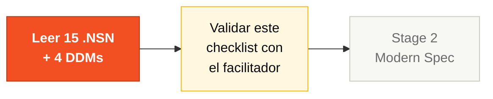

# Checklist de Exploración del Legado

> **GATE DURO ANTES DEL STAGE 2.** Ningún requerimiento EARS se acepta sin una referencia a un programa Natural o archivo DDM. Los requerimientos greenfield (sin paralelo en el legado) deben marcarse `[GREENFIELD]` y justificarse por escrito en la spec.
>
> ¿Por qué? En la edición anterior del workshop, varios equipos se saltaron la exploración del legado y escribieron specs basadas solo en el brief de modernización. El resultado fueron specs que no preservaban reglas reales de 29 años de SIFAP. **Esta vez el gate se aplica.**

## Dónde encaja en el SDLC



**Estás en el punto de control entre lectura y especificación.** Sin pasar este checklist, no entras al Stage 2. El CI también valida programáticamente la línea `source_legacy:` en cada REQ-ID.

---

## 1. La regla dura

```
Cada REQ-ID en tu SPECIFICATION.md DEBE tener una línea `source_legacy` que
apunte a uno de:
 - un programa .NSN específico en legacy/natural-programs/ (idealmente con rango de líneas)
 - un archivo .ddm específico en legacy/adabas-ddms/
 - la cadena literal [GREENFIELD] con una justificación de 1 línea
```

El CI rechaza los PRs hacia `develop` si algún REQ-ID le falta la línea `source_legacy`. Los facilitadores verifican por muestreo en H2 (Handoff #2, ~14:30).

---

## 2. Los 15 programas Natural — Quién lee qué

Cada Pair es dueño de 3 programas. **Ningún programa puede quedar sin leer.**

| Pair | Programas a leer | Por qué |
|------|------------------|---------|
| **1 · Vision** (PO + RE) | `CADBENEF.NSN`, `CADDEPEND.NSN`, `CADPROG.NSN` | Lógica de cadastro = las entidades centrales que se vuelven sujetos EARS |
| **2 · Architecture** (EA + SA) | `BATCHPGT.NSN`, `BATCHREL.NSN`, `BATCHCON.NSN` | Los flujos batch revelan los límites de módulo (bounded contexts) |
| **3 · Implementation** (TL + Dev) | `CALCBENF.NSN`, `CALCCORR.NSN`, `CALCDSCT.NSN` | Los cálculos son donde vivirá el código moderno; debes reproducirlos |
| **4 · Quality** (DBA + QA) | `VALBENEF.NSN`, `VALDOCS.NSN`, `VALELEG.NSN` | Las validaciones se vuelven tests; el DBA además mapea campos de los DDMs |
| **5 · Operations** (DevOps + TW) | `CONSBENF.NSN`, `RELPGT.NSN`, `RELAUDIT.NSN` | Las rutas de lectura informan el glosario y el runbook |

### Checklist por programa (marcar en `01-arqueologia/business-rules-catalog.md`)

Para cada programa que tu Pair lidera, llena estos 5 campos:

- [ ] Nombre del programa + autor + año de última modificación
- [ ] Inputs (qué DDMs lee)
- [ ] Outputs (qué DDMs escribe)
- [ ] Otros programas que llama (cadena CALLNAT)
- [ ] **Al menos 1 regla de negocio extraída como línea en `business-rules-catalog.md`** con `Programa Fonte` e idealmente rango de líneas

`Programa Fonte` vacío = línea inválida.

---

## 3. Los 4 DDMs — Mapeo de campos

El Pair 4 (DBA + QA) lidera. Todos los demás Pairs contribuyen con revisión.

| DDM | Dueño | Artefacto PostgreSQL objetivo |
|-----|-------|-------------------------------|
| `BENEFICIARIO.ddm` | Pair 4 | tabla `beneficiary` |
| `PAGAMENTO.ddm` | Pair 4 | tabla `payment` |
| `PROGRAMA-SOCIAL.ddm` | Pair 4 | tabla `social_program` |
| `AUDITORIA.ddm` | Pair 4 | tabla `audit_event` |

Para cada DDM:

- [ ] Listado cada campo con tipo (A/N/D/etc.) y longitud
- [ ] Marcado explícitamente los campos `MU` (multi-valor) y `PE` (grupo periódico)
- [ ] Propuesto mapeo PostgreSQL (tipo de columna, nullability, tabla de relación para MU/PE)
- [ ] Identificado al menos 1 antipatrón (denormalización, constantes mágicas, …)

---

## 4. Caza de misterios — Cuota mínima

Hay **10 reglas de negocio escondidas**, **3 easter eggs** y **4 inconsistencias** plantadas en el código legado. Mira [`mysteries-checklist.md`](mysteries-checklist.md) para la lista de caza (sin respuestas).

**Cuota para pasar el gate:** al menos **5 misterios** documentados en `mysteries-found.md` con:

- El misterio en sí (una frase)
- Dónde lo encontraste (archivo + rango de líneas)
- Por qué importa (impacto si no se preserva)

---

## 5. Verificación antes de abrir el Stage 2

A las ~11:45 un facilitador revisará el trabajo de tu Pair contra esta matriz. No puedes pasar al Stage 2 con líneas rojas.

| Artefacto | Path | Criterio del gate |
|-----------|------|-------------------|
| Glosario | `01-arqueologia/glossary.md` | ≥ 30 términos, cada uno con `legacy source` si vino del código |
| Catálogo de reglas | `01-arqueologia/business-rules-catalog.md` | ≥ 15 reglas, **100% con `Programa Fonte` no vacío** |
| Mapa de dependencias | `01-arqueologia/dependency-map.md` | Grafo Mermaid cubriendo los 15 programas .NSN (sin huérfanos) |
| Misterios encontrados | `01-arqueologia/mysteries-found.md` | ≥ 5 misterios con evidencia archivo+línea |
| Reporte de descubrimiento | `01-arqueologia/discovery-report.md` | Todas las secciones llenas (sin placeholders) |

---

## 6. Snippet de formato de spec requerido (llevar al Stage 2)

Cuando empieces a escribir EARS en el Stage 2, **cada requerimiento debe seguir este formato**:

```yaml
REQ-PAY-001:
 pattern: event-driven
 text: "When a payment cycle is generated, the SIFAP shall create payment records
 for every beneficiary with status ACTIVE."
 source_legacy: legacy/natural-programs/BATCHPGT.NSN#L120-L168
 acceptance: "10 active + 2 suspended beneficiaries produces 10 payment records."
```

Caso greenfield (sin paralelo en el legado):

```yaml
REQ-AUTH-001:
 pattern: ubiquitous
 text: "The SIFAP shall authenticate users via OAuth2 with JWT tokens."
 source_legacy: "[GREENFIELD] Legacy used terminal session auth; modern API needs token auth."
 acceptance: "Unauthenticated requests return 401."
```

> Spec sin línea `source_legacy` = inválida. Los validadores de Specky en CI aplican esto.

---

## Trampas comunes

| ❌ Si estás haciendo esto | ✅ Hazlo así |
|---------------------------|--------------|
| Saltar la lectura de algún `.NSN` porque "se ve aburrido" | Cada Pair tiene 3 programas asignados; ninguno queda sin leer |
| Llenar `source_legacy` con solo el nombre del archivo | Mejor con rango de líneas: `ARCHIVO.NSN#L120-L168` |
| Marcar todo como `[GREENFIELD]` para evitar buscar | Los facilitadores muestrean; greenfield abusivo baja la nota |
| Documentar misterios sin archivo+línea | El catálogo necesita evidencia verificable |

---

## Cómo saber que terminaste

- [ ] Los 5 artefactos de la sección 5 verdes
- [ ] Cuota de 5 misterios cumplida (idealmente 8+)
- [ ] El facilitador firmó el gate H1 a las ~11:45
- [ ] Tu Pair sabe a qué Pair le hace handoff y qué le entrega

## Próximo paso

Una vez que el facilitador firme, el **Pair 2 (Architecture)** lidera el Stage 2 usando tus artefactos como input. Abre [`../02-spec-moderna/GUIDE.md`](../02-spec-moderna/GUIDE.md).

---

## Navegación

| Anterior | Inicio | Siguiente |
|----------|--------|-----------|
| [Stage 1 — Guía completa](GUIDE.md) | [Stage 1 — README](README.md) | [Stage 2 — Modern Spec](../02-spec-moderna/GUIDE.md) |

— Paula
