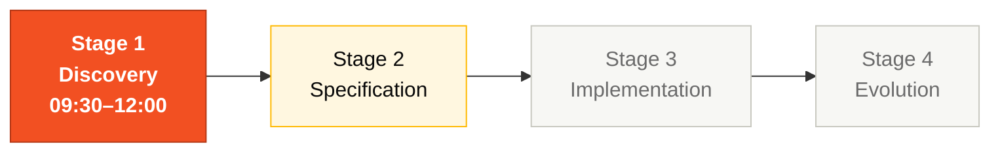
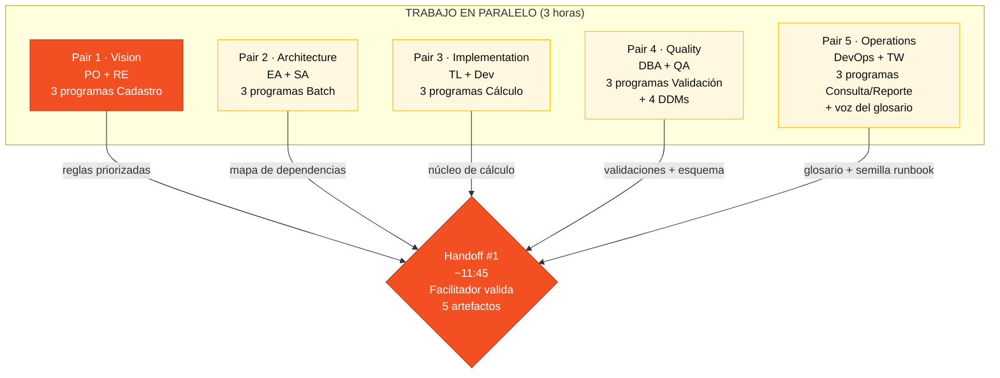

# Stage 1 — Archaeology

> **LEE PRIMERO:** [`LEGACY-EXPLORATION-CHECKLIST.md`](LEGACY-EXPLORATION-CHECKLIST.md) — gate duro antes del Stage 2.
>
> Explora el SIFAP legado con Copilot Chat y Specky Research. Extrae reglas de negocio, construye un glosario y mapea dependencias. Cada artefacto producido aquí alimenta al Stage 2; las specs sin trazabilidad al legado las rechaza el CI.

## Dónde encaja en el SDLC

**Estás en el Stage 1.** La salida de este stage alimenta directamente al Stage 2. Sin entrega clara aquí, falla el handoff #1 y todo el equipo se atasca.

## Contenido

| Archivo | Propósito |
|---------|-----------|
| [`LEGACY-EXPLORATION-CHECKLIST.md`](LEGACY-EXPLORATION-CHECKLIST.md) | **GATE DURO.** Propiedad de programas por Pair + DoD para pasar al Stage 2 |
| [`GUIDE.md`](GUIDE.md) | Guía paso a paso de este stage |
| [`glossary.md`](glossary.md) | Template del glosario de términos del dominio |
| [`business-rules-catalog.md`](business-rules-catalog.md) | Catálogo de reglas extraídas (`Programa Fonte` obligatorio) |
| [`dependency-map.md`](dependency-map.md) | Template de mapeo de dependencias del sistema |
| [`discovery-report.md`](discovery-report.md) | Template del reporte de hallazgos |
| [`mysteries-checklist.md`](mysteries-checklist.md) | Checklist de lógica escondida para los equipos |
| [`mysteries-found.md`](mysteries-found.md) | Template para registrar los misterios descubiertos |

El código legado vive en [`../../legacy/`](../../legacy/) (incluido en el kit).

## Quién trabaja aquí (los 5 Pairs en paralelo)

## Próximo paso

Abre [`GUIDE.md`](GUIDE.md) y empieza el trabajo de tu Pair. A las ~11:45 un facilitador (cordón azul) valida tus artefactos contra [`LEGACY-EXPLORATION-CHECKLIST.md`](LEGACY-EXPLORATION-CHECKLIST.md). Si algo está rojo, tu Pair no abre el Stage 2.

## Navegación

| Anterior | Inicio | Siguiente |
|----------|--------|-----------|
| [Team Flow (ES)](../TEAM-FLOW.md) | [Kit del Equipo (ES)](../README.md) | [Stage 1 — Guía completa](GUIDE.md) |
