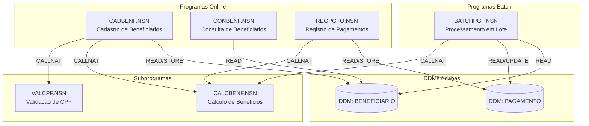
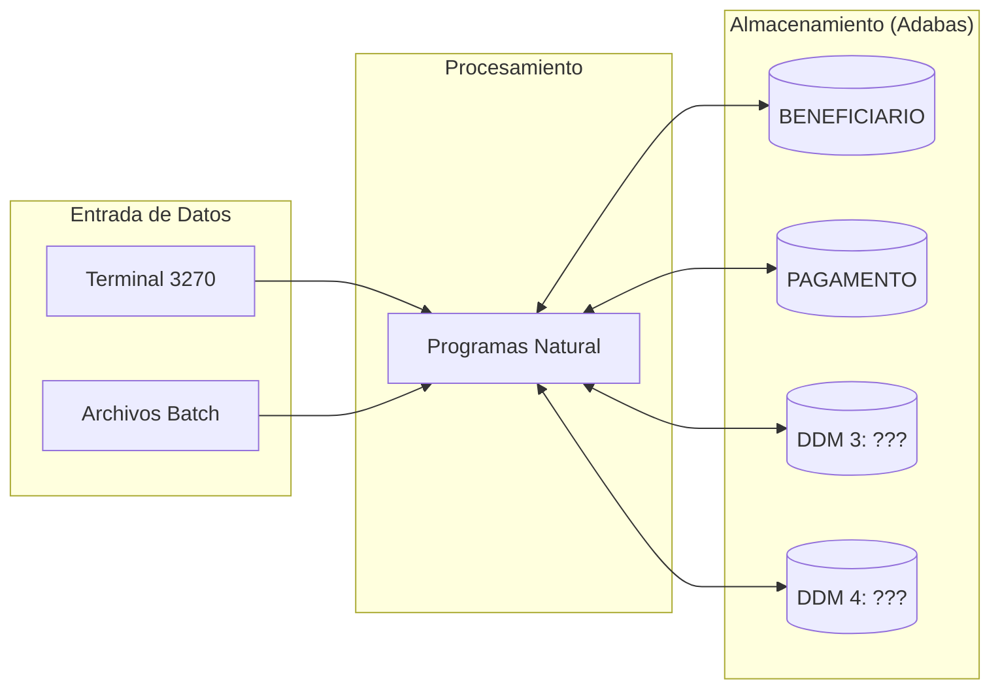

# Mapa de Dependencias — SIFAP Legado

> Usa diagramas Mermaid para mapear las dependencias entre programas Natural y DDMs Adabas. El objetivo es visualizar "quién llama a quién" y "quién lee/escribe qué".

## Cómo pensar en esto

El mapa de dependencias revela los **bounded contexts naturales** del sistema. Un cluster de programas que se llaman entre sí y leen los mismos DDMs es candidato a ser un módulo del monolito modular del Stage 2. Sin el mapa, los bounded contexts se vuelven adivinanza.

## Diagrama de dependencias entre programas

> Reemplaza el ejemplo de abajo por el mapa real de tu equipo.
> Tip: usa `CALLNAT` y `PERFORM` en el código para encontrar llamadas entre programas.

> **Instrucción**: este es solo un ejemplo inicial con 6 programas.
> Tu equipo debe mapear **los 15 programas** y los **4 DDMs**.

## Diagrama de flujo de datos (DDMs)

> Reemplaza "DDM 3: ???" y "DDM 4: ???" por los nombres reales encontrados.

## Tabla de dependencias

| Programa | Llama (CALLNAT) | Lee (READ) DDMs | Escribe (STORE/UPDATE) DDMs | Observaciones |
|----------|-----------------|-----------------|-----------------------------|---------------|
| CADBENF.NSN | | | | |
| CONBENF.NSN | | | | |
| REGPGTO.NSN | | | | |
| BATCHPGT.NSN | | | | |
| CALCBENF.NSN | | | | |
| VALCPF.NSN | | | | |
| | | | | |
| | | | | |
| | | | | |
| | | | | |
| | | | | |
| | | | | |
| | | | | |
| | | | | |
| | | | | |

## Dependencias circulares

> Lista aquí cualquier dependencia circular encontrada (programa A llama a B que llama a A):

- Ninguna encontrada hasta ahora.

## Programas huérfanos

> Programas que no son llamados por ningún otro (posibles puntos de entrada o código muerto):

- Por investigar.
