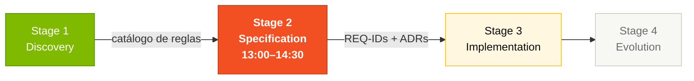
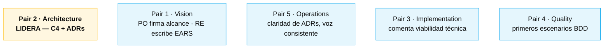
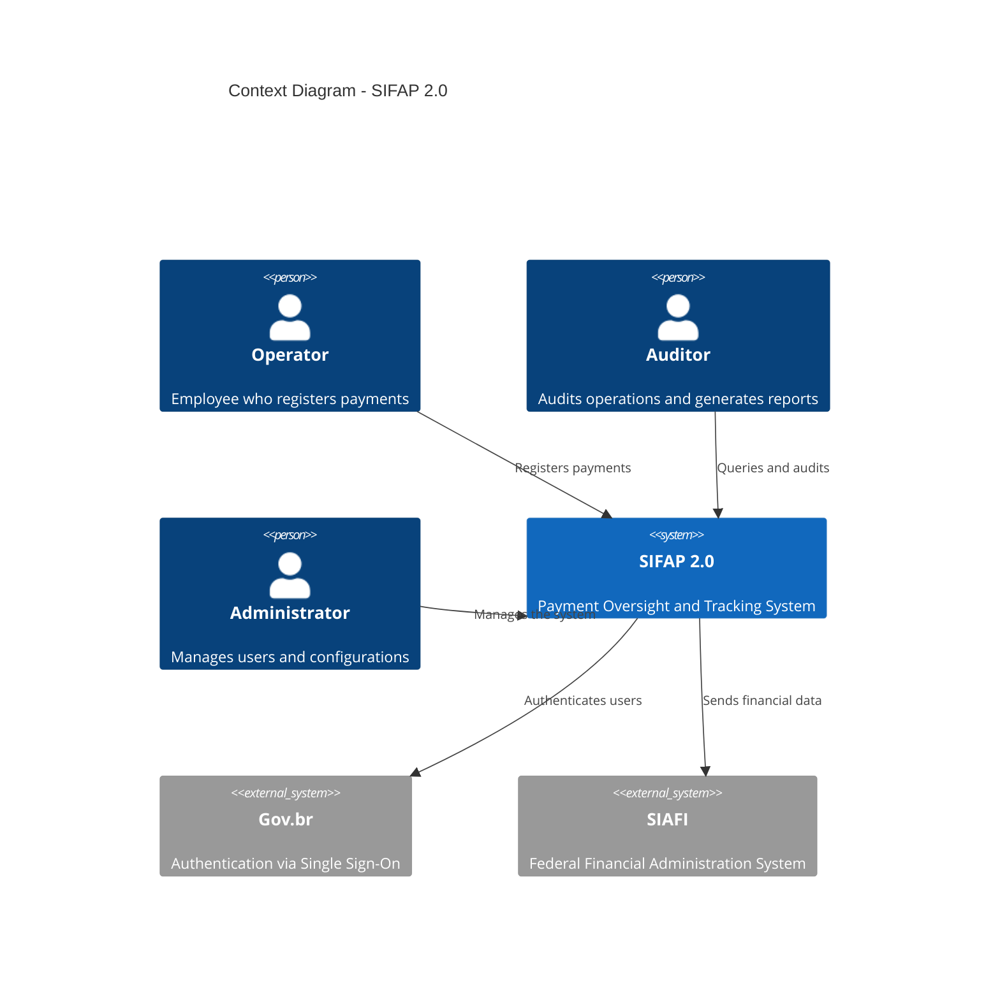
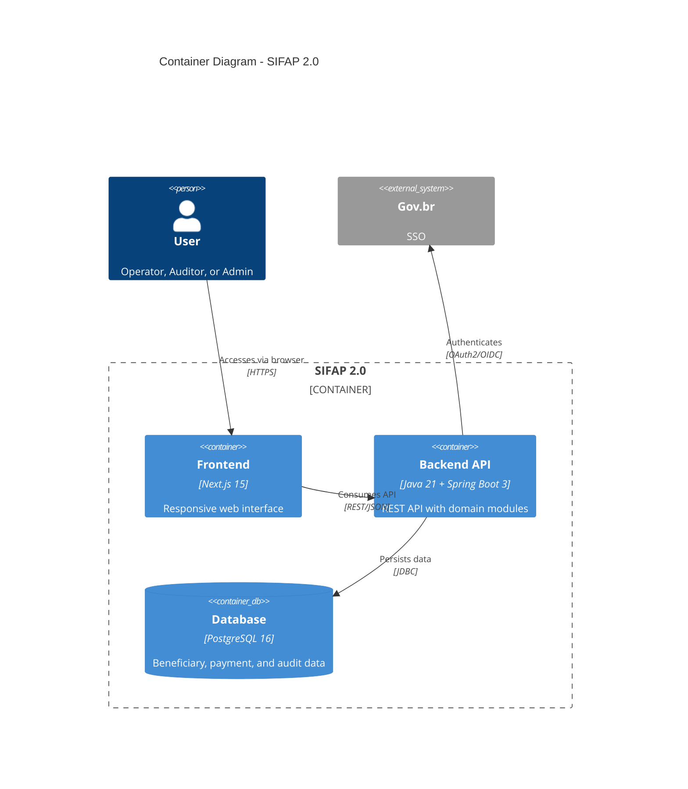

# Stage 2 — Especificación Moderna (3 horas)

> **REGLA DURA.** Cada requerimiento EARS en tu `SPECIFICATION.md` debe incluir una línea `source_legacy:` apuntando a un archivo `.NSN` o `.ddm` dentro de [`../../legacy/`](../../legacy/), **o** marcarse como `source_legacy: "[GREENFIELD] <justificación de una línea>"`. El CI rechaza los PRs que violan esto. Los facilitadores muestrean en el Handoff #2 (~14:30).
>
> ¿Por qué? En la edición anterior algunos equipos escribieron specs solo desde el brief de modernización, saltándose la lectura del legado. Sus prototipos perdieron reglas reales. Esta vez, la trazabilidad es el gate.

## Dónde encaja en el SDLC



## Quién trabaja aquí



---

## Por qué importa

Un sistema legado tiene reglas escondidas. Una especificación moderna **explícita** esas reglas. Sin esta capa intermedia, el equipo de Stage 3 va a improvisar — y la rúbrica castiga sin piedad la falta de trazabilidad.

EARS existe para que cada requerimiento sea testeable. Una frase como "el sistema debe ser seguro" no se puede testear. Una frase como "When a beneficiary is registered, the SIFAP shall validate the CPF using modulo-11" sí — y va directo a un test JUnit.

## Cómo pensar en esto

Piensa en la especificación como **el contrato entre el legado y el código moderno**. Cada regla del catálogo del Stage 1 se vuelve, o bien:

1. Una **REQ-ID en EARS** con `source_legacy:` apuntando al `.NSN` original (caso 99%)
2. Una **REQ-ID greenfield** con justificación escrita (caso raro, ej: OAuth2)
3. **Descartada explícitamente** en `scope-decisions.md` con motivo

Lo que **no** puede pasar: regla del catálogo que desaparece sin nota. El facilitador busca exactamente eso en H2.

## Referencia gold-standard

Antes de empezar, estudia la especificación de referencia:

```
03-spec-sifap-moderno/SPECIFICATION.md
```

Este documento muestra el formato y nivel de detalle esperado. Tu especificación debe seguir la misma estructura — incluyendo el campo `source_legacy:` en cada requerimiento.

---

## Notación EARS — Easy Approach to Requirements Syntax

EARS es un método para escribir requerimientos sin ambigüedad. Hay **6 patrones** que eliminan el lenguaje vago. Specky valida cada requerimiento programáticamente vía `sdd_validate_ears`.

### Patrón 1: Ubiquitous (siempre verdadero)

> **The [system] shall [action].**

Ejemplo SIFAP:
> The SIFAP shall store all payment records with a UTC timestamp.

Úsalo cuando: la regla SIEMPRE se cumple, sin condición.

### Patrón 2: Event-Driven (cuando algo sucede)

> **When [event], the [system] shall [action].**

Ejemplo SIFAP:
> When a beneficiary is registered, the SIFAP shall validate the CPF using the modulo-11 algorithm from Receita Federal.

Úsalo cuando: la regla solo aplica después de un evento específico.

### Patrón 3: State-Driven (mientras una condición se mantiene)

> **While [condition], the [system] shall [action].**

Ejemplo SIFAP:
> While a payment has status PENDING, the SIFAP shall allow cancellation by a user with the OPERATOR profile.

Úsalo cuando: la regla solo se mantiene durante un estado.

### Patrón 4: Optional (si el usuario elige)

> **Where [optional condition], the [system] shall [action].**

Ejemplo SIFAP:
> Where the operator chooses to export the report, the SIFAP shall generate a CSV file with UTF-8 encoding.

Úsalo cuando: la funcionalidad no es obligatoria — depende de una elección del usuario.

### Patrón 5: Unwanted Behavior (lo que NO debe pasar)

> **The [system] shall not [unwanted action].**

Ejemplos SIFAP:
> The SIFAP shall not allow deletion of records from the audit table.
> The SIFAP shall not process payments for beneficiaries with status CANCELLED.

Úsalo cuando: necesitas documentar restricciones o prohibiciones explícitas.

### Patrón 6: Complex Scenario (combinación de condiciones)

> **While [condition], when [event], where [optional condition], the [system] shall [action].**

Ejemplo SIFAP:
> While the beneficiary has status ACTIVE, when a payment cycle is generated in December, the SIFAP shall calculate the 13th salary using a differentiated formula.

Úsalo cuando: combinan múltiples condiciones.

### Ejemplo: requerimiento MALO vs BUENO

| Malo (vago) | Bueno (EARS) |
|-------------|--------------|
| "El sistema debe ser seguro" | "The SIFAP shall mask CPF in logs using the format \*\*\*.\*\*\*.XXX-\*\*" |
| "Los pagos deben procesarse" | "When a cycle is generated, the SIFAP shall create payment records for all beneficiaries with status ACTIVE" |
| "Auditoría completa" | "When any entity is changed, the SIFAP shall write an audit record with prior and posterior state in JSON format" |

### Tip: cada requerimiento debe ser TESTEABLE

Al escribir un requerimiento pregúntate: "¿Cómo testearía esto automáticamente?" Si no puedes responder, el requerimiento está demasiado vago.

| Requerimiento | Test |
|---------------|------|
| REQ-BEN-01: "The SIFAP shall validate CPF with modulo-11" | Test: CPF inválido retorna error 400 |
| REQ-PAY-03: "When a cycle is generated, create payments for ACTIVE beneficiaries" | Test: 10 activos + 2 suspendidos = 10 pagos |
| REQ-AUD-01: "The SIFAP shall not allow DELETE on audit" | Test: DELETE retorna error 403 |

---

## Paso a paso (cronometrado, 90 min efectivos)

### Paso 1 — Importar catálogo (15 min)

Cada regla de `business-rules-catalog.md` se vuelve **una entrada candidata** a REQ-ID. Pair 1 (Requirements Engineer) abre el catálogo y pega cada `BR-NNN` como borrador de requerimiento. Todavía sin formato EARS, solo crudo. **Por qué:** sin importar primero, te olvidas de reglas.

### Paso 2 — Convertir a EARS (30 min)

Pair 1 + Pair 2, en paralelo, convierten cada borrador a uno de los 6 patrones EARS. **Cómo decidir el patrón:**

- ¿Es una regla siempre vigente? → Ubiquitous
- ¿Se dispara por un evento? → Event-driven
- ¿Solo aplica en cierto estado? → State-driven
- ¿Es opcional, depende del usuario? → Optional
- ¿Es una prohibición? → Unwanted
- ¿Combina dos condiciones? → Complex

**Cada REQ-ID lleva `source_legacy:` apuntando al `.NSN` del catálogo.** Sin esto, CI bloquea.

### Paso 3 — Decisiones de alcance (15 min)

Pair 1 (Product Owner) abre [`scope-decisions.md`](scope-decisions.md) y por cada funcionalidad del legado decide: **Migrar**, **Descartar** o **Evolucionar**. Esta es la lista oficial — el Stage 3 solo construye lo que está marcado Migrar o Evolucionar.

### Paso 4 — ADRs y C4 (20 min)

Pair 2 (Architecture) escribe mínimo 3 ADRs y dibuja C4 L1 + L2 en Mermaid. **Cada ADR lleva el path no elegido** (qué descartaron y por qué).

### Paso 5 — Handoff #2 (10 min)

A las ~14:30, walkthrough de 5 minutos del Pair 2 al Pair 3 + Pair 4: "estas son las REQ-IDs, este es el C4, estos son los ADRs". Pair 1 firma alcance.

---

## Ejemplo completo: de regla legada a test

Mira el ciclo completo de una regla SIFAP desde el código legado hasta el test automatizado:

### 1. Regla encontrada en el Stage 1

En el programa `CALCDSCT.NSN`, el equipo descubre:
```natural
* CHECK DEDUCTION CAP
IF #TIPO-DSCT NE 'J'
 IF #VLR-TOTAL-DSCT > (#VLR-BRUTO * 0.30)
 COMPUTE #VLR-TOTAL-DSCT = #VLR-BRUTO * 0.30
 END-IF
END-IF
```

**Interpretación**: los descuentos tienen tope del 30% del valor bruto, EXCEPTO descuentos judiciales (tipo 'J'), que no tienen tope.

### 2. Requerimiento EARS (Stage 2)

Usando los patrones **Unwanted Behavior** + **Event**:

> **REQ-PAY-DSCT-01**: The SIFAP shall not allow the total of non-judicial deductions to exceed 30% of the payment's gross amount.
>
> **REQ-PAY-DSCT-02**: When a judicial deduction is applied, the SIFAP shall add the value to the total deductions without applying the 30% cap.

**Criterios de aceptación**:
- AC-01: Descuento no-judicial de 35% se trunca a 30%
- AC-02: Descuento judicial de 50% se acepta completo
- AC-03: Mix de judicial (20%) + no-judicial (25%) = 45% total aceptado

### 3. Código (Stage 3)

```java
// payment/application/PaymentService.java
public BigDecimal calculateTotalDeductions(List<Deduction> deductions, BigDecimal grossAmount) {
 BigDecimal judicialTotal = deductions.stream()
 .filter(d -> "JUDICIAL".equals(d.type()))
 .map(Deduction::amount)
 .reduce(BigDecimal.ZERO, BigDecimal::add);
 
 BigDecimal otherTotal = deductions.stream()
 .filter(d -> !"JUDICIAL".equals(d.type()))
 .map(Deduction::amount)
 .reduce(BigDecimal.ZERO, BigDecimal::add);
 
 BigDecimal maxOther = grossAmount.multiply(new BigDecimal("0.30"));
 otherTotal = otherTotal.min(maxOther); // Cap at 30%
 
 return judicialTotal.add(otherTotal); // Judicial has no cap
}
```

### 4. Test (Stage 3)

```java
@Test
@DisplayName("REQ-PAY-DSCT-01: Non-judicial deductions capped at 30%")
void nonJudicialDeductionsCappedAt30Percent() {
 var deductions = List.of(new Deduction("TAX", new BigDecimal("350.00")));
 var gross = new BigDecimal("1000.00");
 
 var total = service.calculateTotalDeductions(deductions, gross);
 
 assertThat(total).isEqualByComparingTo("300.00"); // 35% capped to 30%
}
```

### Trazabilidad

| Artefacto | ID | Referencia |
|-----------|-----|------------|
| Regla legada | BR-013 | CALCDSCT.NSN líneas 142-148 |
| Requerimiento | REQ-PAY-DSCT-01/02 | SPECIFICATION.md |
| Código | PaymentService.calculateTotalDeductions() | payment/application/ |
| Test | PaymentServiceTest (2 métodos) | payment/application/ |

**Este ciclo es lo que Specky aplica automáticamente vía `sdd_check_sync`.** Si el código diverge de la spec, el hook lo detecta.

---

## ADRs — Architecture Decision Records

Los ADRs documentan decisiones importantes de arquitectura. Para cada decisión, crea un archivo usando el template [`ADR-TEMPLATE.md`](ADR-TEMPLATE.md).

### Cuándo crear un ADR

- Elección de tecnología (base de datos, framework, etc.)
- Patrón de arquitectura (monolito modular vs. microservicios)
- Estrategia de migración (big bang vs. incremental)
- Trade-offs significativos (performance vs. simplicidad)

### ADRs esperados (mínimo 3)

1. **ADR-001**: Elección de arquitectura (ej: monolito modular)
2. **ADR-002**: Estrategia de migración de datos
3. **ADR-003**: Approach de autenticación y autorización
4. ADR-004 a ADR-005: Decisiones adicionales del equipo

---

## Diagramas C4 — Context, Containers, Components

Usa Mermaid para crear al menos los diagramas **Context (C4-L1)** y **Containers (C4-L2)**.

### Ejemplo C4-L1: Context Diagram



### Ejemplo C4-L2: Container Diagram



---

## Flujo de Specky — RECOMENDADO

> **¿Qué es Specky?** Es una herramienta CLI que instala dentro de tu proyecto (VS Code o Claude Code) un conjunto de **agentes** (asistentes especializados que invocas en el chat), **slash commands** (atajos como `/specky-migration`) y **MCP tools** (motores internos que validan tus artefactos). Tú interactúas con los **agentes** y los **slash commands** — las MCP tools corren abajo automáticamente.

**Specky** (https://github.com/paulasilvatech/specky) es el motor de Spec-Driven Development del workshop. Valida tus requerimientos EARS programáticamente y refuerza la calidad.

### Instalación (si no está en el devcontainer)

```bash
npm install -g specky-sdd@latest
specky install --ide=copilot # VS Code + GitHub Copilot
# O
specky install --ide=claude # Claude Code
```

### Verifica la instalación

```bash
specky doctor # Todos los checks deben estar verdes
specky status # Muestra la fase actual del pipeline
```

### Agentes de Specky (invoca en chat)

| Agente | Qué hace | Cuándo usar |
|--------|----------|-------------|
| `@specky-orchestrator` | Coordina el pipeline completo | Para correr el flujo completo |
| `@spec-engineer` | Escribe SPECIFICATION.md en EARS | Fase 2 - requerimientos |
| `@design-architect` | Genera DESIGN.md + diagramas C4 | Fase 4 - arquitectura |
| `@sdd-clarify` | Resuelve ambigüedades en EARS | Cuando un requerimiento es confuso |
| `@requirements-engineer` | Extrae requerimientos de docs/código | Convertir Stage 1 → requerimientos |

### Slash commands (atajos)

| Comando | Descripción |
|---------|-------------|
| `/specky-greenfield` | Proyecto nuevo desde cero |
| `/specky-brownfield` | Feature en un sistema existente |
| `/specky-migration` | Modernización de legado ← **USA ESTE** |
| `/specky-specify` | Especificar requerimientos EARS |

### MCP tools (las usan los agentes internamente)

| Tool | Qué hace |
|------|----------|
| `sdd_init` | Inicializa el proyecto en `.specs/NNN-feature/` |
| `sdd_discover` | Fase de discovery (usa datos del Stage 1) |
| `sdd_write_spec` | Genera SPECIFICATION.md estructurado |
| `sdd_write_design` | Genera DESIGN.md con diagramas |
| `sdd_validate_ears` | **Valida requerimientos contra el patrón EARS** (6 patrones) |
| `sdd_generate_diagram` | Genera diagramas C4 en Mermaid |
| `sdd_clarify` | Resuelve ambigüedades entre requerimientos |

### Flujo recomendado para el Stage 2

```
1. @specky-orchestrator "run migration pipeline for SIFAP 2.0"
 → Crea la estructura en .specs/001-sifap-modernization/

2. @requirements-engineer
 → Importa reglas del Stage 1 y las convierte a EARS

3. @spec-engineer
 → Genera SPECIFICATION.md completa con 20-30 requerimientos EARS

4. sdd_validate_ears
 → Valida que cada requerimiento siga uno de los 6 patrones EARS

5. @design-architect
 → Genera DESIGN.md con C4 L1+L2 y ADRs

6. @sdd-clarify (si es necesario)
 → Resuelve ambigüedades detectadas
```

### Si Specky NO está disponible

No te preocupes — escribe los requerimientos EARS manualmente en SPECIFICATION.md siguiendo los 6 patrones de arriba. El formato es texto plano.

---

## Trampas comunes

| ❌ Si estás haciendo esto | ✅ Hazlo así |
|---------------------------|--------------|
| Escribir REQ sin `source_legacy:` | CI bloquea. Cada REQ trae el archivo .NSN o `[GREENFIELD]` con justificación |
| Usar EARS Ubiquitous para todo | Aprende los 6 patrones; cada uno tiene su lugar |
| ADR de una línea ("usaremos Spring Boot") | Cada ADR lleva contexto + decisión + path no elegido + consecuencias |
| Saltar las decisiones de alcance | Sin `scope-decisions.md` el Stage 3 no sabe qué construir |
| Dibujar C4 L3 detallado | L1 + L2 alcanzan. L3 raramente es necesario en un workshop |

---

## Cómo saber que terminaste (Definition of Done)

Antes del Handoff #2 (~14:30), tu equipo debe tener:

- [ ] `SPECIFICATION.md` completa con requerimientos EARS (archivo: `02-spec-moderna/SPECIFICATION.md`)
- [ ] 3 a 5 ADRs (archivos: `02-spec-moderna/ADR-001.md`, `ADR-002.md`, etc.)
- [ ] Diagrama C4 en Mermaid (dentro de SPECIFICATION.md o en archivo separado)
- [ ] Decisiones de alcance documentadas (archivo: `02-spec-moderna/scope-decisions.md`)
- [ ] **100% de los REQ-IDs con `source_legacy:` lleno** (validado por CI)

## Prompts para Copilot Chat

1. "Convierte esta regla de negocio a notación EARS: [describe la regla]"
2. "Crea un ADR para la decisión de usar [tecnología X] en lugar de [tecnología Y]"
3. "Genera un diagrama C4 context en Mermaid para un sistema que [descripción]"
4. "Revisa este requerimiento EARS y sugiere mejoras de claridad"
5. "¿Qué atributos de calidad (NFRs) deberíamos considerar para este sistema?"
6. "A partir de estas reglas de negocio, sugiere la estructura de módulos del backend"
7. "Crea user stories a partir de estos requerimientos EARS"

## Próximo paso

Cuando el Pair 2 firme el Handoff #2, el **Pair 3 (Implementation)** + **Pair 4 (Quality)** lideran el Stage 3 con las REQ-IDs y los ADRs como input. Abre [`../03-implementacao/GUIDE.md`](../03-implementacao/GUIDE.md).

## Tip de oro

No intentes reinventar la rueda. La especificación de referencia en `03-spec-sifap-moderno/SPECIFICATION.md` ya tiene la estructura ideal. Úsala como base y adáptala con los hallazgos de tu equipo.

---

## Navegación

| Anterior | Inicio | Siguiente |
|----------|--------|-----------|
| [Stage 1 — Archaeology](../01-arqueologia/GUIDE.md) | [Kit del Equipo (ES)](../README.md) | [Stage 3 — Implementation](../03-implementacao/GUIDE.md) |
