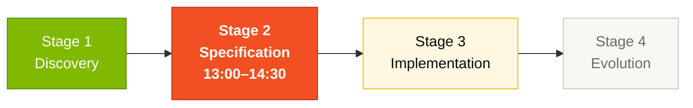
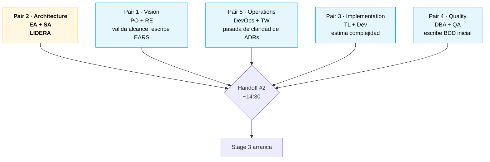

# Stage 2 — Modern Specification

> Escribe la especificación modernizada del SIFAP usando notación EARS, crea Architecture Decision Records y define los límites de alcance.

## Dónde encaja en el SDLC

**Estás en el Stage 2 (Specification del SDLC).** El input vino del Stage 1: el `business-rules-catalog.md` y el `discovery-report.md` que produjeron en arqueología. El output alimenta directamente a los Stages 3 y 4.

## Contenido

| Archivo | Propósito |
|---------|-----------|
| [`GUIDE.md`](GUIDE.md) | Guía paso a paso de este stage |
| [`ADR-TEMPLATE.md`](ADR-TEMPLATE.md) | Template para Architecture Decision Records |
| [`scope-decisions.md`](scope-decisions.md) | Template para decisiones de límites de alcance |

## Quién lidera

## Navegación

| Anterior | Inicio | Siguiente |
|----------|--------|-----------|
| [Stage 1 — Archaeology](../01-arqueologia/README.md) | [Kit del Equipo (ES)](../README.md) | [Stage 2 — Guía completa](GUIDE.md) |
