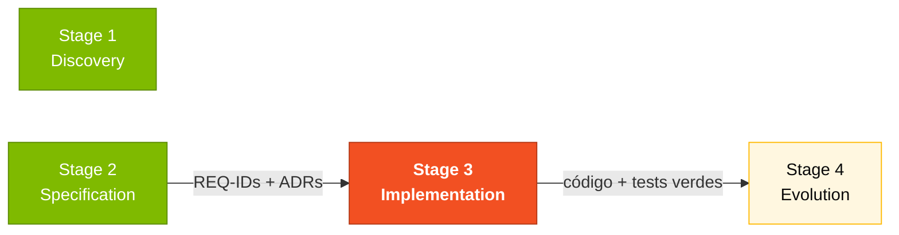
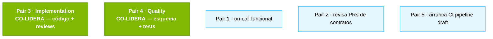

# Stage 3 — Implementación (3 horas)

## Dónde encaja en el SDLC



## Quién trabaja aquí



## Objetivo

Extender el prototipo SIFAP 2.0 funcionando, implementando las features priorizadas en el Stage 2. El prototipo ya tiene la estructura base — tu equipo agrega features, arregla bugs y escribe tests.

---

## Por qué importa

El Stage 3 es donde el spec se vuelve software real. Es el único stage donde **tu propio cliente** (los pagos de 2.3 millones de beneficiarios) realmente sufriría si el código fuera incorrecto. Por eso aquí no se acepta "casi funciona": tests verdes, `docker compose up` funciona, Swagger UI documenta los endpoints. Sin esto, el Stage 4 no tiene sobre qué construir.

## Cómo pensar en esto

Piensa en este stage como **una carrera de relevos, no una maratón individual**. Pair 3 escribe el código, Pair 4 escribe los tests y migraciones, Pair 2 revisa los PRs que tocan contratos. Si una persona acumula trabajo, todo el equipo se atasca. **Pequeños commits, pequeños PRs, revisión rápida.**

---

## Arranque (primeros 15 minutos)

### 1. Levanta el entorno

```bash
# En la raíz del repositorio (04-prototipo-sifap-moderno/)
docker compose up -d
```

Esto arranca:
- **PostgreSQL 16** en el puerto 5432
- **Backend (Java 21 + Spring Boot 3)** en el puerto 8080
- **Frontend (Next.js 15)** en el puerto **3000** (local) o **3001** (root docker-compose)

> **OJO**: si corriste `docker compose up` desde la RAÍZ del workspace (recomendado), el frontend está en **http://localhost:3001**. Si lo corriste desde dentro de `04-prototipo-sifap-moderno/`, está en **http://localhost:3000**.

### 2. Verifica que todo funcione

- Backend health: http://localhost:8080/actuator/health
- Swagger UI: http://localhost:8080/swagger-ui.html
- Frontend: http://localhost:3001 (o 3000 si compose local)

### 3. Credenciales por defecto

| Usuario | Contraseña | Perfil | Qué puede hacer |
|---------|------------|--------|-----------------|
| `admin` | `client2026` | ADMIN | Todo: gestionar usuarios, configuraciones |
| `operator1` | `client2026` | OPERATOR | Registrar beneficiarios, registrar pagos |
| `auditor1` | `client2026` | AUDITOR | Consultar, generar reportes, auditar |

### 4. Prueba la API en Swagger

Abre http://localhost:8080/swagger-ui.html y prueba:
1. `POST /api/v1/auth/login` con `{"username": "admin", "password": "client2026"}`
2. Copia el JWT token devuelto
3. Click en "Authorize" en Swagger y pega el token
4. Prueba los endpoints de beneficiarios y pagos

---

## Estructura del backend

El backend sigue una arquitectura de **monolito modular** con 4 módulos y 3 capas cada uno:

```
src/main/java/br/gov/client/sifap/
|
|-- beneficiary/ # Módulo: Beneficiarios
| |-- domain/ # Entidades y reglas de negocio
| |-- application/ # Servicios y DTOs
| |-- infrastructure/ # Controllers, Repositories, JPA Entities
|
|-- payment/ # Módulo: Pagos
| |-- domain/
| |-- application/
| |-- infrastructure/
|
|-- audit/ # Módulo: Auditoría
| |-- domain/
| |-- application/
| |-- infrastructure/
|
|-- admin/ # Módulo: Administración
| |-- domain/
| |-- application/
| |-- infrastructure/
```

### Capas (de dentro hacia afuera)

| Capa | Responsabilidad | Ejemplos |
|------|-----------------|----------|
| **domain** | Reglas de negocio puras, sin dependencia de framework | Enums de status, interfaces de repositorio, value objects |
| **application** | Casos de uso, orquestación | Services, DTOs de Request/Response |
| **infrastructure** | Detalles técnicos, I/O | Controllers REST, JPA Entities, Spring Data Repositories |

### Regla de oro

La capa `domain` **nunca** importa clases de `infrastructure`. El flujo siempre es: Controller → Service → Repository (interfaz en domain, implementación en infrastructure).

---

## Cómo agregar una nueva feature

Sigue estos 5 pasos por cada funcionalidad:

### Paso 1: Crear o actualizar la entidad del domain

```java
// src/.../payment/domain/PaymentStatus.java
public enum PaymentStatus {
 PENDING, APPROVED, REJECTED, CANCELLED
}
```

### Paso 2: Crear el service

```java
// src/.../payment/application/PaymentService.java
@Service
public class PaymentService {
 // Inyecta el repository, implementa la lógica
}
```

### Paso 3: Crear el controller

```java
// src/.../payment/infrastructure/PaymentController.java
@RestController
@RequestMapping("/api/v1/payments")
public class PaymentController {
 // Inyecta el service, expone los endpoints
}
```

### Paso 4: Crear la migración de la base de datos

```sql
-- src/main/resources/db/migration/V2__add_payment_status.sql
ALTER TABLE payments ADD COLUMN status VARCHAR(20) DEFAULT 'PENDING';
```

> **Importante**: usa Flyway. Nunca modifiques migraciones existentes — siempre crea una nueva (V2__, V3__, etc.).

### Paso 5: Escribir tests

```java
// src/test/.../payment/application/PaymentServiceTest.java
@SpringBootTest
class PaymentServiceTest {
 @Test
 void shouldCalculatePaymentCorrectly() {
 // Arrange, Act, Assert
 }
}
```

---

## Flujo con Copilot Edits

Para implementar features rápido con Copilot:

1. **Selecciona los archivos relevantes** en VS Code (Ctrl+click)
2. **Abre Copilot Edits** (Ctrl+Shift+I)
3. **Describe el cambio** en lenguaje natural:
 > "Agrega un endpoint PUT /api/v1/beneficiaries/{id}/status que permite
 > cambiar el estado del beneficiario. Valida que la transición de estado es válida
 > (ACTIVE → SUSPENDED se permite, INACTIVE → ACTIVE no). Crea el test."
4. **Revisa el diff** antes de aceptar — verifica que sigue la arquitectura
5. **Corre los tests** para confirmar

---

## Tests

### Correr todos los tests

```bash
cd 04-prototipo-sifap-moderno/backend
./mvnw test
```

### Requisitos

- **Docker debe estar corriendo** — los tests usan Testcontainers para levantar un PostgreSQL real
- Java 21 instalado (o usa el DevContainer)

### Tipos de tests esperados

| Tipo | Dónde | Qué testea |
|------|-------|------------|
| Unit | `*ServiceTest.java` | Lógica de negocio aislada |
| Integración | `*ControllerTest.java` | Endpoint completo (HTTP → DB) |
| Repository | `*RepositoryTest.java` | Queries custom |

---

## Frontend

### Correr el frontend localmente

```bash
cd 04-prototipo-sifap-moderno/frontend
npm install
npm run dev
```

Abre http://localhost:3000

### Arquitectura del frontend

El frontend usa **Next.js 15 con App Router** y **Server Components**:

```
src/app/
|-- layout.tsx # Root layout
|-- page.tsx # Home page
|-- (auth)/
| |-- login/page.tsx # Página de login
|-- (dashboard)/
| |-- beneficiaries/ # CRUD de beneficiarios
| |-- payments/ # CRUD de pagos
| |-- audit/ # Logs de auditoría
| |-- admin/ # Gestión de usuarios
```

### Patrón de Server Components

- **Server Components** (default): traen datos del servidor, sin JavaScript en el cliente
- **Client Components** (`"use client"`): solo cuando necesitas interactividad (formularios, modales)

---

## Trazabilidad: Requerimiento → Código → Test

Por cada feature que implementes, mantén la trazabilidad con la spec:

| Requerimiento EARS | Código | Test |
|--------------------|--------|------|
| REQ-BEN-01: "The SIFAP shall validate CPF with modulo-11" | `Cpf.java` (domain) | `CpfTest.java` - 11 tests |
| REQ-PAY-03: "When a cycle is generated, create payments for ACTIVE beneficiaries" | `PaymentCycleService.generate()` | `PaymentCycleServiceTest.generate_openCycle` |
| REQ-AUD-01: "When an entity is changed, write an audit record" | `AuditService.record()` | `SifapApplicationIntegrationTest` |

Cuando agregues una feature, documéntala en tu commit: "Implements REQ-XXX". Esto cierra el loop spec → código → test.

---

## Trampas comunes

| ❌ Si estás haciendo esto | ✅ Hazlo así |
|---------------------------|--------------|
| Trabajar 3 horas en una sola branch gigante | Commits pequeños, PRs pequeños, merge cada 30–45 min |
| Editar una migración Flyway existente | NUNCA. Crea una nueva (V5__, V6__...). Las migraciones son inmutables. |
| Capa `domain` importando de `infrastructure` | Viola el monolito modular. La inversión de dependencias va por la interfaz en domain. |
| Código sin test "lo agrego después" | Escribe el test al mismo tiempo que el código. A las 16:30 no hay "después". |
| Usar Copilot Agent para un cambio de 5 minutos | Usa Edits. Agent es para tareas que valen 30+ min de tu tiempo. |

---

## Troubleshooting

| Problema | Solución |
|----------|----------|
| `docker compose up` falla | Verifica: ¿Docker Desktop corriendo? ¿Puertos 5432/8080/3000 libres? Intenta `docker compose down && docker compose up -d` |
| Backend no conecta a PostgreSQL | Verifica que el container postgres esté healthy: `docker compose ps` |
| Frontend muestra "Failed to load" | ¿El backend está corriendo? Prueba: `curl http://localhost:8080/actuator/health` |
| Login retorna "Invalid credentials" | Usa: admin / client2026. Verifica que V4__auth.sql corrió (Flyway) |
| Test falla con Testcontainers | Docker Desktop debe estar corriendo. Alternativa: test unitario con Mockito |
| Migración falla al arrancar | NUNCA edites una migración existente. Crea una nueva (V5__, V6__...) |
| `mvn test-compile` error de import | Verifica que el package siga la estructura: domain/ → application/ → infrastructure/ |
| Swagger UI no aparece | Intenta: http://localhost:8080/swagger-ui/index.html (path alternativo) |

---

## Cómo saber que terminaste (Definition of Done)

Al final del Stage 3, tu equipo debe tener:

- [ ] Backend funcionando con al menos 2 endpoints nuevos implementados
- [ ] Frontend con al menos 1 pantalla nueva o mejora significativa
- [ ] Tests pasando: `./mvnw test` sin fallas
- [ ] `docker compose up` funcionando — cualquier revisor puede levantar el sistema
- [ ] Swagger UI mostrando todos los endpoints documentados
- [ ] Al menos 1 regla de negocio del Stage 1 implementada y testeada

## Prompts para Copilot Chat

1. "Crea un endpoint REST para [funcionalidad] siguiendo la arquitectura existente"
2. "Escribe un test de integración para el endpoint [endpoint]"
3. "Agrega Bean Validation al DTO [class]"
4. "Crea una migración Flyway para agregar [tabla/columna]"
5. "Implementa la regla de negocio BR-XXX: [descripción de la regla]"
6. "Crea un React Server Component para listar [entidad]"
7. "Agrega manejo de errores para el caso de [escenario]"
8. "Refactoriza este service para separar la lógica de [responsabilidad]"

## Próximo paso

Cuando los tests estén verdes y `docker compose up` funcione, el **Pair 5 (Operations)** lidera el Stage 4 con el código como input. Abre [`../04-evolucao/GUIDE.md`](../04-evolucao/GUIDE.md).

## Tip de oro

No intentes implementar todo. Enfócate en **calidad sobre cantidad**. Un endpoint bien construido, con tests, validación y documentación, vale más que 5 endpoints rotos.

---

## Navegación

| Anterior | Inicio | Siguiente |
|----------|--------|-----------|
| [Stage 2 — Modern Spec](../02-spec-moderna/GUIDE.md) | [Kit del Equipo (ES)](../README.md) | [Stage 4 — Evolution](../04-evolucao/GUIDE.md) |
