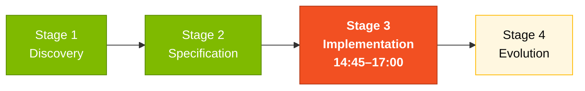
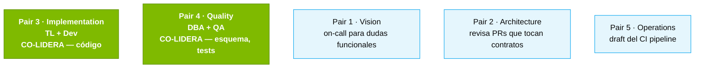

# Stage 3 — Implementation

> Construye el prototipo de SIFAP 2.0 — backend Java 21, frontend Next.js 15, base de datos PostgreSQL 16 — usando el modo Agent de GitHub Copilot.

## Dónde encaja en el SDLC

**Estás en el Stage 3.** El input son las REQ-IDs y los ADRs del Stage 2. El output: una aplicación que arranca con `docker compose up` y pasa los tests.

## Contenido

| Archivo | Propósito |
|---------|-----------|
| [`GUIDE.md`](GUIDE.md) | Guía paso a paso de este stage |

## Quién lidera

## Navegación

| Anterior | Inicio | Siguiente |
|----------|--------|-----------|
| [Stage 2 — Modern Spec](../02-spec-moderna/README.md) | [Kit del Equipo (ES)](../README.md) | [Stage 3 — Guía completa](GUIDE.md) |
