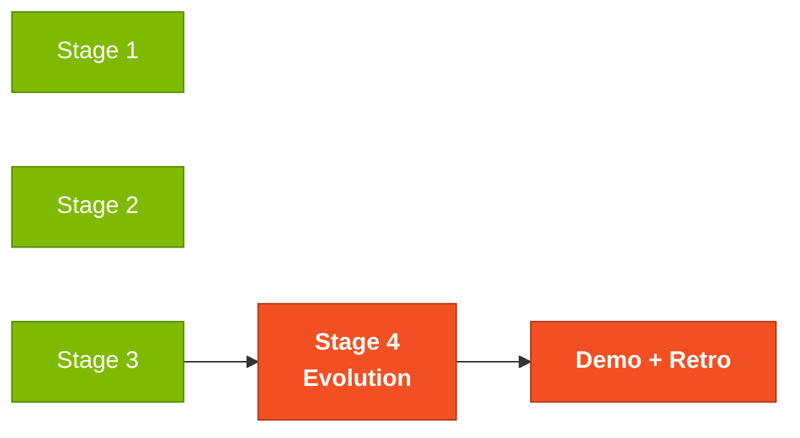
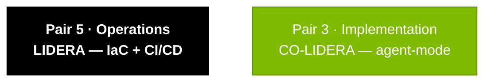

# Stage 4 — Evolución con Agentes (3 horas)

## Dónde encaja en el SDLC



## Quién trabaja aquí



## Objetivo

Usar **GitHub Copilot Agent Mode** para implementar features completas vía Issues y Pull Requests, y explorar infraestructura como código (Terraform) para deploy a Azure.

---

## Por qué importa

Hasta el Stage 3, tú escribías el código y Copilot ayudaba. En el Stage 4 cambia el patrón: **tú describes la feature en un Issue**, y el Agent escribe el código completo. Es un cambio de rol: de programador a revisor. La calidad ya no depende de qué tan rápido escribas — depende de qué tan claro pidas.

Quien gana este stage no es quien escribe más Issues — es quien escribe **el Issue más preciso**. Mismo principio que EARS en el Stage 2.

## Cómo pensar en esto

Trata al Agent como un **dev junior muy rápido pero sin contexto**. Necesita:
1. **Saber dónde está parado** (archivos a tocar, arquitectura existente)
2. **Saber qué entregar** (lista de checks de aceptación)
3. **Saber qué NO hacer** (no toques el esquema, no agregues nuevas dependencias)

Si tu Issue cubre los tres, el PR sale usable. Si no, el PR es basura y vas a gastar más tiempo arreglando que escribiendo el código tú mismo.

---

## Parte 1: GitHub Copilot Agent Mode (2 horas)

### ¿Qué es Agent Mode?

**Copilot Agent Mode** es el tercer modo de GitHub Copilot (además de Chat y Edits). En Agent Mode:

1. **Escribes un GitHub Issue** describiendo la feature completa
2. **Disparas el Agent** en VS Code (vía panel de Copilot → "Start Agent" o por Copilot Workspace en github.com)
3. **El Agent analiza todo el codebase**, planea los cambios e implementa código + tests + docs
4. **Abre un Pull Request** para que lo revises

Piensa en el Agent como un **dev junior muy rápido** — hace el trabajo pesado, pero TÚ necesitas revisar todo antes de mergear.

> **Diferencia entre los 3 modos:**
> - **Chat**: tú preguntas, Copilot responde (exploración, preguntas)
> - **Edits**: tú seleccionas archivos y describes el cambio, Copilot edita (implementación guiada)
> - **Agent**: tú describes la feature completa por un Issue, Copilot implementa solo (delegación)

### Cómo escribir un buen Issue para el Agent

Un Issue bien escrito es 80% del éxito. Sigue este formato:

---

#### Ejemplo real: notificación de pago por email

```markdown
## Title
Add email notification on payment confirmation

## Description
When a payment is confirmed (status changing from PENDING to APPROVED),
the system must send a notification email to the beneficiary informing
them of the amount and the payment date.

## Functional Requirements
- [ ] When a payment's status changes to APPROVED, send an email
- [ ] The email must contain: beneficiary name, amount, date, payment number
- [ ] If sending fails, log it in the audit log (do not block the payment)
- [ ] The email template must be configurable

## Technical Requirements
- [ ] Create an EmailService in the payment/application module
- [ ] Use Spring Mail configured via application.yml
- [ ] Create a unit test mocking the email send
- [ ] Create an integration test with MailHog (Docker container)
- [ ] Add the SMTP_HOST variable to docker-compose.yml

## Architecture
- Follow the existing modular structure (domain/application/infrastructure)
- The EmailService must be injected into PaymentService
- Use Spring events (ApplicationEvent) to decouple

## Acceptance Criteria
- [ ] Unit test passing
- [ ] Integration test passing
- [ ] Working docker compose up with MailHog
- [ ] Email received in MailHog when approving a payment via Swagger

## Context
- Backend: Java 21 + Spring Boot 3
- Relevant module: src/.../payment/
- References: PaymentService.java, PaymentController.java
```

---

### Checklist para escribir Issues

Antes de enviar el Issue al Agent, verifica:

- [ ] **Título claro** — describe la feature en una frase
- [ ] **Descripción con contexto** — el Agent necesita entender el "por qué"
- [ ] **Requerimientos como checklist** — ítems verificables
- [ ] **Requerimientos técnicos** — dónde en el código, qué patrones seguir
- [ ] **Criterios de aceptación** — cómo saber que terminó
- [ ] **Referencias a archivos** — ayudan al Agent a encontrar el código correcto

### Flujo de trabajo con el Agent

1. **Crea el Issue** en GitHub usando el formato de arriba
2. **Dispara el Agent** (vía Copilot Workspace o VS Code)
3. **Espera el PR** — el Agent trabaja y abre un PR
4. **Revisa el PR** usando el checklist de abajo
5. **Pide cambios** si es necesario (comenta en el PR)
6. **Mergea** cuando estés satisfecho

---

### Cómo revisar un PR del Agent (checklist de calidad)

Cuando el Agent abre un PR, revísalo con cuidado:

#### Correctness
- [ ] ¿El código compila sin errores?
- [ ] ¿Los tests pasan? (`./mvnw test`)
- [ ] ¿La feature funciona como dice el Issue?

#### Architecture
- [ ] ¿Sigue la estructura modular (domain/application/infrastructure)?
- [ ] ¿No hay imports circulares entre módulos?
- [ ] ¿La capa domain evita importar clases de infrastructure?

#### Quality
- [ ] ¿Los nombres de clases, métodos y variables son claros?
- [ ] ¿Hay manejo apropiado de errores?
- [ ] ¿Hay validación de input (Bean Validation)?
- [ ] ¿No hay credenciales hardcoded?

#### Tests
- [ ] ¿Hay tests unitarios para la lógica de negocio?
- [ ] ¿Hay tests de integración para los endpoints?
- [ ] ¿Los tests cubren casos de error (no solo el happy path)?

#### Documentation
- [ ] ¿Los endpoints nuevos aparecen en Swagger?
- [ ] ¿Hay JavaDoc en los métodos públicos?
- [ ] ¿El README se actualizó si era necesario?

---

## Parte 2: Terraform e infraestructura (1 hora)

### Visión general

Los módulos Terraform para deploy a Azure están en:

```
05-terraform-azure/
|-- main.tf # Módulo raíz
|-- variables.tf # Variables de input
|-- outputs.tf # Outputs
|-- modules/
| |-- resource-group/ # Resource group de Azure
| |-- container-registry/ # ACR para imágenes Docker
| |-- container-apps/ # Azure Container Apps
| |-- postgresql/ # Azure Database for PostgreSQL
| |-- key-vault/ # Azure Key Vault para secretos
| |-- monitoring/ # Application Insights + Log Analytics
```

### Qué explorar

1. **Lee `main.tf`** — entiende cómo se conectan los módulos
2. **Mira las variables** — ¿qué parámetros son configurables?
3. **Estudia los outputs** — ¿qué información exporta Terraform?
4. **Verifica Key Vault** — ¿cómo se gestionan los secretos?

### Terraform en práctica

Los módulos Terraform están en `05-terraform-azure/`:

| Módulo | Qué provisiona | Recurso Azure |
|--------|----------------|---------------|
| `compute/` | Backend Java | App Service (B1 dev, P1v3 prod) |
| `database/` | Base de datos | PostgreSQL Flexible Server |
| `frontend/` | Frontend Next.js | Static Web App |
| `registry/` | Imágenes Docker | Azure Container Registry |
| `security/` | Secretos | Key Vault |
| `observability/` | Monitoreo | Application Insights + Log Analytics |
| `identity/` | Identidad | Azure AD / Entra ID |

#### Para explorar (no necesitas aplicar):

```bash
cd 05-terraform-azure/envs/dev
terraform init # Inicializa providers
terraform plan # Muestra qué SE crearía (sin aplicar)
```

Ejemplo de salida de `terraform plan`:
```
Plan: 12 to add, 0 to change, 0 to destroy.

 + azurerm_resource_group.sifap
 + azurerm_postgresql_flexible_server.sifap
 + azurerm_service_plan.sifap
 + azurerm_linux_web_app.sifap_backend
 + azurerm_static_web_app.sifap_frontend
 + azurerm_key_vault.sifap
 + azurerm_application_insights.sifap
 + azurerm_container_registry.sifap
 ...
```

> **Alcance del workshop**: explora y entiende los módulos. NO apliques (`terraform apply`) — eso crearía recursos reales de Azure con costo real. `terraform plan` es suficiente para demostrar conocimiento.

### Cuando el Agent falla

Copilot Agent no es perfecto. Problemas comunes:

| Síntoma | Causa probable | Qué hacer |
|---------|----------------|-----------|
| PR no compila | Al Issue le faltó contexto técnico | Agrega: arquitectura esperada, archivos de referencia, patrones a seguir |
| Tests faltantes en el PR | El Issue no pedía tests | Agrega un checkbox: "Include unit and integration tests" |
| Imports cruzan bounded contexts | El Agent ignora los límites de módulo | Rechaza el PR; agrega al Issue: "Respect domain/application/infrastructure boundaries" |
| PR tiene lógica incorrecta | Requerimiento ambiguo | Reescribe el requerimiento en EARS y abre un nuevo Issue |
| Agent se atasca o tarda mucho | Codebase demasiado grande | Estrecha el alcance: apunta a archivos específicos en el Issue |

**Regla de oro**: cuando el Agent se equivoca, la causa casi siempre está en el Issue. Mejora el Issue antes de intentar otra vez.

### CI/CD: GitHub Actions

Los workflows de CI/CD están en:

```
.github/workflows/
|-- ci.yml # Build + test en cada PR
|-- cd-staging.yml # Deploy automático a staging
|-- cd-production.yml # Deploy a producción (aprobación manual)
```

#### Workflow de CI (ci.yml)

- Corre en cada Pull Request
- Pasos: checkout → setup Java 21 → build → test → lint
- Si falla, el PR no se puede mergear

#### Workflow de CD (cd-staging.yml)

- Corre después del merge a la branch `develop`
- Pasos: build Docker image → push a ACR → deploy a Container Apps (staging)

---

## Trampas comunes

| ❌ Si estás haciendo esto | ✅ Hazlo así |
|---------------------------|--------------|
| Issue vago "agregar autenticación" | Issue detallado con context, requirements, technical requirements, acceptance criteria |
| Mergear el PR del Agent sin revisar "porque es Copilot" | Cada PR — humano o Agent — pasa por el mismo checklist de revisión |
| Usar Agent para un fix de typo | Usa Edits. Agent es para tareas que valdrían 30+ min de tu tiempo |
| `terraform apply` en el workshop | NO. Solo `terraform plan`. Recursos Azure cuestan dinero real. |
| Hardcodear credenciales en `.env` versionado | Usa Key Vault o secrets de GitHub Actions |

---

## Cómo saber que terminaste (Definition of Done)

Al final del Stage 4, tu equipo debe tener:

- [ ] **2 Issues** creados en el formato correcto para el Agent
- [ ] **2 PRs** generados por el Agent (uno por Issue)
- [ ] **1 feature mergeada** — al menos un PR debe estar aprobado y mergeado
- [ ] **Reporte de experiencia con el Agent** (archivo: `04-evolucao/agent-experience-report.md`)

## Prompts para Copilot Chat

1. "Crea un GitHub Issue para que Copilot Agent implemente [funcionalidad]"
2. "Revisa este PR generado por el Agent y lista los problemas de calidad"
3. "Explica este módulo Terraform: [pega el código]"
4. "¿Qué recursos Azure va a crear este Terraform?"
5. "Crea un diagrama de los recursos Azure definidos en este Terraform"
6. "¿Cómo asegura este workflow de CI/CD la calidad antes del deploy?"
7. "Sugiere mejoras de seguridad para esta configuración de Terraform"

## Próximo paso

Al cerrar el Stage 4, el equipo entra en **Demo prep**: 30 segundos por persona, contando qué hizo su Pair. Luego viene la **retrospectiva** — abre los formularios en `08-retrospectiva/`. Lo que no se documente ahí se pierde.

## Tip de oro

El Agent es tan bueno como el Issue que escribas. Gasta **más tiempo en el Issue** y **menos tiempo arreglando el PR**. Un Issue con contexto claro, requerimientos específicos y referencias a archivos produce PRs mucho mejores.

---

## Navegación

| Anterior | Inicio | Siguiente |
|----------|--------|-----------|
| [Stage 3 — Implementation](../03-implementacao/GUIDE.md) | [Kit del Equipo (ES)](../README.md) | [Reporte de experiencia](agent-experience-report.md) |
