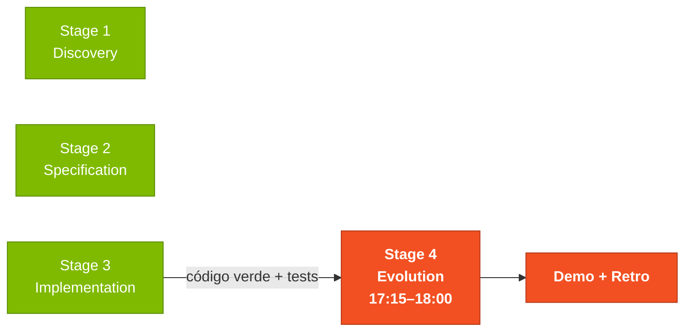
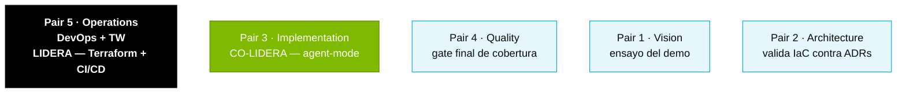

# Stage 4 — Evolution

> Agrega infraestructura como código (Terraform), pipeline de CI/CD (GitHub Actions) e itera usando flujos agénticos.

## Dónde encaja en el SDLC

## Contenido

| Archivo | Propósito |
|---------|-----------|
| [`GUIDE.md`](GUIDE.md) | Guía paso a paso de este stage |
| [`agent-experience-report.md`](agent-experience-report.md) | Template para documentar los resultados de la interacción con el Agent |

## Quién lidera

## Navegación

| Anterior | Inicio | Siguiente |
|----------|--------|-----------|
| [Stage 3 — Implementation](../03-implementacao/README.md) | [Kit del Equipo (ES)](../README.md) | [Stage 4 — Guía completa](GUIDE.md) |
